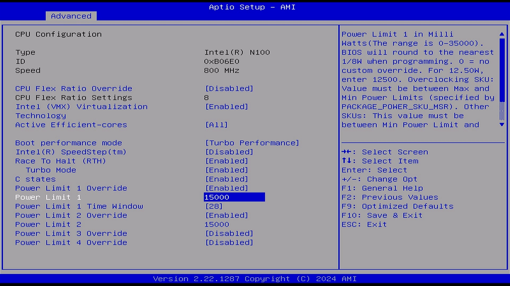
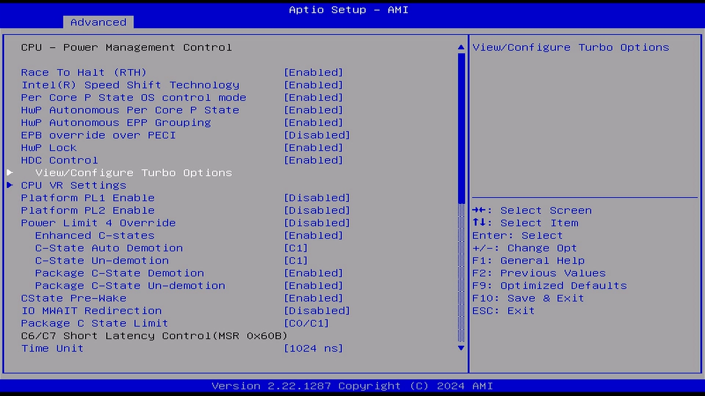
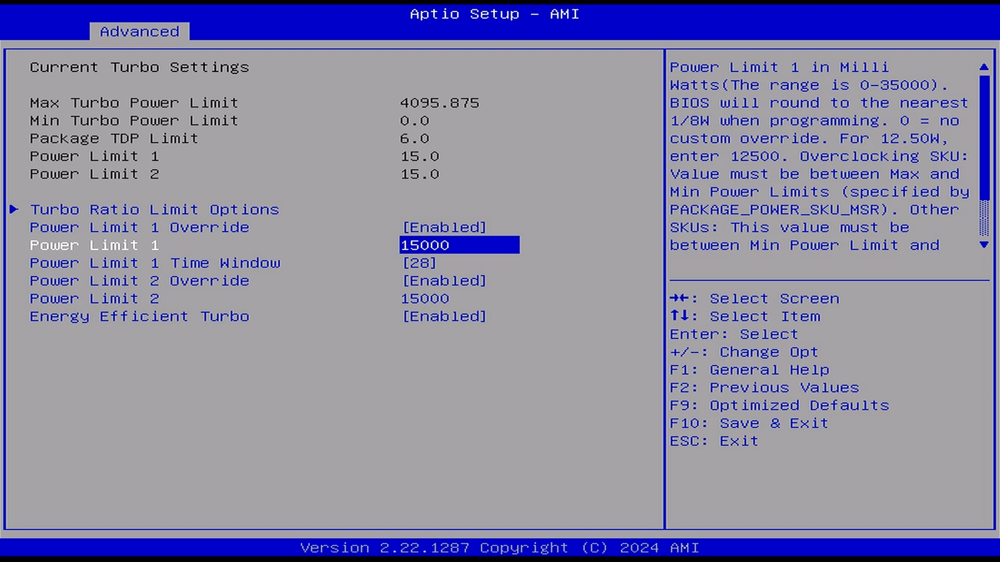
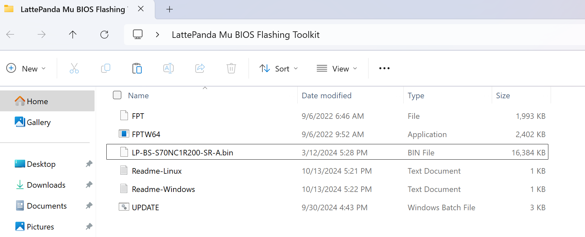
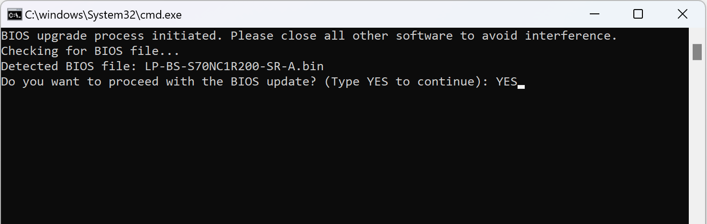
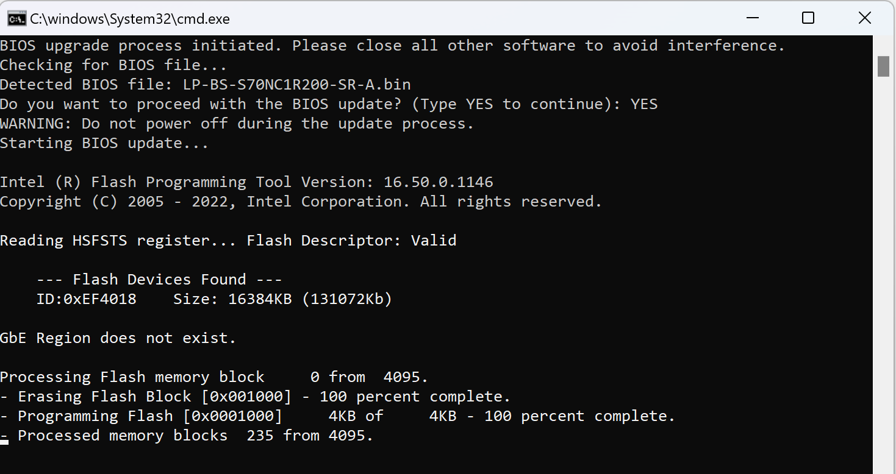
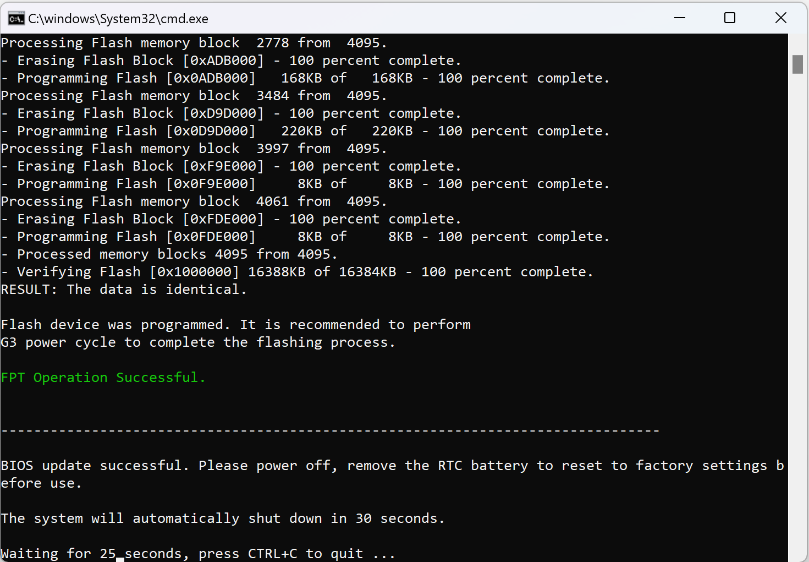

# BIOS Setup

## Entering BIOS Setting

* Power on or reboot LattePanda.

* Press **++del++** key continuously to enter into BIOS menu before you see the LattePanda logo on the splash screen. 

    
    

## Adjusting TDP to Balance Performance and Power Consumption
The LattePanda Mu is a versatile single-board computer that allows users to adjust the Thermal Design Power (TDP) settings to balance performance with power consumption and thermal output. 

By reducing the TDP, you can lower the energy usage and heat generation. Here's how you can set the TDP to as low as 6W via the BIOS settings.

!!! info "**NOTE** "

    Before making any changes to the BIOS settings, ensure that you have a stable power supply and that you're aware of the potential impacts on performance when reducing the TDP. Lowering the TDP may cause the processor to throttle under heavy loads, which can affect the overall performance of the system.

!!! Warning "TDP-down Limit"

    According to the TDP parameters provided by Intel, 
    - For the Intel N100 processor, the TDP must not be lower than 6W.  
    - For the Intel N305 processor, the TDP must not be lower than 9W.  
    Otherwise, setting the TDP too low will cause the processor to operate at its minimum frequency, severely impacting performance.

**Path:**

- BIOS Setup --> **`Advanced`** --> **`CPU Configuration`** --> **`Power Limit 1`** --> 6000

- BIOS Setup --> **`Advanced`** --> **`CPU Configuration`** --> **`Power Limit 2`** --> 6000

  (Change the value to **`6000`** to set the TDP to 6W)

  {width="600" }

**Alternative Method:**

You can also find the TDP settings under a different section:

   - Navigate to **`Advanced`** > **`Power & Performance`** > **`CPU - Power Management Control`**.
   - Choose **`View/Configure Turbo Options`** to access TDP settings.

    {width="600" }
    {width="600" }

By following these steps, you can effectively adjust the TDP on your LattePanda Mu to find the right balance between performance and power consumption that suits your needs.

## Update BIOS Firmware

To enable your Lattepanda Mu to support different functionalities, such as various PCIe and USB lanes, it is necessary to flash the appropriate BIOS firmware.

In this section, we will demonstrate the specific steps for using FPTW64 to fully update the BIOS firmware in the Windows OS. 

For steps in the Linux OS, please refer to the readme_linux document in the toolkit.

### Steps

!!! Warning "Correct BIOS Firmware"

    - Kindly ensure that you download the **correct version of the BIOS**. Flashing an incorrect BIOS file can result in the LattePanda board being unable to boot.

* Download [**the BIOS file of LattePanda Mu**](https://github.com/LattePandaTeam/LattePanda-Mu/tree/main/Softwares/BIOS).

* Download [**LattePanda Mu BIOS Flashing Toolkit**](../../assets/drivers/mu_edition/LattePanda Mu BIOS Flashing Toolkit.zip).

* Unzip the `LattePanda Mu BIOS Flashing Toolkit` in the Windows OS, then copy the BIOS firmware(.bin file) into this folder.

   **The whole files should be as shown below.**

  {width="600" }

* Run the `UPDATE` as a administrator. Then Type `YES` to start the update.

   {width="600" }

* Updating the BIOS firmware. This process will take approximately 2 to 3 minutes, please be patient.

   {width="600" }

* After the update is complete, please shut down the LattePanda, and unplug the power. Wait for 30 seconds, then plug it back in and power on the LattePanda board.

   {width="600" }

If you encounter any further issues, feel free to reach out to the [**LattePanda tech support team**](mailto:techsupport@lattepanda.com) for assistance.

[**:simple-discord: Join our Discord**](https://discord.gg/k6YPYQgmHt){ .md-button .md-button--primary }