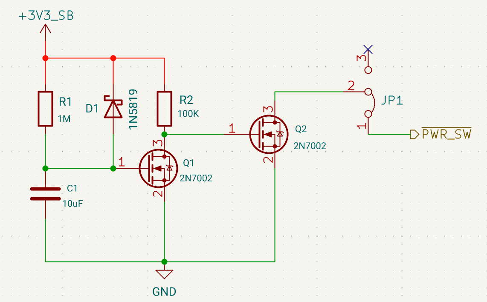

# Auto Power-On

To ensure the LattePanda Mu compute module boots up automatically when power is applied, an external hardware circuit is required on the carrier board.

- ✅ **Hardware-based implementation is strongly recommended** for reliability. 
    This ensures consistent boot behavior even after abnormal power loss or rapid power cycling.
- ❌ **Not Recommended**: Relying solely on BIOS menu settings like "Restore AC Power Loss".

## Reference Circuit

{width="600" }

### Circuit Principle

The purpose of this circuit is to electrically simulate the physical action of pressing the power button.

1. **Initialization**: The circuit activates immediately when the carrier board receives power.

2. **Action**: It pulls the `PWR_BTN#` (Power Button) signal LOW for a specific duration (simulating a "Press"), triggering the compute module's boot sequence.

3. **Release**: After the delay, it releases `PWR_BTN#` back to HIGH (simulating a "Release").

JP1 is a jumper. When JP1 is ON, the automatic power-on function is enabled.

### Power Requirement

The power supply for the auto power-on circuit MUST be **3.3V Standby**. That is, this 3.3V power supply must be active as soon as the carrier board is plugged in the main power.