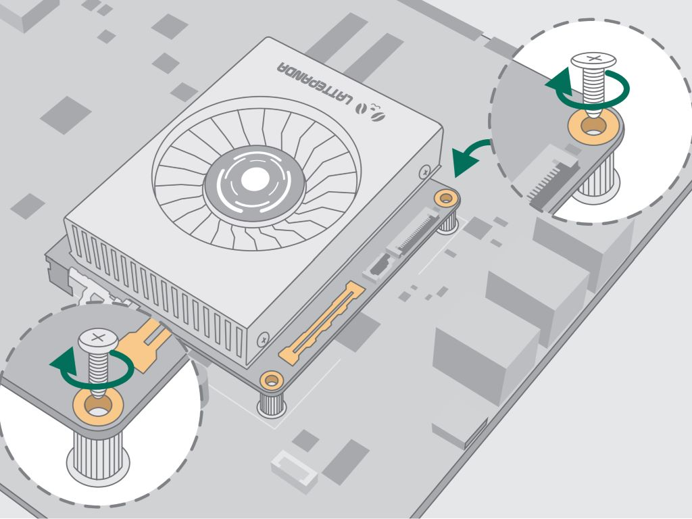

LattePanda Mu x86 compute module utilizes a **260-Pin Edge Connector**, physically compatible with standard laptop **DDR4 SODIMM** memory sockets.

## Pinout

Given the high-density edge connector and the versatile pin definitions of the LattePanda Mu compute module, we provided the detailed pin introduction into the separate [**LattePanda Mu Pinout Documentation**](https://github.com/LattePandaTeam/LattePanda-Mu/tree/main/Electricals/Pinouts).

## Mechanical Specs

- Vertical distance from top PCB surface to processor boss surface: 1.55mm
- Max component height on top PCB: 3mm
- Max component height on bottom PCB: 2mm

## Socket Selection Guidelines

While compatible with standard DDR4 sockets, strict adherence to the following selection rules is required to ensure proper mechanical fit and electrical connectivity.

### Critical Rules

- **Pin Count**: Must use a **260-Pin** DDR4 SODIMM socket.
- **Orientation**: Must use **Standard (STD)** type sockets, not Reverse (RVS) type sockets. 

!!! note "How to identify a Standard (STD) socket?"
    
    - **Marking**: Most sockets have "STD" stamped on the plastic body.
    - **Notch Position**: When facing the socket opening (as if inserting the module) with the pads facing down, the Keying Notch should be offset to the LEFT.
    

- **Height Requirement**: Socket height should be **≥ 5.2 mm** (while carrier board areas beneath the compute module without components)

    > Due to the retention screws and passive components on the back of the Compute Module, the socket must provide sufficient bottom clearance.

- **Recommended Parts**

    | Height | Brand           | Part Number      |
    | ------ | --------------- | ---------------- |
    | 8.0mm  | TE Connectivity | 2309411-1        |
    | 9.2mm  | FOXCONN         | ASAA821-EASB0-7H |
    | 9.2mm  | LOTES           | ADDR0110-P005A   |
    | 5.2mm  | LOTES           | ADDR0207-P001A   |

### Solderable Standoff Selection

{width="400"}

After inserting the LattePanda Mu into the SODIMM socket, it must be secured to the carrier board using screws and standoff.
The height of the standoff on the carrier board must match the SODIMM socket height to ensure the compute module sits flat.

| SODIMM Socket Height | Recommended Standoff Height |
| -------------------- | --------------------------- |
| 8.0mm                | 5.5mm                       |
| 9.2mm                | 6.6mm                       |
| 5.2mm                | 2.6mm                       |

>- *Recommended Tolerance：±0.1mm*
>- *Standoff Height: The distance from the PCB surface to the top surface of the standoff.*

On the DFR1142 Lite carrier board, the DDR4 socket height is 8.0 mm; therefore, the standoff height is 5.5 mm(shown as below), and the fixing screw diameter is 2 mm.

{width="500"}