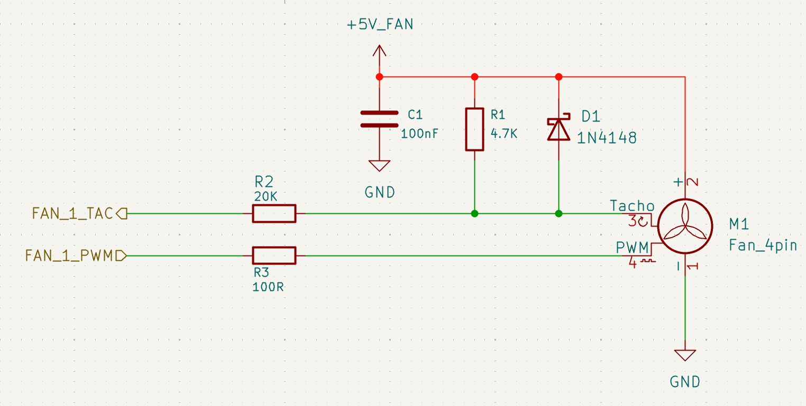
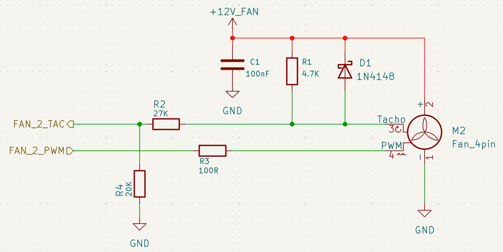

# Fan

LattePanda Mu x86 compute module provides **2 independent** fan interfaces, supporting PWM speed control and RPM monitoring (Tachometer).

- **CPU_FAN**: Dedicated for the CPU cooler.
- **SYS_FAN**: Generic system chassis fan.

## Design Guidelines

### Pin Definition

| Pin Name | Pin Number | Note          |
| :------- | :--------- | :------------ |
| FAN2_CTL | 2          | CPU Fan PWM   |
| FAN2_TAC | 4          | CPU Fan Tacho |
| TAN3_CTL | 6          | SYS Fan PWM   |
| FAN3_TAC | 8          | SYS Fan Tacho |

### PWM Signal

The PWM output pins on the module feature integrated **4.7kΩ pull-up resistors** (to 3.3V). No external pull-up is required on the carrier board.

It is recommended to place a series resistor in the PWM signal path.

- Value: 100Ω
- Function: Current Limiting. Although most fans have internal driver ICs, this resistor protects the module's IO pins from potential current surges or faults within the fan.

### Tachometer Signal

The TAC pins are Open-Drain Input requiring external pull-up and protection circuitry. The design varies depending on the fan voltage (5V vs. 12V).

!!!warning

    All TAC pins can tolerate only 5V!

### Critical Design Rules

1. **Pull-up Source**:
    - The TAC signal **must** be pulled up to the **Fan's Operating Voltage**.
    - **Do NOT** pull up a 12V fan's TAC signal to a 5V or 3.3V rail on the carrier board. The TAC feedback loop depends on the fan's power rail; cross-biasing may result in incorrect RPM readings and risks voltage back-feeding (current leakage).

2. **Surge Protection**:
    - A **Diode** (e.g., 1N4148) is recommended in parallel with the pull-up.
    - **Function**: Clamps voltage surges. If the TAC signal exceeds the supply voltage, the diode conducts, diverting the surge current to the power rail.

3. **Level Shifting**:
    - **12V Fan:** A resistive voltage divider (multiple resistors in series) is **MANDATORY** to step down the 12V tachometer signal to a safe logic level (≤ 5V) compatible with the compute module.
    - **5V Fan**: Since the voltage is within the safe range, the divider can be simplified.

### Recommended Fan Circuit

#### 5V Fan

{width="600" }

- In the image above, resistor R2 can be selected from 1K to 30K. If space is tight, this resistor can also be omitted.

#### 12V Fan

{width="600" }

- In the image above, resistor R4 is part of a voltage divider, ensuring that the voltage at the TAC input pin does not exceed 5V, and therefore cannot be omitted. Based on this principle, the specific resistance values of R2 and R4 can be adjusted according to actual conditions.