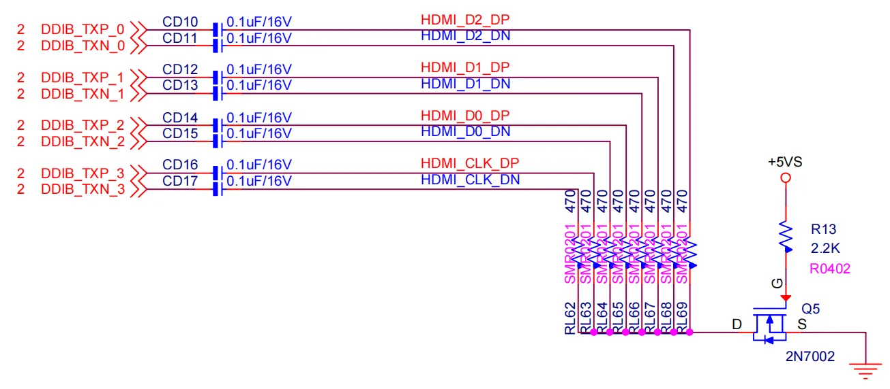

# HDMI 2.1

LattePanda Mu x86 compute module derives up to 3 HDMI outputs from the DDIB, TCP0, and TCP1 interfaces, supports up to **4K @ 60Hz**.

## Interface Configuration

- HDMI signals(operating in TMDS mode) can **only** be configured from **DDIB**, **TCP0**, or **TCP1**.
  
- The default BIOS enables **DDIB** and **TCP0** as HDMI.

!!!note

    - To change TCP1 to HDMI(in TMDS mode), a specific BIOS firmware must be flashed. Dynamic switching via the BIOS menu is not supported.

## Design Guidelines

### Pin Definition

| Interface Name                | Pin Number                             |
| ----------------------------- | -------------------------------------- |
| DDIB (TDMS Differential Pair) | 197, 199, 203, 205, 209, 211, 215, 217 |
| DDIB DDC & HPD                | 169, 171, 183                          |
| TCP0 (TDMS Differential Pair) | 227, 229, 233, 235, 239, 241, 245, 247 |
| TCP0 DDC & HPD                | 177, 179, 187                          |
| TCP1 (TDMS Differential Pair) | 220, 222, 226, 228, 232, 234, 238, 240 |
| TCP1 DDC & HPD                | 173, 175, 185                          |

### AC Coupling & Pull-down Bias

!!!note
    On LattePanda Mu compute module, DDIB,TCP0 and TCP1 signal lines do not integrate AC coupling capacitors.

Intel platform HDMI output design requires a specific **AC Coupling + Pull-down Bias** topology.

- **AC Coupling**: A 100nF (0.1uF) capacitor must be placed in series on all four TMDS differential pairs. 0402 or smaller package is recommended to minimize parasitics.
- **Pull-down Bias**: After the capacitor (connector side), each TMDS signal line must be pulled down to GND via a 470Ω resistor.
- **Switch Control**: The ground connection of all 470Ω resistors should be gathered and controlled by an NMOS.
    The NMOS turns ON (enabling the pull-downs) ONLY when the system is in the Working (S0) state.

    {width="600" }

!!! tip "Why are 470Ω pull-down resistors mandatory?"

    This is the standard design required by Intel. Omitting the 470Ω resistor will cause the signal eye diagram to fail and lead to compatibility issues.

### Level Shifter

- `DDC` (I2C) and `HPD` signals from compute module are **3.3V**.
- HDMI standard requires **5V** logic levels.
- **Direct connection is prohibited.** A level shifting circuit (using NMOS or dedicated chips) must be implemented on the carrier board.

### No AUX Signal

When operating in TMDS mode, the AUX signals are unused, so they should be left not connected.

For example, when DDIB is operating in TMDS mode, the following pins should be NC.
```text
Pin 191: DDIB_AUX_N 
Pin 193: DDIB_AUX_P
```

### ESD Protection

Since HDMI ports are subject to frequent hot-plugging, they are vulnerable to Electrostatic Discharge (ESD). And TMDS signals are extremely sensitive to capacitance. So **Ultra-low capacitance** ESD protection diodes are mandatory.

| Signal Type         | Recommended Specs                                            | Recommended Parts |
| :------------------ | :----------------------------------------------------------- | :---------------- |
| High Speed (TMDS)   | Junction Capacitance: < 0.18 pF<br>Reverse Working Voltage: 3.3 V | AZ1023-04F        |
| Low Speed (DDC/HPD) | Junction Capacitance: <0.8pF<br>Reverse Working Voltage: 5V or 6 V | BV-FA05ZCT        |

### Layout Guidelines

| Parameter | Requirement |
| :--- | :--- |
| Differential Impedance | 100Ω |
| Intra-pair Skew | < 5 mil |
| Inter-pair Skew | < 13 mm |
| AC Cap for TMDS | 100nF nominal |
| Number of Vias Allowed | Max 2 Vias |
| Reference Plane | Continuous GND Recommended |

#### Spacing & Crosstalk

- Recommended Trace Type: Microstrip Differential Pair .

- Pair-to-Pair Spacing: ≥ 5W (where W is trace width).
    - To ensure signal integrity for HDMI 2.1 (4K@60Hz) , a spacing of at least 5W is required to strictly minimize crosstalk.
    - General Spacing: Maintain > 20 mil or > 5W spacing between high-speed TMDS pairs and other signals (DDC, HPD, Power).
    
### Differential Pair Net Length

The follow tables list the LattePanda Mu compute module track-length difference within each group.

| Net Name | Net Length(mil) | VIA |
| :--- | :--- | :--- |
| DDIB_TX0_P | 1856 | 2 |
| DDIB_TX0_N | 1857 | 2 |
| DDIB_TX1_P | 1794 | 2 |
| DDIB_TX1_N | 1795 | 2 |
| DDIB_TX2_P | 1804 | 2 |
| DDIB_TX2_N | 1804 | 2 |
| DDIB_TX3_P | 1791 | 2 |
| DDIB_TX3_N | 1792 | 2 |
| DDIB_AUX_P | 1784 | 4 |
| DDIB_AUX_N | 1787 | 4 |

| Net Name | Net Length(mil) | VIA |
| :--- | :--- | :--- |
| TCP1_TXRX0_P | 2139 | 3 |
| TCP1_TXRX0_N | 2141 | 3 |
| TCP1_TXRX1_P | 2228 | 3 |
| TCP1_TXRX1_N | 2231 | 3 |
| TCP1_TX0_P | 1965 | 3 |
| TCP1_TX0_N | 1968 | 3 |
| TCP1_TX1_P | 2087 | 3 |
| TCP1_TX1_N | 2091 | 3 |
| TCP1_AUX_P | 2162 | 3 |
| TCP1_AUX_N | 2161 | 3 |

| Net Name | Net Length(mil) | VIA |
| :--- | :--- | :--- |
| TCP0_TXRX0_P | 2339 | 3 |
| TCP0_TXRX0_N | 2340 | 3 |
| TCP0_TXRX1_P | 2017 | 3 |
| TCP0_TXRX1_N | 2017 | 3 |
| TCP0_TX0_P | 1956 | 2 |
| TCP0_TX0_N | 1958 | 2 |
| TCP0_TX1_P | 2090 | 3 |
| TCP0_TX1_N | 2094 | 3 |
| TCP0_AUX_P | 1943 | 2 |
| TCP0_AUX_N | 1945 | 2 |
