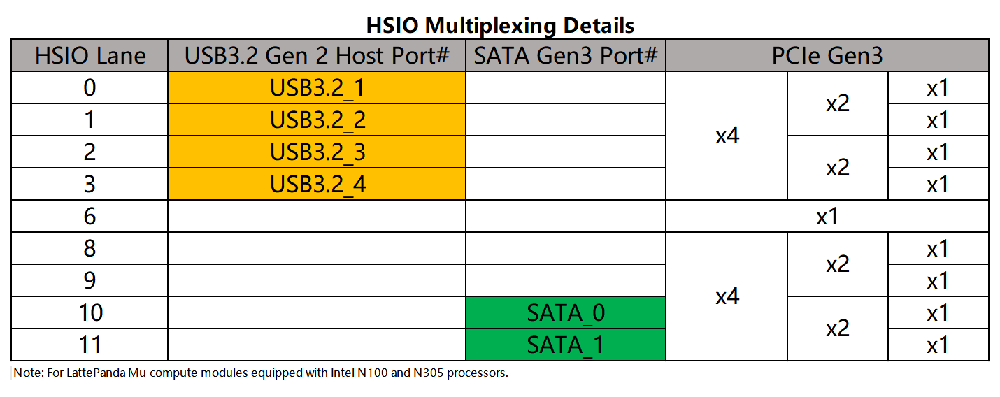
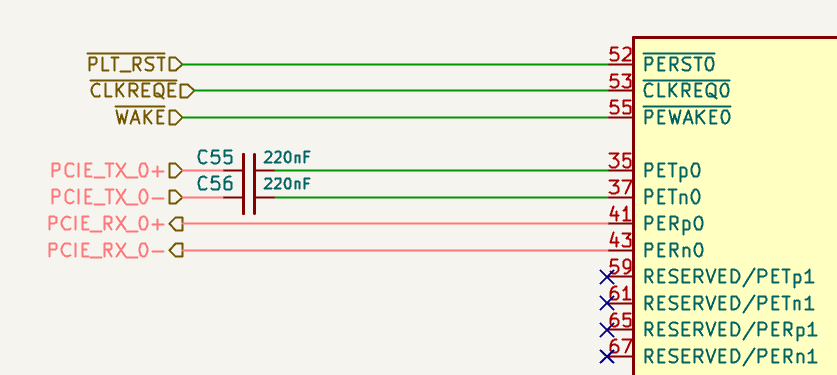

# PCIe 3.0

LattePanda Mu x86 compute module derives up to **9 lanes** of PCIe 3.0 x1 signals from the HSIO (High Speed I/O) lanes. 

- Each lane supports speeds up to **8.0 GT/s**, and is backward compatible with PCIe 2.0 (5.0 GT/s) and PCIe 1.0 (2.5 GT/s).

- All PCIe lanes operate only in **Root Complex** mode. Endpoint mode is not supported.

- The maximum configurable link width is **PCIe x4**. PCIe x8 is not supported.

!!! warning

    Hot-plugging is NOT supported on any PCIe lanes. Power off the system and disconnect the power supply before inserting or removing PCIe devices.

## Lane Configuration

- PCIe lanes can be multiplexed from HSIO lanes.
  {width="600" }
- HSIO lanes are multiplexed resources. Once a lane is configured as USB 3.2 or SATA, it cannot be used as PCIe.
- Any change to HSIO assignment or PCIe bifurcation requires customized BIOS firmware. Dynamic switching via the BIOS menu is not supported.
- Due to the flexible HSIO assignment and PCIe bifurcation, it is strongly recommended to read the [HSIO Multiplexing & PCIe Bifurcation chapter](hsio_multiplexing.md) before reading the following contents.

- For released BIOS firmware and HSIO assignments, please refer to our [GitHub repository](https://github.com/LattePandaTeam/LattePanda-Mu/tree/main/Softwares/BIOS).

## Design Guidelines

### Pin Definition

| Lane Name    | Pin Number     |
| :----------- | :------------- |
| HSIO 0       | 13, 15, 16, 18 |
| HSIO 1       | 19, 21, 22, 24 |
| HSIO 2       | 25, 27, 28, 30 |
| HSIO 3       | 31, 33, 34, 36 |
| HSIO 6       | 61, 63, 64, 66 |
| HSIO 8       | 37, 39, 40, 42 |
| HSIO 9       | 43, 45, 46, 48 |
| HSIO 10      | 49, 51, 52, 54 |
| HSIO 11      | 55, 57, 58, 60 |
| REFCLK 0     | 85, 87         |
| REFCLK 1     | 91, 93         |
| REFCLK 2     | 97, 99         |
| REFCLK 3     | 88, 90         |
| REFCLK 4     | 94, 96         |
| REFCLK_REQ3# | 100            |
| REFCLK_REQ4# | 102            |
| PLT_RST#     | 105            |
| PCIE_WAKE#   | 103            |
| SUSCLK       | 131            |

### AC Coupling

!!! note

    On LattePanda Mu compute module, HSIO lane signal lines do not integrate AC coupling capacitors.


PCIe data links require AC coupling capacitors on the transmitter side.

- **Compute Module PCIe_TX (from HSIO_TX)**: Must place **0.22uF (220nF)** series capacitors. 0402 or smaller package is recommended to minimize parasitics.
- **Compute Module PCIe_RX (from HSIO_RX)**: Whether additional AC coupling capacitors are required depends on whether the external PCIe device transmitter already includes AC coupling capacitors.
- **REFCLK**: No AC coupling capacitors are required.

#### Connecting to a PCIe Device

For PCIe devices such as standard PCIe cards and M.2 NVMe SSDs, AC coupling capacitors are usually already placed on the device TX side.

Therefore, on the carrier board:

- Place AC coupling capacitors only on the compute module PCIe_TX lanes.
- Place the capacitors as close to the PCIe connector or M.2 socket as possible, recommended distance **< 8 mm**.
- No additional AC coupling capacitors are required on the compute module PCIe_RX lanes.

```text
+---------------------+                         +---------------------+  
|  Compute Module     |                         |  PCIe Connector /   |  
|                     |                         |  M.2 Socket         |  
|                     |                         |                     |  
| PCIe_TX_P ----------o-->>-------||------------o--- PETp             |  
|                     |         0.22uF          |                     |  
| PCIe_TX_N ----------o-->>-------||------ -----o--- PETn             |  
|                     |         0.22uF          |                     |  
|                     |                         |                     |  
| PCIe_RX_P ----------o---------------------<<--o--- PERp             |  
|                     |        (NO CAP)         |                     |  
| PCIe_RX_N ----------o---------------------<<--o--- PERn             |  
|                     |        (NO CAP)         |                     |  
+---------------------+                         +---------------------+  
```

- The pinout of the PCIe connector in the figure above uses the host perspective. For details, see [Host's Perspective Section](#hosts-perspective).

#### Connecting to a PCIe Chip

For on-board PCIe chips, such as PCIe Ethernet controllers, the transmitter side does not integrate AC coupling capacitors inside the chip.

In this case,  on the carrier board:

- Place AC coupling capacitors on the compute module PCIe_TX lanes and PCIe_RX lanes.

- Follow the PCIe chip vendor's reference design for capacitor placement. In general, place the capacitors close to the PCIe chip, recommended distance **< 8 mm**.

```text
+---------------------+                         +---------------------+
|  Compute Module     |                         |  On-board PCIe Chip |
|                     |                         |                     |
|                     |                         |                     |
| PCIe_TX_P ----------o-->>------||-------------o--- HSIP             |
|                     |        0.22uF           |                     |
| PCIe_TX_N ----------o-->>------||-------------o--- HSIN             |
|                     |        0.22uF           |                     |
|                     |                         |                     |
| PCIe_RX_P ----------o----------||---------<<--o--- HSOP             |
|                     |        0.22uF           |                     |
| PCIe_RX_N ----------o----------||---------<<--o--- HSOP             |
|                     |        0.22uF           |                     |
+---------------------+                         +---------------------+
```

### Polarity Inversion

The PCI Express Base Specification requires polarity inversion to be supported independently by all receivers across the Link where each differential pair within each Lane of the PCIe Link handles its own polarity inversion. 

If the P/N signals of a PCIe data differential pair cross during layout, the P and N signals within the same differential pair can be swapped. The receiver will automatically handle polarity inversion, and no BIOS modification is required.

```text
- For PCIe Connector:
Host_PCIe_TX_P  --------  Connector_PCIe_TX_N
Host_PCIe_TX_N  --------  Connector_PCIe_TX_P

- For PCIe chip:
Host_PCIe_TX_P  --------  Device_PCIe_RX_N
Host_PCIe_TX_N  --------  Device_PCIe_RX_P
```

Polarity inversion only applies to P/N swapping within the same differential pair. It does not mean TX/RX direction swapping or lane order reversal.

For the PCIe REFCLK differential pair, polarity inversion is also supported.

### No Lane Reversal

Polarity inversion is not lane reversal, and it is not direction reversal. For multi-lane links, do not reverse the lane order unless both the BIOS firmware and the PCIe device explicitly support lane reversal.

- Allowed:

    - Swapping P/N within the same differential pair (Polarity Inversion).

- Not allowed:

    - Swapping TX and RX directions.
    - Swapping lane order.

### Host's Perspective

In our schematics(such as the [DFR1142 Lite Carrier Board](https://github.com/LattePandaTeam/LattePanda-Mu/tree/main/Electricals/Examples)), the PCIe connector pinout is defined from the host's perspective.

When routing, connect the host's TX signals directly to the connector's TX pins, and connect the host's RX signals directly to the connector's RX pins. Do not swap these signals. As shown in the figure below.

  {width="600"}

The figure above shows some of the pins of the M.2 M key socket. For M.2 sockets:

- `PET` usually indicates host transmit signals.
- `PER` usually indicates host receive signals.

### REFCLK_REQ# Signal

Some PCIe devices require the `CLKREQ#` signal, marked as `REFCLK_REQ#` in the LattePanda Mu compute module pinout. It is used to request or control the PCIe reference clock and also be required for ASPM or advanced power management features.

LattePanda Mu compute module exposes only `CLKREQ3` and `CLKREQ4`, controlling `REFCLK3` and `REFCLK4` outputs respectively. Their mapping relationship with the HSIO channels in the [default BIOS firmware](https://github.com/LattePandaTeam/LattePanda-Mu/tree/main/Softwares/BIOS/DFLT) is shown in the table below:

| CLKREQ#  | Associated PCIe Clock Lane | Associated HSIO Lane |
| :------- | -------------------------- | :------------------- |
| CLKERQ 3 | REFCLK 3                   | HSIO 3               |
| CLKERQ 4 | REFCLK 4                   | HSIO 6               |

!!! note

    When using the default BIOS firmware, it is recommanded to follow the default Clock-to-Lane mapping table. For more details, please refer to [the Clock-to-Lane Mapping chapter](hsio_multiplexing.md#clock-to-lane-mapping).

It is recommended to connect `CLKREQ#` in the following cases:

- The PCIe device requires `CLKREQ#` to enable or request the reference clock.
- ASPM or low-power states need to be supported.
- The PCIe device reference design explicitly requires `CLKREQ#`.

If the device does not need `CLKREQ#`, you can select an HSIO without `CLKREQ#` control, or pull `CLKREQ#` down to `GND` via a 1K resistor to use an always-on reference clock.

### PLT_RST# Signal

PCIe devices usually require a reset signal `PERST#`. In the LattePanda Mu compute module pinout, this signal is marked as `PLT_RST#`.

When designing the carrier board, connect `PLT_RST#` from the compute module to the PCIe connector or on-board PCIe chip.

For M.2 sockets, PCIe CEM connectors and PCIe chips, this signal must not be omitted.

If there are multiple PCIe connectors or PCIe chips on the carrier board, their `PERST#` signals should be connected together to the compute module's `PLT_RST#` pin.

### PCIE_WAKE# & SUSCLK Signals

`WAKE#` is an optional signal used by PCIe devices to wake the host from D3cold status. If wake-up functionality, such as Wake-on-LAN, is required, connect the device `WAKE#` signal according to the device reference design.

`SUSCLK` is an optional 32.768 kHz clock signal. Most PCIe devices integrate their own low-speed clock, but some devices, such as  M.2 E-key(Hybrid) CNVio wireless modules, require an external 32.768 kHz clock.

Whether `WAKE#` and `SUSCLK` should be connected depends on the PCIe device reference design and the required power management features.

If multiple devices are used, the `WAKE#` pins of the devices should be connected together to the compute module's `PCIE_WAKE#` pin; similarly, the `SUSCLK` pins of the devices should be connected together to the compute module's `SUSCLK` pin.

### Device Interoperability

Different PCIe endpoint devices can be directly recognized on the same PCIe lane. 
> For example, replacing a PCIe Ethernet controller with an NVMe SSD on the same PCIe lane, which is similar to connecting different USB devices to the same USB port.

PCIe 2.0 and PCIe 1.0 devices are also supported. The compute module will automatically negotiate the proper link speed.

Changing regular PCIe endpoint devices does not require BIOS firmware modification unless HSIO assignment or PCIe bifurcation need to be changed.

### Layout Guidelines

| Parameter              | Requirement                                                  |
| ---------------------- | ------------------------------------------------------------ |
| Differential Impedance | 85Ω for both Data Pair and REFCLK Pair                       |
| Intra-pair Skew        | < 5 mil for Data Pair<br>< 15 mil for REFCLK Pair            |
| Inter-pair Skew        | Length matching is **NOT** required among TX differential pairs, nor among RX differential pairs. |
| AC Cap for Data Pair   | 220nF nominal                                                |
| AC Cap Placement       | On host TX lanes: close to the PCIe connector or PCIe chip (<8 mm)<br>On host RX lanes: only required when connecting to a PCIe chip ; close to the PCIe chip(< 8 mm) |
| Reference Plane        | Continuous GND Recommended                                   |

#### Spacing & Crosstalk

- Trace Type: Microstrip Differential Pair

- Recommended Pair-to-Pair Spacing: ≥ 5W (where W is trace width).

    > To ensure signal integrity for PCIe 3.0, a spacing of at least 5W is required to strictly minimize crosstalk.

- Recommended General Spacing: Maintain at least 5W spacing between PCIe Data Pairs, REFCLK Pair, and other signals.
- [More details in *High-Speed Interface Layout Guidelines*](https://www.ti.com/lit/an/spraar7j/spraar7j.pdf?ts=1718105682488)