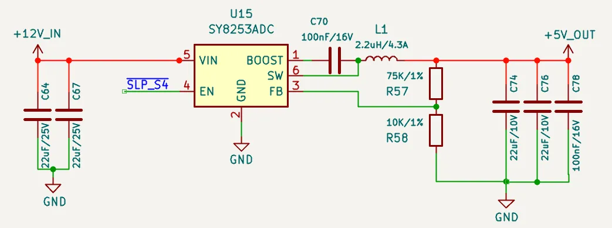
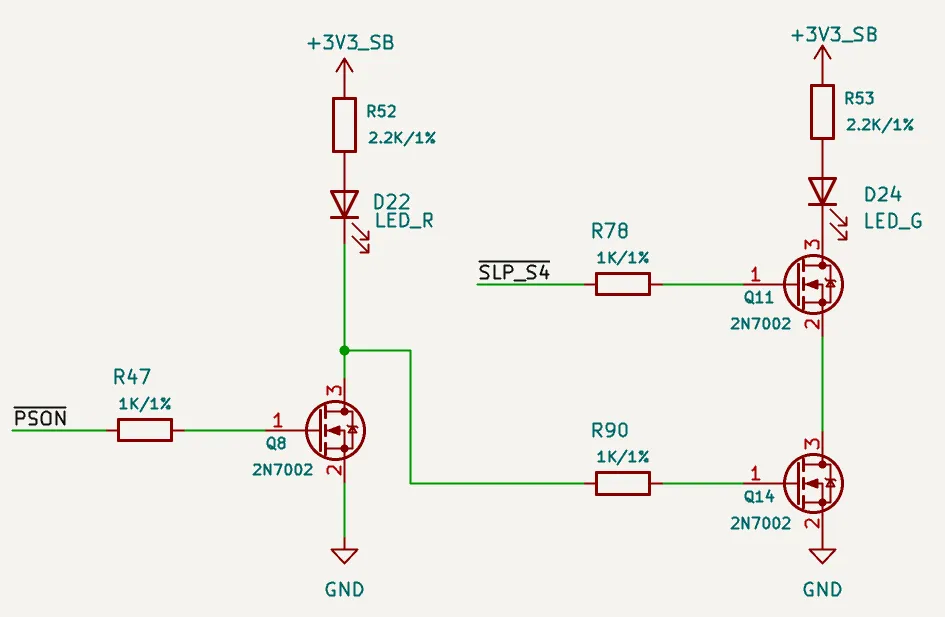

# Power Control & Status

## Status Indication

LattePanda Mu x86 compute module provides two status output pins, **PSON** and **SLP_S4**, to indicate the current system power state (e.g., S0, S3). These pins are dedicated to controlling the power enable lines for peripherals or to drive status LEDs.

### Pin Definition

| Pin Name | Pin Number | Note                                               |
| -------- | ---------- | -------------------------------------------------- |
| PSON     | 5          | Output HIGH(Weak Drive) only when S0(Working)      |
| SLP_S4   | 7          | Output HIGH only when S0(Working) and S3(Sleeping) |

!!!note

    - The `PSON` pin relies on the 10kΩ pull-up resistor to output HIGH. It cannot source significant current (max source current is approximately 0.33 mA). Thus, an external NMOS is required to drive an LED indicator or other components that need higher current.
    - When the LattePanda Mu compute module is powered but not started while the RTC battery is missing or low, the `SLP_S4` pin will output HIGH. In this case, please assemble a new RTC battery and complete one full power cycle (power on and then power off). After this, `SLP_S4` pin's level indication will function normally as described in the table above.

### Status Logic Table

| System State   | PSON Level | SLP_S4 Level | Note               |
| :------------- | :--------- | :----------- | :------------------------ |
| Working (S0)   | HIGH       | HIGH         | System running normally   |
| Sleep (S3)     | LOW        | HIGH         | Suspend to RAM            |
| Hibernate (S4) | LOW        | LOW          | Suspend to Disk           |
| Shutdown (S5)  | LOW        | LOW          | Soft OFF                  |
| Standby (G3)   | LOW        | LOW          | Powered but not Turned ON |

The above logic simplifies the power enable control of peripherals and the driving of status LEDs, and can be implemented purely in hardware. 

Examples will be given separately below.

### Peripheral Power Control

{width="600" }

As shown in the schematic above, using `SLP_S4` to control the EN pin of the DCDC Buck chip allows the 5V power supply to remain on in working and sleep states. In other states, such as shutdown or standby, the 5V power is cut off. This 5V power logic is suitable for USB ports and similar applications.

If 5V power is only needed in the working state, the DCDC Buck chip's EN pin can instead be controlled by `PSON`.

### Status LED Drive

{width="600" }

As shown in the schematic above, the following behavior is achieved: 

- When powered on(in working mode), only the left LED illuminates. 

- In sleep mode, only the right LED illuminates. 

- In other states, such as power off or standby, both LEDs are off. 

These two LEDs can be set to different colors(e.g. blue, green) to reflect the current status.

## Power Control

LattePanda Mu x86 compute module provides signal lines for power and reset buttons, which function exactly like those on a standard laptop or desktop computer.

### Pin Definition

| Pin Name | Pin Number | Note                                          |
| -------- | ---------- | --------------------------------------------- |
| PWR_SW#  | 1          | System Power Switch; Internally 10K Pulled Up |
| RST_SW#  | 3          | System Reset Switch; Internally 10K Pulled Up |

### PWR_SW\#

- Connect to a physical power button. Active Low.
- A low pulse duration of **≥ 125ms** is recommended for reliable detection.
- Holding Low for **> 4 seconds** will trigger a forced shutdown.

### RST_SW\#

- Connect to a physical hard reset button. Active Low.
- A low pulse duration of **≥ 16ms** is recommended to ensure a successful reset.

### ESD Protection

Since buttons are frequently touched, they are vulnerable to electrostatic discharge (ESD). Adding ESD protection diodes is strongly recommended.

- Reverse Working Voltage: 5V

## FAQ

| Question                                          | Potential Cause / Check Point                                | Explanation / Solution                                       |
| ------------------------------------------------- | ------------------------------------------------------------ | ------------------------------------------------------------ |
| CMOS Error appears after boot                     | Low RTC battery voltage                                      | Replace the RTC battery with a new one.                      |
|                                                   | First initialization after BIOS update                       | This is normal behavior. The message will disappear once initialization is complete. |
| Boot process is extremely slow every time         | `PWR_SW#` pin held low (>10s) before booting                 | If the `PWR_SW#` is held for over 10s, it triggers a **BIOS Reset**. The subsequent boot requires full hardware re-initialization, causing a significant delay. |
| Powered but not started, `SLP_S4` pin output HIGH | Low RTC battery voltage                                      | Replace the RTC battery with a new one. Then complete one full power cycle (power on and then power off). |
|                                                   | First powered but not started after being assembled into the carrier board | Ensure the RTC battery is assembled. Then complete one full power cycle (power on and then power off). |