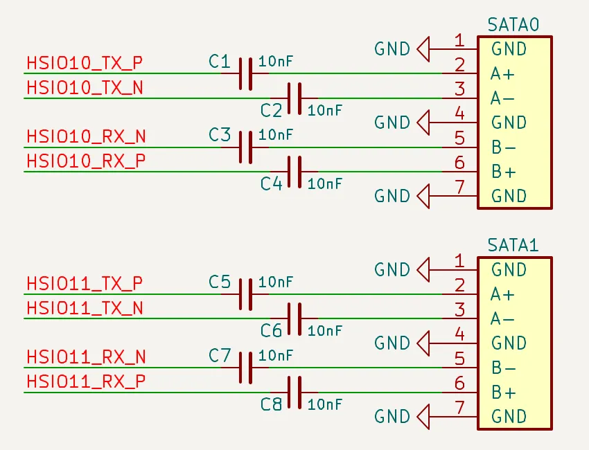

# SATA III

LattePanda Mu x86 compute module derives up to **2 lanes** of SATA III signals from the HSIO (High Speed I/O) lanes, supporting speeds up to **6.0 Gb/s**, and backward compatible with SATA 2.0 (3.0 Gb/s).

!!! warning

    Hot-plugging is NOT supported on any SATA lanes. Power off the system and disconnect the power supply before inserting or removing SATA devices.

## Lane Configuration

- SATA signals can **only** be multiplexed from **HSIO10** and **HSIO11**.
    {width="600"}

- The [SATA branch BIOS firmware](https://github.com/LattePandaTeam/LattePanda-Mu/tree/main/Softwares/BIOS/SATA) configures **HSIO10** and **HSIO11** as SATA by default.

- HSIO lanes are multiplexed resources. Once HSIO10 or HSIO11 is configured as SATA, it cannot be used as PCIe.

- Customized BIOS firmware is required for any HSIO assignment changes. Dynamic switching via the BIOS menu is not supported.

- For more details about HSIO Multiplexing, please see the [HSIO Multiplexing & PCIe Bifurcation chapter](hsio_multiplexing.md).

## Design Guidelines

### Pin Definition

| Lane Name | Pin Number     |
| --------- | -------------- |
| HSIO 10   | 49, 51, 52, 54 |
| HSIO 11   | 55, 57, 58, 60 |

### AC Coupling

!!! note

    On LattePanda Mu compute module, HSIO lane signal lines do not integrate AC coupling capacitors.

SATA links require AC coupling capacitors on the data differential pairs.

On the carrier board, both SATA_TX and SATA_RX differential pairs from HSIO10/HSIO11 must be connected in series with **10nF** capacitors. 0402 or smaller package is recommended to minimize parasitics.

- **SATA_TX from HSIO10/11_TX**: Place **10nF** series capacitors.
- **SATA_RX from HSIO10/11_RX**: Place **10nF** series capacitors.
- **AC Cap Placement**: Close to the SATA data connector, recommended distance **< 10 mm**.

### Polarity Check

SATA differential pairs do not support polarity inversion.

Strict polarity matching must be implemented on the carrier board. Ensure that Positive (+) maps to Positive (+) and Negative (-) maps to Negative (-). **Do NOT Swap P & N Signals.**

### Power Requirement

The SATA data port does not provide device power. Thus, the carrier board must provide proper power connector according to the connected SATA device. 

Normally, the HDD power requirements are as follows:

- **2.5" HDD**: requires 5V only. Recommended minimum current: 1A.
- **3.5" HDD**: requires both 5V and 12V simultaneously. Recommended minimum current: 1A for 5V and 2A for 12V.

### Reference Data Circuit

{width="600"}

| Pin Name    | SATA Function(Host Perspective) | SATA Connector Pin |
| ----------- | ------------------------------- | ------------------ |
| HSIO10_TX_P | SATA_TX0_P                      | A+                 |
| HSIO10_TX_N | SATA_TX0_N                      | A-                 |
| HSIO10_RX_P | SATA_RX0_P                      | B+                 |
| HSIO10_RX_N | SATA_RX0_N                      | B-                 |
| HSIO11_TX_P | SATA_TX1_P                      | A+                 |
| HSIO11_TX_N | SATA_TX1_N                      | A-                 |
| HSIO11_RX_P | SATA_RX1_P                      | B+                 |
| HSIO11_RX_N | SATA_RX1_N                      | B-                 |

### Layout Guidelines

| Parameter              | Requirement                                                  |
| ---------------------- | ------------------------------------------------------------ |
| Differential Impedance | 100Ω                                                         |
| Intra-pair Skew        | < 5 mil                                                      |
| Inter-pair Skew        | Length matching between TX pairs and RX pairs is **NOT** required |
| AC Cap                 | 10nF nominal                                                 |
| AC Cap Placement       | As close to SATA data connector as possible(<10 mm)          |
| Reference Plane        | Continuous GND Recommended                                   |

#### Spacing & Crosstalk

- Trace Type: Microstrip Differential Pair
- Recommended Pair-to-Pair Spacing: ≥ 5W (where W is trace width).

    > To ensure signal integrity for SATA 6.0 Gb/s, a spacing of at least 5W is required to strictly minimize crosstalk.

- Recommended General Spacing: Maintain at least 5W spacing between SATA TX/RX differential pairs and other signals.
- [More details in *High-Speed Interface Layout Guidelines*](https://www.ti.com/lit/an/spraar7j/spraar7j.pdf?ts=1718105682488)
