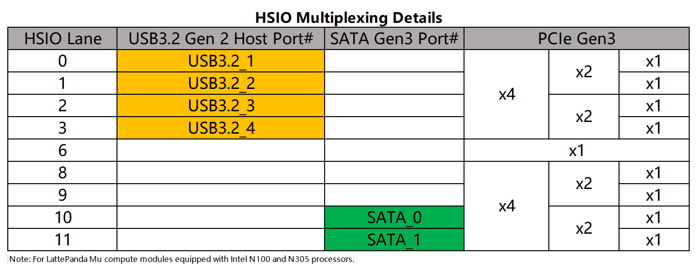

# USB 3.2

LattePanda Mu x86 compute module derives up to **4 lanes** of USB 3.2 Gen 2 signals from the HSIO (High Speed I/O) lanes, supporting speeds up to **10Gbps**, full-duplex communication, backward compatible with USB 3.0 (5Gbps).

## Lane Configuration

- USB 3.2 signals **only** can be multiplexed from **HSIO0 ~ HSIO3**.
  {width="600" }

- The default BIOS enables **HSIO 0** and **HSIO 1** as USB 3.2 lane.

!!!note "HSIO Exclusivity"

    - HSIO lanes are multiplexed resources.
    - Once a lane is configured as USB 3.2, it cannot be used as PCIe.
    - To change an HSIO lane to PCIe (or to configure other HSIO lanes as USB 3.2), a specific BIOS firmware must be flashed. Dynamic switching via the BIOS menu is not supported.

- For more details, please see the [HSIO Multiplexing chapter](hsio_multiplexing.md).

## Design Guidelines

### Pin Definition

| Lane Name | Pin Number     |
| --------- | -------------- |
| HSIO 0    | 13, 15, 16, 18 |
| HSIO 1    | 19, 21, 22, 24 |
| HSIO 2    | 25, 27, 28, 30 |
| HSIO 3    | 31, 33, 34, 36 |

### AC Coupling

!!! note

    On LattePanda Mu compute module, HSIO lane signal lines do not integrate AC coupling capacitors.

USB 3.2 links require AC coupling.

- **SSTX**: Must place **0.1uF (100nF)** series capacitors. 0402 or smaller package is recommended to minimize parasitics.

- **SSRX**: No capacitors required (they are included in the device side).

```
+---------------------+       +---------------------+
|    Carrier Board    |       |       Device        |
|                     |       |                     |
| SSTX+ ---||---------o-->>---o--- SSRX+            |
|        0.1uF        |       |                     |
|                     |       |                     |
| SSTX- ---||---------o-->>---o--- SSRX-            |
|        0.1uF        |       |                     |
|                     |       |                     |
|                     |       |  0.1uF              |
| SSRX+ --------------o--<<---o---||--- SSTX+       |
|       (NO CAP)      |       |                     |
|                     |       |  0.1uF              |
| SSRX- --------------o--<<---o---||--- SSTX-       |
|       (NO CAP)      |       |                     |
+---------------------+       +---------------------+
```

### Polarity Check
The USB 3.2 controller supports automatic Lane Polarity Inversion.

- **Recommendation**: Although the controller supports auto-correction, **it is strongly recommended to design the PCB with correct polarity matching (Direct Mapping).**
- **Reason**: To minimize link training latency and ensure optimal signal integrity margins by not relying on the auto-negotiation feature.

### Pairing Requirement

A standard USB 3.2 Type-A connector consists of two parts:

- **SuperSpeed Signals**: USB 3.2 Lane (SSTX / SSRX) from HSIO.
- **HighSpeed Signals**: USB 2.0 Lane (D+ / D-).

Any USB 3.2 lane can be paired with any USB 2.0 lane (except USB2_P6). There is no fixed hardware binding between them.

!!! note "USB2_P6 Restriction"
    As [USB2.0 chapter](design_guide_usb_20.md) noted, **USB2_P6** is reserved for Type-C connector by default and cannot be used as a generic USB 2.0 companion for a USB 3.2 port without BIOS modification.

### ESD Protection

Since USB ports are subject to frequent hot-plugging, they are vulnerable to Electrostatic Discharge (ESD). And  USB 3.2 10Gbps signals are extremely sensitive to capacitance. So **Ultra-low capacitance** ESD protection diodes are mandatory.

- Recommended Specs:
    - Junction Capacitance: **< 0.18 pF**
    - Reverse Working Voltage: **3.3V**
- Recommended Parts:
    - AZ1023-04F

### Layout Guidelines

| Parameter | Requirement |
| :--- | :--- |
| Differential Impedance | 90Ω |
| Intra-pair Skew | < 5 mil |
| Inter-pair Skew | Length matching between the SSTX pair and SSRX pair is **NOT** required. |
| SSTX AC Cap for USB 3.2 | 100nF nominal |
| Number of Vias Allowed | Max 2 Vias |
| Reference Plane | Continuous GND Recommended |
