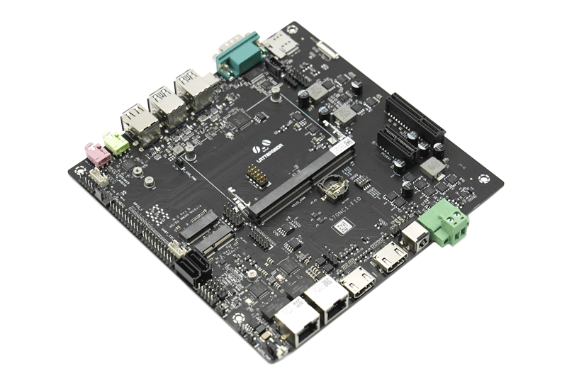
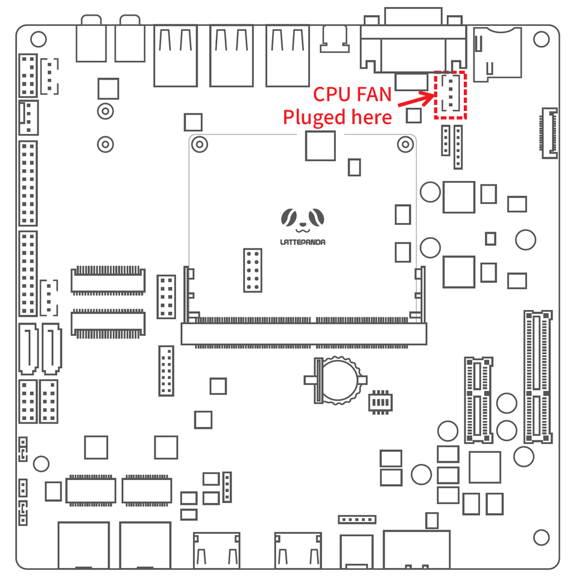
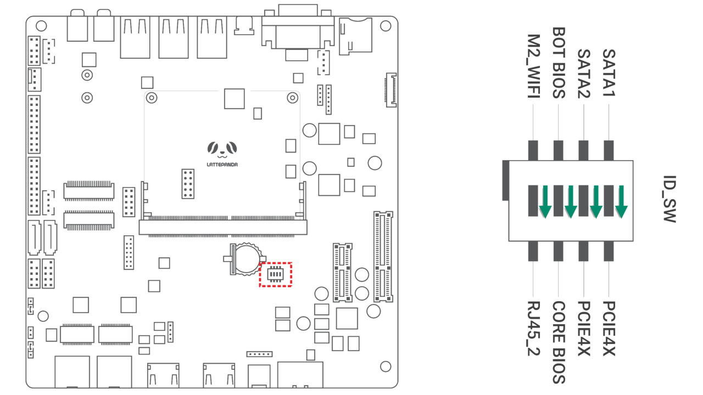
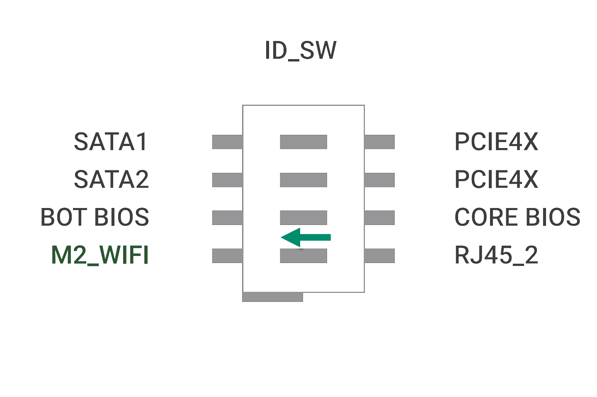
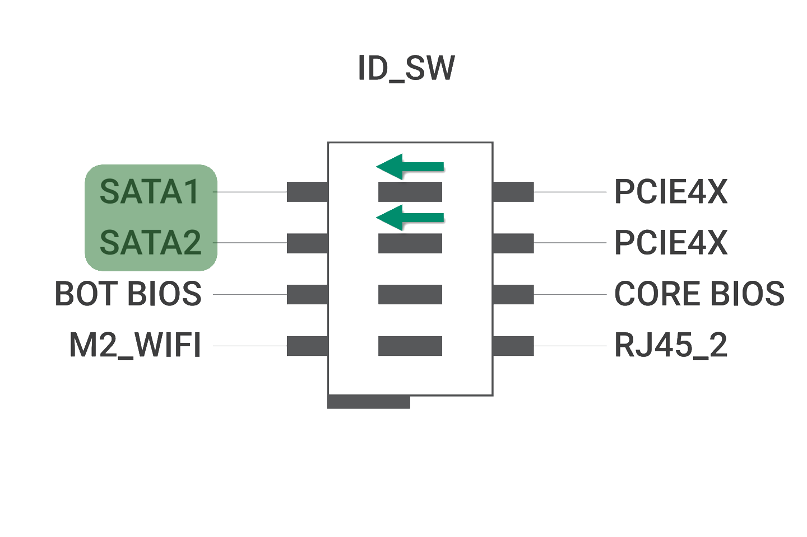
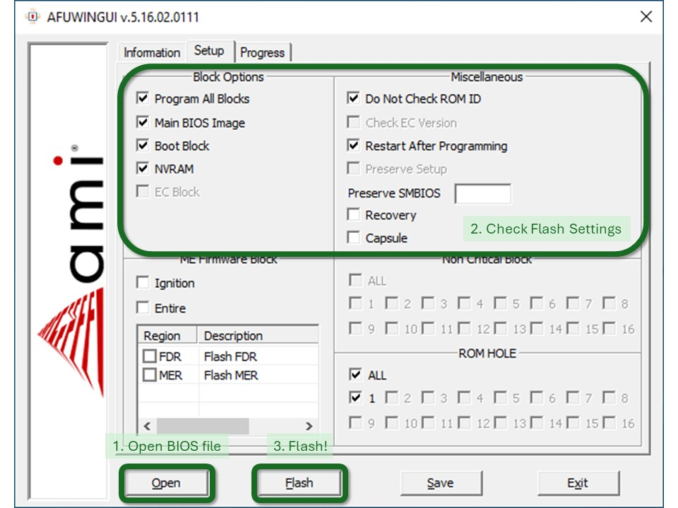
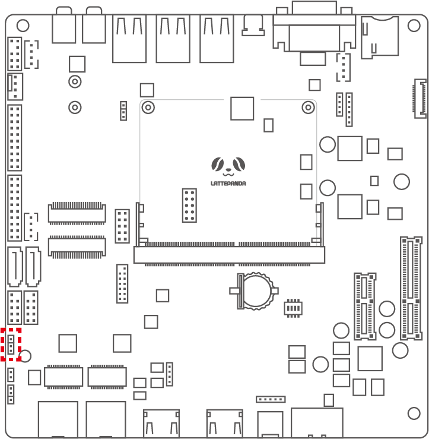
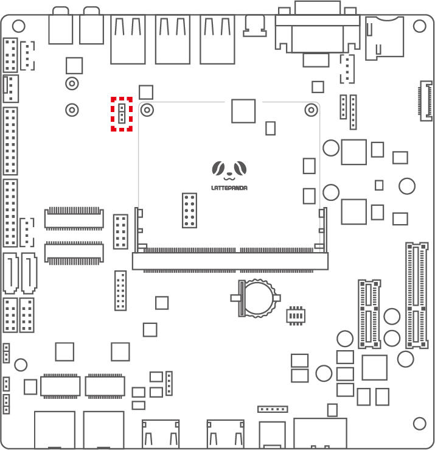
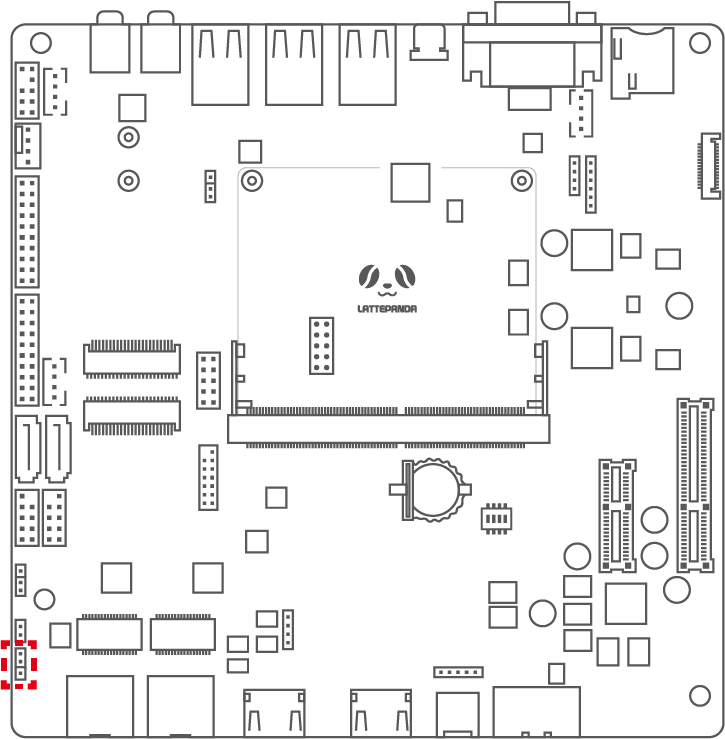

# DFR1141 Full Eval Carrier

{ width="400" }

## Introduction

This is a full-function evaluation carrier board which exposes all the pins of the LattePanda Mu compute module, providing an ideal platform for evaluating and developing each pin. With a wealth of onboard interfaces and expansion slots, it supports the connection of various peripherals and modules, greatly facilitating the testing of hardware and software and their compatibility evaluation, thus shortening the development time.

???+ danger

    - 🔌 Before inserting/removing the LattePanda Mu or connecting/disconnecting any type of ribbon cable and internal interface, ensure that the power is completely disconnected and wait for the power indicator light on the carrier board to turn off.
    - ❗ All pin headers operate at 3.3V levels; do NOT connect 5V peripherals.
    - 🔥 If installing high-powered expansion cards such as graphics cards into the PCIe x4 slot, verify that the power supply is sufficient.
    - ⚡ The CPU FAN must be plugged into the corresponding connector, otherwise the fan may be damaged.  
        { width="512" }

## Get Started

1. Install the heatsink onto the LattePanda Mu.
2. Insert the LattePanda Mu equipped with a heatsink at a 30° angle into the slot, then press down. Secure the LattePanda Mu with fixing screws.
3. Connect the heatsink fan, eDP ribbon cable, and other internal peripherals as required.
4. Install the RTC battery.
5. Check DIP switch configuration as follows[^1]  
    { width="400" }  
6. Connect the power supply and press the power button to start the device.

[^1]: Default Config: Use BIOS ROM on Mu; Enable 2nd ethernet port, PCIe x4 Slot; Disable SATA, M.2 E Key.

Because the RTC loses power, the initial boot may be slow and the system may automatically restart 1-2 times. Please be patient. After the first boot, as long as the RTC remains powered, the boot speed will return to normal.

## Function Configuration

### Enable M.2 E Key

The M.2 E Key slot is multiplexed with the second 2.5GbE NIC and disabled by default.

If you need to enable the M.2 E Key, power off first and set it up as follows:

{ width=320 }

After enable M.2 E Key slot, the second 2.5GbE NIC will be disabled.

### Enable SATA

Enabling SATA ports involves modifying the CPU I/O configuration, so you need to flash [the BIOS of the SATA branch](https://github.com/LattePandaTeam/LattePanda-Mu/tree/main/Softwares/BIOS/SATA). The procedure is as follows

1. Flash the SATA branch BIOS into the carrier ROM according to [the carrier second BIOS flashing tutorial](#flashing-carriers-bios).
2. Power off, switch ID_SW to SATA side  
    { width=320 }
3. Installing and using SATA hard disks

### Flashing Carrier's BIOS

The Full Eval Carrier is equipped with a second BIOS ROM. So you only need to flash the second BIOS on the carrier to test new functions, and avoid modifying the main BIOS on the core board.

This way, no matter what errors occur in the second BIOS, you can still boot up using the main BIOS.

=== "1. Download"

    - Download flashing tool [AfuWin64](https://github.com/LattePandaTeam/LattePanda-Mu/raw/main/Softwares/BIOS/Tools/AfuWin64.zip)
    
    - Download BIOS version you need at [BIOS repo](https://github.com/LattePandaTeam/LattePanda-Mu/tree/main/Softwares/BIOS)  
        If you are trying to switch to SATA branch, please download [this BIOS](https://github.com/LattePandaTeam/LattePanda-Mu/raw/main/Softwares/BIOS/SATA/LP-BS-S70NC1R200-SR-A-SATA.bin.zip) directly

    - Unzip all the files you downloaded

=== "2. Boot and switch BIOS"

    1. Switch `ID_SW` on `CORE BIOS` side to boot up, which is using the LattePanda Mu main BIOS.
    
    2. After entering the operating system, switch `ID_SW` to `BOT BIOS` side. The circuit is now switched to the second BIOS

=== "3. Flash BIOS"

    1. Open `AFUWINGUIx64`, select the BIOS file you need to flash, and set the flashing block as shown below  
        {width=400}
    
    2. After flashing, turn off, unplug the power, press and hold the power button for 10s to clear RTC and reset BIOS setting.

    3. Keep `ID_SW` on `BOT BIOS` side, plug in power supply and turn on, then the second BIOS will be used.

!!! note
    Due to clearing RTC and resetting settings, the initial boot up may be slow and will automatically reboot several times. Please wait for the boot to complete.

### USB Power Control

The USB ports on the evaluation board are controlled in two groups, allowing control over whether USB ports continue to supply power after the system is powered down.

=== "F_USB_PWR"

    The F_USB_PWR controls the power mode of the F_USB1 pin header

    {width=320}

    | Jumper | Setting | Function |
    | :----: |  :----: |  -------- |
    | {width=64} | Short 1-2 | Enable USB power supply during power-on and sleep |
    | {width=64} | Short 2-3 | Always enable USB power supply |

=== "R_USB_PWR"

    The R_USB_PWR controls the power mode for the front two USB 2.0 and four USB 3.0 ports

    {width=320}

    | Jumper | Setting | Function |
    | :----: |  :----: |  -------- |
    | {width=64} | Short 1-2 | Enable USB power supply during power-on and sleep |
    | {width=64} | Short 2-3 | Always enable USB power supply |

### Auto Power-On

The auto power-on jumper enables you to set the LattePanda Mu to either automatically power on or not when power is applied.

{width=320}

| Jumper | Setting | Function |
| :----: |  :----: |  -------- |
| {width=64} | Short 1-2 | Enable auto power-on upon receiving power |
| {width=64} | Short 2-3 | Disable auto power-on upon receiving power |

The auto power-on function is hardware-implemented, so it is not affected by the BIOS or operating system.

## Compatibility List

### Power Supply Compatibility

Compatible with power adapters outputting a voltage between 12~19V and delivering a minimum output power of 45W.

The above is the basic power supply requirement for only installing the LattePanda Mu. If you need to expand for other high-power components such as a graphics card, please reassess the aggregate power demand and use a suitable power adapter.

### M.2 WLAN Module Compatibility

Compatible with M.2 E Key 2230 WLAN network cards, supporting only the PCIe protocol, not the CNVio protocol.

Tested M.2 WLAN modules include:

- [Intel® Wi-Fi 6E AX210](https://www.dfrobot.com/product-2325.html)
- Intel® Wi-Fi 6 AX200
- Intel® Wireless-AC 9260
- [Intel® Dual Band Wireless-AC 8265](https://www.dfrobot.com/product-1998.html)
- Intel® Dual Band Wireless-AC 8260

This list includes only the modules we have verified. If you have successfully tested modules not listed here and they function properly, we encourage you to submit a pull request to include them.

### SATA Compatibility

Compatible with standard SATA mechanical hard drives and solid-state drives, ith no special requirements noted.

### M.2 NVMe SSD Compatibility

The DFR1141 does not have an integrated M.2 M Key slot, so you need to use the included adapter to install an M.2 M Key SSD.

The adapter is compatible with standard M.2 2280 M Key PCIe NVMe protocol solid-state drives, with no special requirements noted.

### M.2 WWAN Module Compatibility

Compatible with M.2 B Key WWAN modules of sizes 3042, 3052, using the USB 2.0 or USB3.0 protocol. Not compatible with M.2 WWAN modules using the PCIe protocol.

Tested M.2 WWAN modules include:

- [SIMCom SIM7600G-H-M2](https://www.dfrobot.com/product-2643.html)
- [SIMCom SIM8262E-M2](https://www.dfrobot.com/product-2635.html)
- [SIMCom SIM8262A-M2](https://www.dfrobot.com/product-2636.html)
- AirPrime EM7455

This list includes only the modules we have verified. If you have successfully tested modules not listed here and they function properly, we encourage you to submit a pull request to include them.

### PCIe Expansion Card Compatibility

Compatible with common standard PCIe expansion cards. If you need to insert high-power expansion cards, please check if the power adapter's power is sufficient.

When using the M.2 NVMe SSD adapter card, it will occupy one PCIe expansion slot.

## Interface Pinouts

Work in progress.

Please refer to the paper manual inside the package first.

## Design Documentation

Full Eval Carrier for LattePanda Mu provides full schematics and PCB drawings. You can download them at [LattePanda Mu GitHub repository](https://github.com/LattePandaTeam/LattePanda-Mu/tree/main/Electricals/Examples/%5BDFR1141%5DFull%20EVA%20Carrier%20for%20LattePanda%20Mu).
