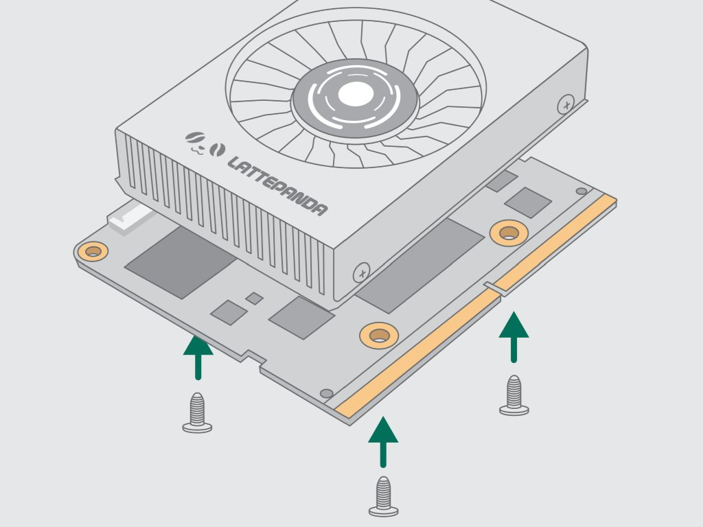
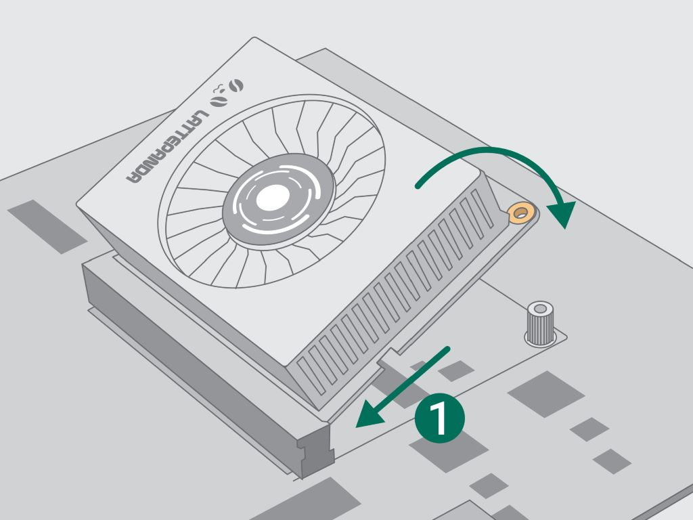
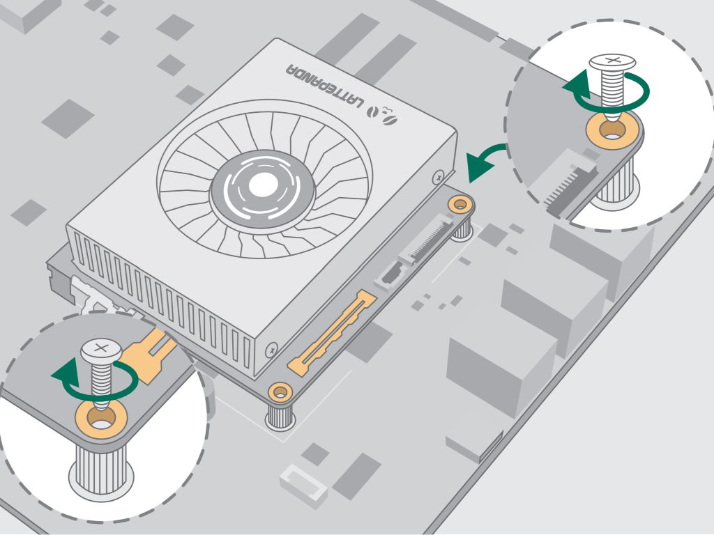

# Initial Setup

This chapter will show how to install and start with your LattePanda Mu at the first time.

!!! danger "Maybe you've already seen it, but I'll say it again."
    Remember to completely disconnect the power input before plugging or unplugging the LattePanda Mu.

## Install Heatsink

LattePanda Mu must be used with a heatsink. Due to the small area of the chip, the heat density is quite high even in the lowest power configurations.

1. Remove the heatsink screws, and remove the heatsink silicone protection.

2. Lay the heatsink flat on a table, align the LattePanda Mu's screw holes with the heatsink's nut posts, and hold them in place by hand.

3. Install the mounting screws. Cycle each screw, 1 turn at a time, until it is in place.  
    Do not tighten one screw completely at once, as uneven pressure may damage the CPU.

## Install Mu on Carrier

1. Remove the fixing screws on the carrier

2. Tilt the LattePanda Mu into the Slot  

3. Press down the LattePanda Mu and install screws.  

4. Connect the appropriate power supply according to the requirements of the carrier board, and TURN ON!

[**:simple-discord: Join our Discord**](https://discord.gg/RkSvc9g7eU){ .md-button .md-button--primary }