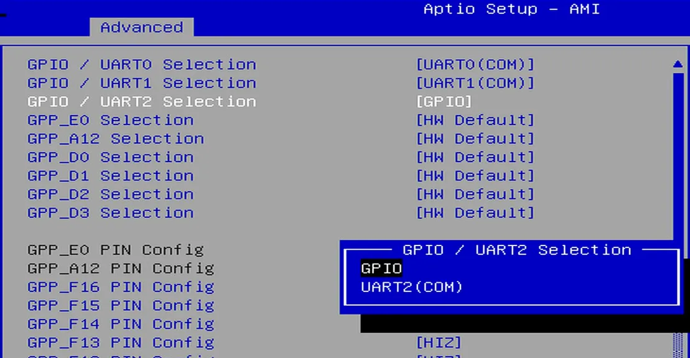

## UART Pinout Assignment

The LattePanda Mu compute module provides up to 4 UART ports.

Users can read from and write to these ports using standard serial terminal tools. Various serial monitors are available for Windows, while Linux users can utilize tools like CuteCom.

The pin locations and corresponding system port mappings are detailed below:

| **Pin#(Edge Connector)** | Pin Name | Note |
| ------------------------ | -------- | ---- |
| 10                     | SIO_UART_TX | UART exposed from SuperIO; <br>Typically mapped as `COM1` in Windows or `/dev/ttyS0` in Linux |
| 12                      | SIO_UART_RX | As above |
| 139                      | SOC_UART0_TXD | UART0 exposed from PCH; <br/>Typically mapped as `COM2` in Windows or `/dev/ttyS4` in Linux |
| 137                      | SOC_UART0_RXD | As above |
| 143                      | SOC_UART1_TXD | UART1 exposed from PCH; <br/>Typically mapped as `COM3` in Windows or `/dev/ttyS5` in Linux |
| 141                      | SOC_UART1_RXD | As above |
| 138                      | SOC_UART2_TXD  | UART2 exposed from PCH; <br/>Typically mapped as `COM4` in Windows or `/dev/ttyS6` in Linux |
| 140                      | SOC_UART2_RXD  | As above |

!!!tip "BIOS Firmware Requirement"

    To ensure the port mapping matches the table above, the BIOS version must be `S70NC1R200-8G/16G-A` or `S70NC1R200-8G/16G-A-SATA` (Build Date: 2025/12/19) or newer.
    
    Older BIOS versions may cause duplicate serial port mappings or mappings that don't match the table above. If upgrading from an older BIOS version:
    
    - Windows: It is recommended to uninstall all COM devices in Device Manager and reboot the system to refresh the mapping.
    - Linux: A simple system reboot is sufficient.


## I2C Pinout Assignment

The LattePanda Mu compute module provides up to 4 I2C ports.

The pin locations are detailed below:

| **Pin#(Edge Connector)** | Pin Name |
| ------------------------ | -------- |
| 154                   | I2C2_SCL |
| 156                    | I2C2_SDA |
| 150                    | I2C3_SCL |
| 152                    | I2C3_SDA |
| 146                     | I2C4_SCL |
| 148                     | I2C4_SDA |
| 142                    | I2C5_SCL |
| 144                     | I2C5_SDA |

All the pins mentioned above are pulled up to 3.3 V via 2.2 kΩ resistors inside the compute module.

## I2C Programming in Linux

Please refer to the ["How to Use the I2C Pins on LattePanda Mu in Ubuntu OS"](https://www.lattepanda.com/forum/topic/336132) post in our forum.


## GPIO Pinout Assignment

The LattePanda Mu compute module currently provides up to 17 GPIO pins that can be configured as either inputs or outputs. You can execute scripts within the system to control these GPIOs to read signals from or send signals to peripheral devices.

The pin locations and their default functions are listed in the table below:

| **Pin#(Edge Connector)** | Pin Name                | Default Function |
| ------------------------ | ----------------------- | ---------------- |
| 126                      | GPP_F12                 | GPIO             |
| 124                      | GPP_F13                 | GPIO             |
| 122                      | GPP_F14                 | GPIO             |
| 120                      | GPP_F15                 | GPIO             |
| 118                      | GPP_F16                 | GPIO             |
| 119                      | GPP_E0                  | WWAN_PWR_EN      |
| 121                      | GPP_A12                 | CAM_PWR_EN       |
| 139                      | SOC_UART0_TXD / GPP_H11 | UART0_TXD        |
| 137                      | SOC_UART0_RXD / GPP_H10 | UART0_RXD        |
| 143                      | SOC_UART1_TXD / GPP_D18 | UART1_TXD        |
| 141                      | SOC_UART1_RXD / GPP_D17 | UART1_RXD        |
| 138                      | SOC_UART2_TXD / GPP_F2  | UART2_TXD        |
| 140                      | SOC_UART2_RXD / GPP_F1  | UART2_RXD        |
| 128                      | GPP_D0                  | WWAN_PWR_EN      |
| 130                      | GPP_D1                  | WWAN_RST         |
| 132                      | GPP_D2                  | IT8851_INT       |
| 134                      | GPP_D3                  | CAM_PWR_EN       |

## GPIO Features

- 3.3V I/O voltage levels

- Floating input or push-pull output

- Defaults to high-impedance state after OS boot or reboot

- Routed directly from the processor PCH

!!!warning

    Since these GPIOs originate directly from the processor's PCH, special care must be taken during use.<br>Overvoltage, overcurrent, and short circuits are strictly prohibited, as any damage to the pins is irreparable.

## BIOS Requirements

GPIO function requires BIOS support. Please ensure that the BIOS version used by your LattePanda Mu module is *S70NC1R200-8G/16G-A* or higher.

If you are using an older version such as *LP-BS-S70NC1R200-SR/DR-B*, please refer to the [Update BIOS Firmware](bios_setup.md#update-bios-firmware) section to complete a BIOS update.

## Switch Multiplexed Pins to GPIO Mode

GPP_F12 to GPP_F16 pins can be used directly as GPIOs without requiring any BIOS configuration. 

The remaining pins are not set to GPIO by default and must be switched to GPIO mode in the BIOS.

 **Switching Steps:**

- Power-on or restart LattePanda board, press ++del++ to enter the BIOS setup.

- Navigate to the `GPIO Configuration` option  via the following path: `Advanced -> GPIO Configuration`.

- Configure the required pins to GPIO mode.

     For example: If you do not need to use UART2 but wish to use the UART2 TXD and RXD pins as GPIOs, select "GPIO" as shown in the figure below.
     {width="600" }

- Navigate to the `Save & Exit page` and select  `Save Changes and Exit`option to save the BIOS settings and restart the LattePanda board.


## GPIO Address

For LattePanda Mu modules (Intel N100 or N305 processor), the underlying GPIO controller is mapped to `gpiochip0` with the device identifier `[INTC1057:00]`.

You can verify the controller status using the `gpiodetect` command from the terminal:

```bash
sudo apt update
sudo apt install gpiod
sudo gpiodetect
```
The line offsets corresponding to each GPIO pin are detailed in the following table:

| Pin Name                | **Line Offset** |
| ----------------------- | --------------- |
| GPP_F12                 | 300             |
| GPP_F13                 | 301             |
| GPP_F14                 | 302             |
| GPP_F15                 | 303             |
| GPP_F16                 | 304             |
| GPP_E0                  | 320             |
| GPP_A12                 | 76              |
| SOC_UART0_TXD / GPP_H11 | 171             |
| SOC_UART0_RXD / GPP_H10 | 170             |
| SOC_UART1_TXD / GPP_D18 | 210             |
| SOC_UART1_RXD / GPP_D17 | 209             |
| SOC_UART2_TXD / GPP_F2  | 290             |
| SOC_UART2_RXD / GPP_F1  | 289             |
| GPP_D0                  | 192             |
| GPP_D1                  | 193             |
| GPP_D2                  | 194             |
| GPP_D3                  | 195             |

## GPIO Programming in Linux

In Linux OS, the Python or C version of the **libgpiod** can be used for GPIO programming.

The following demonstration uses an Ubuntu OS(either version 22.04 or 24.04) to control the GPP_F12 pin as an example.

### libgpiod Python

#### Environment Preparation

- Install the Python gpiod library

  ```bash
  sudo apt update
  sudo apt install python3-libgpiod
  ```
  :warning: This case uses gpiod library from the system repository, installed via `apt install python3-libgpiod` — not the PyPI version installed via `pip install gpiod`.

#### Outputting High and Low Signals

The following code sets the GPP_F12 pin to output mode and toggles the output level signal every second.

-  Save the following code as a Python file, for example, `gpio_toggle_demo.py`.

```python
import gpiod
import time
import sys

# ================= Configuration =================
# Hardware: LattePanda Mu (Intel N100/N305)
# Chip: [INTC1057:00] -> gpiochip0
CHIP_NAME = 'gpiochip0'

# Pin Definition (Mapping Name to Line Offset)
PIN_GPP_F12 = 300

# Select the target pin for this demo
TARGET_LINE_OFFSET = PIN_GPP_F12
# ===============================================

def main():
    chip = None
    line = None

    try:
        # 1. Initialize Chip
        chip = gpiod.Chip(CHIP_NAME)
        
        # 2. Get the specific line (GPP_F12)
        line = chip.get_line(TARGET_LINE_OFFSET)

        # 3. Request Control
        # Set direction to OUTPUT
        line.request(consumer="GPIO_Toggle_Demo", type=gpiod.LINE_REQ_DIR_OUT)

        print(f"Demo Started: Blinking Pin GPP_F12 (Line {TARGET_LINE_OFFSET})...")
        print("Press Ctrl+C to stop.")

        # 4. Main Loop
        while True:
            # Set High Level
            line.set_value(1)
            print(f"[{time.strftime('%H:%M:%S')}] GPIO -> HIGH (1)")
            time.sleep(1)

            # Set Low Level
            line.set_value(0)
            print(f"[{time.strftime('%H:%M:%S')}] GPIO -> LOW  (0)")
            time.sleep(1)

    except KeyboardInterrupt:
        print("\nDemo stopped by user (Ctrl+C).")
        
    except Exception as e:
        print(f"An error occurred: {e}")

    finally:
        # 5. Clean up resources
        # The 'finally' block GUARANTEES this runs even after Ctrl+C
        if line:
            line.release()
            print("GPIO Line released.")
        if chip:
            chip.close()
            print("GPIO Chip closed.")

if __name__ == "__main__":
    main()
```

- Navigate to the directory containing the `gpio_toggle_demo.py` file and run the following command in the terminal. You will observe the GPP_F12 pin outputting high and low signals at approximately 1-second intervals.

  ```bash
  sudo python3 gpio_toggle_demo.py
  ```

#### Reading High and Low Signals

The following code sets the GPP_F12 pin to input mode and read its level status at one-second intervals.

```python
import gpiod
import time

# ================= Configuration =================
# Hardware: LattePanda Mu
# Chip: gpiochip0
# Pin: GPP_F12 -> Line Offset 300
CHIP_NAME = 'gpiochip0'
PIN_GPP_F12 = 300
# ===============================================

def main():
    chip = None
    line = None

    try:
        # 1. Initialize Chip
        chip = gpiod.Chip(CHIP_NAME)
        
        # 2. Get the line
        line = chip.get_line(PIN_GPP_F12)

        # 3. Request Control as INPUT
        # We specify LINE_REQ_DIR_IN for input mode
        line.request(consumer="GPIO_Input_Demo", type=gpiod.LINE_REQ_DIR_IN)

        print(f"Demo Started: Reading Input from GPP_F12 (Line {PIN_GPP_F12})...")
        print("Connect this pin to GND or VCC (3.3V) to see changes.")
        print("Press Ctrl+C to stop.")

        # 4. Main Loop
        while True:
            # Read current value (0 or 1)
            value = line.get_value()
            
            print(f"[{time.strftime('%H:%M:%S')}] Input Value: {value}")
            
            # Wait 1 second
            time.sleep(1)

    except KeyboardInterrupt:
        print("\nDemo stopped by user.")
    except Exception as e:
        print(f"Error: {e}")
    finally:
        # 5. Cleanup
        if line:
            line.release()
        if chip:
            chip.close()
        print("Resources released.")

if __name__ == "__main__":
    main()
```

### libgpiod C

#### Environment Preparation

- Install the C gpiod library

  ```bash
  sudo apt update
  sudo apt install libgpiod-dev
  ```

#### Outputting High and Low Signals

The following code sets the GPP_F12 pin to output mode and toggles the output level signal every second.

- Save the following code as a C file, for example, `gpio_toggle_demo.c`.

  ```c
  #include <gpiod.h>
  #include <stdio.h>
  #include <unistd.h>
  #include <signal.h>
  #include <stdbool.h>
  
  // ================= Configuration =================
  // Hardware: LattePanda Mu (Intel N100/N305)
  // Chip: gpiochip0
  // Pin: GPP_F12 -> Line Offset 300
  // ===============================================
  
  #define CHIP_NAME "gpiochip0"
  #define PIN_GPP_F12 300
  
  // Flag for the main loop, modified by signal handler
  static volatile sig_atomic_t keep_running = 1;
  
  // Signal Handler for Ctrl+C
  void signal_handler(int sig) {
      keep_running = 0;
  }
  
  int main(void) {
      struct gpiod_chip *chip;
      struct gpiod_line *line;
      int ret;
  
      // 1. Register signal handler (Ctrl+C)
      signal(SIGINT, signal_handler);
  
      // 2. Open the GPIO Chip
      chip = gpiod_chip_open_by_name(CHIP_NAME);
      if (!chip) {
          perror("Open chip failed");
          return 1;
      }
  
      // 3. Get the specific line
      line = gpiod_chip_get_line(chip, PIN_GPP_F12);
      if (!line) {
          perror("Get line failed");
          gpiod_chip_close(chip);
          return 1;
      }
  
      // 4. Request the line as OUTPUT
      // "LattePanda_C_Demo" is the consumer label visible in gpioinfo
      ret = gpiod_line_request_output(line, "GPIO_Toggle_Demo", 0);
      if (ret < 0) {
          perror("Request line as output failed");
          gpiod_chip_close(chip);
          return 1;
      }
  
      printf("Demo Started: Blinking Pin GPP_F12 (Line %d)...\n", PIN_GPP_F12);
      printf("Press Ctrl+C to stop.\n");
  
      // 5. Main Loop
      while (keep_running) {
          // Set High
          gpiod_line_set_value(line, 1);
          printf("GPIO -> HIGH (1)\n");
          sleep(1);
  
          if (!keep_running) break;
  
          // Set Low
          gpiod_line_set_value(line, 0);
          printf("GPIO -> LOW  (0)\n");
          sleep(1);
      }
  
      // 6. Cleanup Resources
      printf("\nReleasing resources...\n");
      gpiod_line_release(line);
      gpiod_chip_close(chip);
      printf("Done.\n");
  
      return 0;
  }
  ```

- Navigate to the directory containing the `gpio_toggle_demo.c` file and run the following command in the terminal. You will observe the GPP_F12 pin outputting high and low signals at approximately 1-second intervals.

  ```bash
  gcc -o gpio_toggle_demo gpio_toggle_demo.c -lgpiod
  sudo ./gpio_toggle_demo
  ```

#### Reading High and Low Signals

The following code sets the GPP_F12 pin to input mode and read its level status at one-second intervals.

```c
#include <gpiod.h>
#include <stdio.h>
#include <unistd.h>
#include <signal.h>

// ================= Configuration =================
#define CHIP_NAME "gpiochip0"
#define PIN_GPP_F12 300
// ===============================================

static volatile sig_atomic_t keep_running = 1;

// Signal Handler for graceful exit
void signal_handler(int sig) {
    keep_running = 0;
}

int main(void) {
    struct gpiod_chip *chip;
    struct gpiod_line *line;
    int value;
    int ret;

    signal(SIGINT, signal_handler);

    // 1. Open Chip
    chip = gpiod_chip_open_by_name(CHIP_NAME);
    if (!chip) {
        perror("Open chip failed");
        return 1;
    }

    // 2. Get Line
    line = gpiod_chip_get_line(chip, PIN_GPP_F12);
    if (!line) {
        perror("Get line failed");
        gpiod_chip_close(chip);
        return 1;
    }

    // 3. Request as INPUT
    ret = gpiod_line_request_input(line, "GPIO_Input_Demo");
    if (ret < 0) {
        perror("Request input failed");
        gpiod_chip_close(chip);
        return 1;
    }

    printf("Demo Started: Reading Input from GPP_F12 (Line %d)...\n", PIN_GPP_F12);
    printf("Press Ctrl+C to stop.\n");

    // 4. Main Loop
    while (keep_running) {
        // Read Value
        value = gpiod_line_get_value(line);
        
        if (value < 0) {
            perror("Read value failed");
        } else {
            printf("Input Value: %d\n", value);
        }

        sleep(1);
    }

    // 5. Cleanup
    printf("\nReleasing resources...\n");
    gpiod_line_release(line);
    gpiod_chip_close(chip);
    
    return 0;
}
```
### libgpiod Programming Reference

- [libgpiod documentation](https://libgpiod.readthedocs.io/en/latest/index.html)


### GPIO Sysfs Interface

The `libgpiod` project provides a low-level C library, bindings to high-level languages and tools for interacting with the GPIO (General Purpose Input/Output) lines on Linux systems. 

It replaces the older, legacy GPIO sysfs interface, which has been deprecated in the Linux kernel. The newer GPIO character device interface (introduced in Linux kernel version 4.8) provides a more flexible and efficient way to interact with GPIO lines, and libgpiod is the primary tool for working with this interface.

However, if you still want to use the legacy GPIO sysfs interface, please follow the steps below.

#### GPIO Number

The sysfs interface uses a global GPIO numbering scheme. The formula is:

```
GPIO Number = Base Address + Offset Address
```

The base address of `gpiochip0 [INTC1057:00]` is fixed at 512.

**Example:**

If the target pin is `GPP_F12` and its offset address is 300.

So its global GPIO number is: 812

#### Output Control

Writing to the GPIO sysfs interface requires root privileges. It is recommended to switch to the root user first.

```bash
sudo -i
```

The following commands configure the `GPP_F12` pin as an output and toggle the voltage level.

```bash
cd /sys/class/gpio
echo 812 > export
cd gpio812
echo out > direction
# Set output to High (Logic 1)
echo 1 > value
# Set output to Low (Logic 0)
echo 0 > value
```

#### Read Input

The following commands configure the pin as an input and read the current level status.

```bash
# Ensure you are inside the gpio812 directory
echo in > direction
# Read current value(0 or 1) every 1 second
watch -n 1 cat value
```

#### Release Resource

After finishing your operations, it is good practice to release the GPIO pin:

```bash
cd /sys/class/gpio
echo 812 > unexport
```
