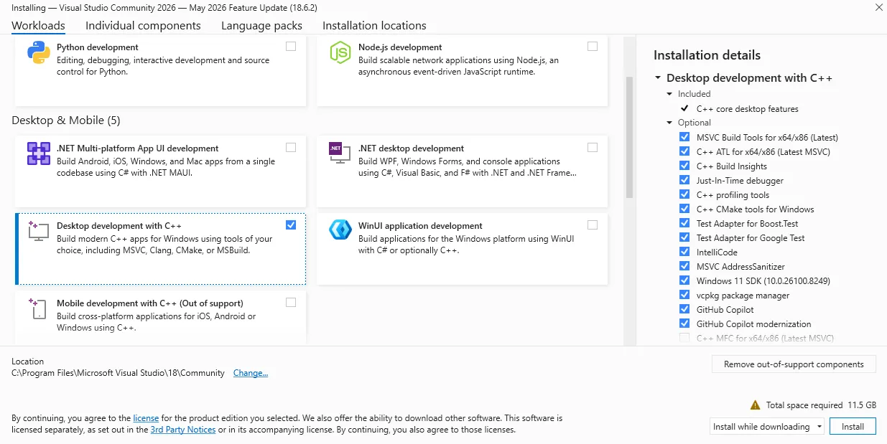
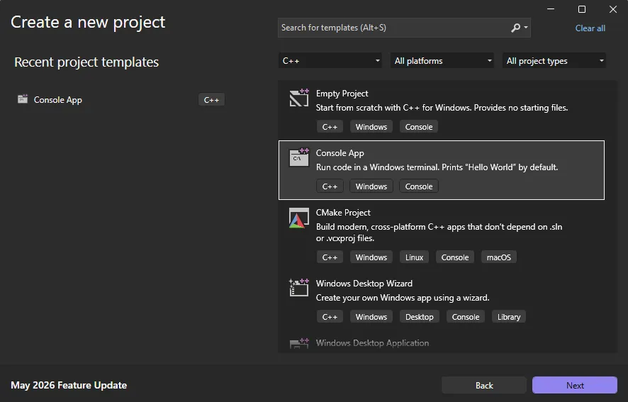
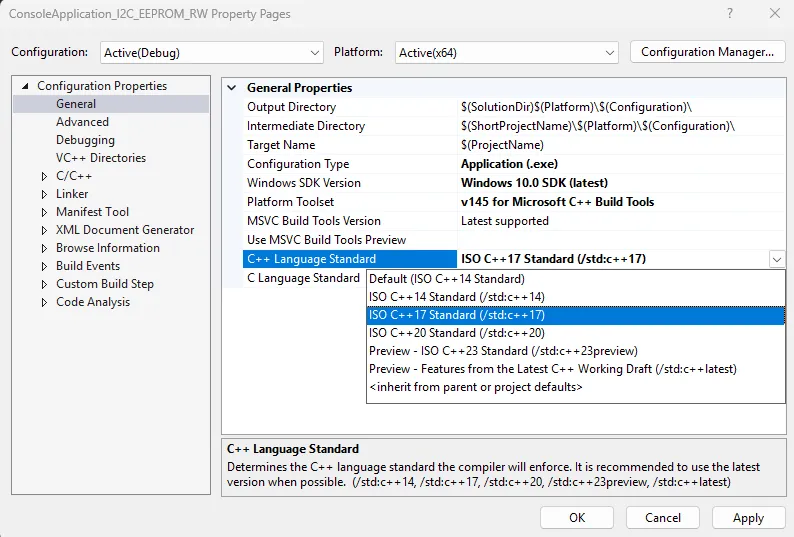

# Windows GPIO Programming - C++

This chapter guides you through programming UART, I2C, and GPIO interfaces on the LattePanda Mu under Windows using C++. It covers pinout mappings, BIOS requirements, Visual Studio setup, and provides ready-to-run examples using `Win32 serial APIs` and `C++/WinRT` for low-level hardware control.

## UART

### Pinout Assignment

The LattePanda Mu compute module provides up to 4 UART ports.

The pin locations and corresponding system port mappings are detailed below:

| **Pin#(Edge Connector)** | Pin Name | Note |
| ------------------------ | -------- | ---- |
| 10                     | SIO_UART_TX | UART exposed from SuperIO; <br>Typically mapped as `COM1` in Windows or `/dev/ttyS0` in Linux |
| 12                      | SIO_UART_RX | As above |
| 139                      | SOC_UART0_TXD | UART0 exposed from PCH; <br/>Typically mapped as `COM2` in Windows or `/dev/ttyS4` in Linux |
| 137                      | SOC_UART0_RXD | As above |
| 143                      | SOC_UART1_TXD | UART1 exposed from PCH; <br/>Typically mapped as `COM3` in Windows or `/dev/ttyS5` in Linux |
| 141                      | SOC_UART1_RXD | As above |
| 138                      | SOC_UART2_TXD  | UART2 exposed from PCH; <br/>Typically mapped as `COM4` in Windows or `/dev/ttyS6` in Linux |
| 140                      | SOC_UART2_RXD  | As above |

### Logic Level

All the UART pins mentioned above use 3.3V levels. Do not apply voltages higher than 3.3V.

### BIOS Requirement

To ensure the port mapping matches the table above, the BIOS version must be `S70NC1R200-8G-A` or the 16G variant or the SATA variant (Build Date: 2025/12/19) or higher.

Older BIOS versions may cause duplicate serial port mappings or mappings that don't match the table above. If upgrading from an older BIOS version:

  - Windows: It is recommended to uninstall all COM devices in Device Manager and reboot the system to refresh the mapping.
  - Linux: A simple system reboot is sufficient.


### Programming with C++ Win32 Serial

#### <span id="cplusplus-env">Environment Setup</span>

We will use C++ in Visual Studio as an example for illustration.

!!!note

    Since the Visual Studio consumes significant storage and computing resources, it is recommended to perform the following steps on your personal computer. Once compiled, the executable file could be transferred to and run in the LattePanda Mu's windows operating system.

- Download and install [Visual Studio](https://visualstudio.microsoft.com) (version 2022 or later is recommended). This guide uses Visual Studio 2026.

- Run the installer and configure the following options:

    - Select the `Desktop development with C++` under the `Workloads` tab.

        {width="1000" }

    - Keep other settings, including those in other tabs, as **default**.

- After installation, create a new project:

    - Choose `Console App (C++)` as the project type.
        {width="800" }

- Once the project is created, configure the following project properties before writing any code:

     - Right-click the project name in the solution explorer and select `Properties`. 

    - Change the `General`->`C++ Language Standard` to `C++ 17` or later.
    
        > This is required because the WinRT headers used in this project depend on C++17 features and will not compile on earlier standards.
        
        {width="1000" }
        


#### UART Loopback

The following sample is used to test the COM1 loopback.

- Copy the following code into your project's `.cpp` file.

    ```c++
    /**
     * @file UART.cpp
     * @hardware LattePanda Mu (Intel N100/N305)
     * @BIOS S70NC1R200-8G-A or later
     * @author LattePanda Team(https://www.lattepanda.com/)
     * @version V1.0
     * @date 2026-06
     * @license The MIT License (MIT)
     * @brief Serial loopback sample code. Short-circuit the TX and RX pins of the corresponding serial port before running this program.
     */
    
    
    // Suppress C++17 experimental coroutine deprecation warnings introduced by WinRT headers.
    // Safe to remove when the project is migrated to C++20.
    #define _SILENCE_EXPERIMENTAL_COROUTINE_DEPRECATION_WARNINGS
    
    #include <iostream>
    #include <string>
    #include <windows.h>
    
    #pragma comment(lib, "runtimeobject.lib")
    
    
    // Available COM ports on LattePanda Mu N100/N305:
    // COM1 - SIO_UART; COM2 - SOC_UART0; COM3 - SOC_UART1; COM4 - SOC_UART2
    static const char* DEFAULT_PORT     = "COM1";
    static const DWORD DEFAULT_BAUD     = 9600;
    static const DWORD READ_TIMEOUT_MS  = 1000;
    static const DWORD WRITE_TIMEOUT_MS = 1000;
    static const DWORD ECHO_DELAY_MS    = 500;   // Wait for loopback echo before reading
    
    namespace
    {
        volatile LONG g_stop = 0;
    
        BOOL WINAPI ConsoleHandler(DWORD signal)
        {
            if (signal == CTRL_C_EVENT || signal == CTRL_BREAK_EVENT || signal == CTRL_CLOSE_EVENT)
            {
                InterlockedExchange(&g_stop, 1);
                return TRUE;
            }
            return FALSE;
        }
    }
    
    static void PrintUsage(const char* exe)
    {
        std::cout << "Usage: " << exe << " [port] [baud]" << std::endl;
        std::cout << "  port  COM port name  (default: " << DEFAULT_PORT << ")" << std::endl;
        std::cout << "  baud  Baud rate      (default: " << DEFAULT_BAUD << ")" << std::endl;
        std::cout << std::endl;
        std::cout << "Available ports:" << std::endl;
        std::cout << "  COM1  SIO_UART" << std::endl;
        std::cout << "  COM2  SOC_UART0" << std::endl;
        std::cout << "  COM3  SOC_UART1" << std::endl;
        std::cout << "  COM4  SOC_UART2" << std::endl;
        std::cout << std::endl;
        std::cout << "Example: " << exe << " COM2 115200" << std::endl;
    }
    
    int main(int argc, char* argv[])
    {
        // Parse optional command-line arguments
        if (argc >= 2 && (std::string(argv[1]) == "-h" || std::string(argv[1]) == "--help"))
        {
            PrintUsage(argv[0]);
            return 0;
        }
    
        std::string portName = (argc >= 2) ? argv[1] : DEFAULT_PORT;
        DWORD       baudRate = (argc >= 3) ? static_cast<DWORD>(std::stoul(argv[2])) : DEFAULT_BAUD;
    
        SetConsoleCtrlHandler(ConsoleHandler, TRUE);
    
        // Open the COM port.
        // Prefix "\\\\.\\" is required for port numbers >= COM10, and harmless for lower numbers.
        std::string portPath = "\\\\.\\" + portName;
        HANDLE hPort = CreateFileA(
            portPath.c_str(),
            GENERIC_READ | GENERIC_WRITE,
            0,              // COM ports cannot be shared
            nullptr,
            OPEN_EXISTING,
            0,
            nullptr
        );
    
        if (hPort == INVALID_HANDLE_VALUE)
        {
            std::cerr << "Failed to open " << portName
                      << " (error " << GetLastError() << ")."
                      << " Check cable and port name." << std::endl;
            return 1;
        }
    
        // Configure baud rate and framing: 8N1
        DCB dcb = {};
        dcb.DCBlength = sizeof(dcb);
        if (!GetCommState(hPort, &dcb))
        {
            std::cerr << "GetCommState failed (error " << GetLastError() << ")." << std::endl;
            CloseHandle(hPort);
            return 1;
        }
    
        dcb.BaudRate = baudRate;
        dcb.ByteSize = 8;               // 8 data bits per frame
        dcb.Parity   = NOPARITY;        // No parity bit
        dcb.StopBits = ONESTOPBIT;      // 1 stop bit
    
        if (!SetCommState(hPort, &dcb))
        {
            std::cerr << "SetCommState failed (error " << GetLastError() << ")." << std::endl;
            CloseHandle(hPort);
            return 1;
        }
    
        // Set read/write timeouts to prevent indefinite blocking
        COMMTIMEOUTS timeouts = {};
        timeouts.ReadIntervalTimeout         = 0;
        timeouts.ReadTotalTimeoutMultiplier  = 0;
        timeouts.ReadTotalTimeoutConstant    = READ_TIMEOUT_MS;
        timeouts.WriteTotalTimeoutMultiplier = 0;
        timeouts.WriteTotalTimeoutConstant   = WRITE_TIMEOUT_MS;
    
        if (!SetCommTimeouts(hPort, &timeouts))
        {
            std::cerr << "SetCommTimeouts failed (error " << GetLastError() << ")." << std::endl;
            CloseHandle(hPort);
            return 1;
        }
    
        std::cout << "Serial port opened: " << portName << ", baud=" << baudRate << std::endl;
    
        // Transmit phase; Build the TX string and send it as raw bytes.
        std::string txString = "Hello from C++ " + portName
                             + " " + std::to_string(baudRate) + "\r\n";
    
        DWORD bytesWritten = 0;
        BOOL  writeOk = WriteFile(
            hPort,
            txString.c_str(),
            static_cast<DWORD>(txString.size()),
            &bytesWritten,
            nullptr
        );
    
        if (!writeOk || bytesWritten != txString.size())
        {
            std::cerr << "Write failed (error " << GetLastError() << ")." << std::endl;
            CloseHandle(hPort);
            return 1;
        }
    
        // Strip trailing CR/LF for cleaner console output
        std::string txPrint = txString;
        while (!txPrint.empty() && (txPrint.back() == '\r' || txPrint.back() == '\n'))
            txPrint.pop_back();
        std::cout << "Sent    : " << txPrint << std::endl;
    
        // Give the UART hardware time to echo the bytes back through the loopback wire
        Sleep(ECHO_DELAY_MS);
    
        // Receive phase; Read back up to 128 bytes. bytesRead may be less than the buffer size.
        std::cout << "Waiting for data..." << std::endl;
    
        char  rxBuf[128] = {};
        DWORD bytesRead  = 0;
        BOOL  readOk = ReadFile(hPort, rxBuf, sizeof(rxBuf) - 1, &bytesRead, nullptr);
    
        if (!readOk)
        {
            std::cerr << "Read failed (error " << GetLastError() << ")." << std::endl;
            CloseHandle(hPort);
            return 1;
        }
    
        if (bytesRead == 0)
        {
            std::cout << "No data received (timeout). Check loopback wire." << std::endl;
            CloseHandle(hPort);
            return 1;
        }
    
        // Decode only the bytes actually received, not the whole buffer
        std::string rxString(rxBuf, bytesRead);
        std::string rxPrint = rxString;
        while (!rxPrint.empty() && (rxPrint.back() == '\r' || rxPrint.back() == '\n'))
            rxPrint.pop_back();
        std::cout << "Received: " << rxPrint << std::endl;
    
        // Compare TX and RX payloads
        if (rxString == txString)
        {
            std::cout << "Result  : PASS (TX == RX)" << std::endl;
        }
        else
        {
            std::cout << "Result  : FAIL" << std::endl;
            std::cout << "  TX bytes: " << txString.size()
                      << ", RX bytes: " << bytesRead << std::endl;
        }
    
        // Always close the port handle to release the OS resource
        CloseHandle(hPort);
        std::cout << "Serial port closed." << std::endl;
    
        // Keep the console window open when launched by double-clicking in Explorer
        std::cout << "\nPress Ctrl+C to exit..." << std::endl;
        while (InterlockedCompareExchange(&g_stop, 0, 0) == 0)
        {
            Sleep(100);
        }
    
        return 0;
    }
    
    ```

- Short the TX and RX pins of the SIO_UART, then run the compiled executable; you will see the serial data loopback.


## I2C

### Pinout Assignment

The LattePanda Mu compute module provides up to 4 I2C ports.

The pin locations are detailed below:

| **Pin#(Edge Connector)** | Pin Name |
| ------------------------ | -------- |
| 154                   | I2C2_SCL |
| 156                    | I2C2_SDA |
| 150                    | I2C3_SCL |
| 152                    | I2C3_SDA |
| 146                     | I2C4_SCL |
| 148                     | I2C4_SDA |
| 142                    | I2C5_SCL |
| 144                     | I2C5_SDA |

!!!note

    If you are using the [DFR1141 Full Eval Carrier](https://www.dfrobot.com/product-2821.html), an I2C device(IT8851 chip) with address `0x40` is already present on the `I2C2` port. Therefore, avoid connecting any other I2C device with the same address to this port.

### Logic Level

All the I2C pins mentioned above are pulled up to 3.3 V via 2.2kΩ resistors inside the compute module. Do not apply voltages higher than 3.3V.

### BIOS Requirement

To ensure  the I2C ports can be controlled on Windows OS, the BIOS version must be `S70NC1R200-8G-B` or the 16G variant or the SATA variant (Build Date: 2026/06/03) or higher.

Older BIOS versions do not support this feature.


### Programming with C++ Windows.Devices.I2c

#### Environment Setup

- Refer to [the C++ environment setup of the UART chapter](#cplusplus-env).

#### I2C Bus Scanner

The following example is used to scan for device addresses on the I2C port.

- Copy the following code into your project's `.cpp` file.

    ```c++
     /**
     * @file I2C_Scan.cpp
     * @brief I2C bus scanner for LattePanda Mu using Windows.Devices.I2c.
     *        Probes each address in the valid 7-bit range and reports responding devices.
     * @Hardware LattePanda Mu (Intel N100/N305); I2C device
     * @BIOS S70NC1R200-8G-B or later
     * @author LattePanda Team(https://www.lattepanda.com/)
     * @version V1.0
     * @date 2026-06
     * @license The MIT License (MIT)
     */
    
    // Suppress C++17 WinRT coroutine deprecation warning; safe to remove when targeting C++20.
    #define _SILENCE_EXPERIMENTAL_COROUTINE_DEPRECATION_WARNINGS
    
    #include <iostream>
    #include <vector>
    #include <string>
    #include <windows.h>
    #include <winrt/base.h>
    #include <winrt/Windows.Foundation.h>
    #include <winrt/Windows.Foundation.Collections.h>
    #include <winrt/Windows.Devices.Enumeration.h>
    #include <winrt/Windows.Devices.I2c.h>
    
    using namespace winrt;
    using namespace Windows::Devices::Enumeration;
    using namespace Windows::Devices::I2c;
    
    #pragma comment(lib, "runtimeobject.lib")
    
    // ---------------------------------------------------------------------------
    // Default configuration
    // Available I2C buses on LattePanda Mu N100/N305: I2C2, I2C3, I2C4, I2C5
    // ---------------------------------------------------------------------------
    static const std::wstring DEFAULT_BUS_NAME = L"I2C2";
    constexpr int DEFAULT_FIRST_ADDRESS = 0x03;
    constexpr int DEFAULT_LAST_ADDRESS  = 0x77;
    
    namespace
    {
        volatile LONG g_stop = 0;
    
        BOOL WINAPI ConsoleHandler(DWORD signal)
        {
            if (signal == CTRL_C_EVENT || signal == CTRL_BREAK_EVENT || signal == CTRL_CLOSE_EVENT)
            {
                InterlockedExchange(&g_stop, 1);
                return TRUE;
            }
            return FALSE;
        }
    }
    
    static void PrintUsage(const char* progName)
    {
        std::cout << "Usage: " << progName << " [BusName]" << std::endl;
        std::cout << "  BusName  : I2C bus name (default: I2C2)" << std::endl;
        std::cout << "             Available buses: I2C2, I2C3, I2C4, I2C5" << std::endl;
        std::cout << "Examples:" << std::endl;
        std::cout << "  " << progName << std::endl;
        std::cout << "  " << progName << " I2C3" << std::endl;
    }
    
    int main(int argc, char* argv[])
    {
        std::wstring busName = DEFAULT_BUS_NAME;
    
        // Parse optional command-line argument: bus name
        if (argc >= 2)
        {
            std::string arg1(argv[1]);
            if (arg1 == "-h" || arg1 == "--help")
            {
                PrintUsage(argv[0]);
                return 0;
            }
            busName = std::wstring(arg1.begin(), arg1.end());
        }
    
        SetConsoleCtrlHandler(ConsoleHandler, TRUE);
        init_apartment();
    
        std::wcout << L"I2C scan started. bus=" << busName
                   << L", range=0x03-0x77, mode=hardware." << std::endl;
    
        // Enumerate the requested I2C controller by bus name
        hstring selector = I2cDevice::GetDeviceSelector(busName);
        DeviceInformationCollection devices = DeviceInformation::FindAllAsync(selector).get();
        if (devices.Size() == 0)
        {
            std::wcerr << L"No WinRT I2C controller found for bus: " << busName << std::endl;
            std::cerr  << "Check BIOS I2C enable/pin-mux settings." << std::endl;
            std::cerr  << "Available buses: I2C2, I2C3, I2C4, I2C5" << std::endl;
            return 1;
        }
    
        hstring deviceId = devices.GetAt(0).Id();
        std::vector<int> found;
    
        // Probe each address in the standard I2C scan range.
        // A successful Read() indicates a device acknowledged the address.
        for (int address = DEFAULT_FIRST_ADDRESS; address <= DEFAULT_LAST_ADDRESS; ++address)
        {
            try
            {
                I2cConnectionSettings settings(address);
                settings.BusSpeed(I2cBusSpeed::StandardMode);
                settings.SharingMode(I2cSharingMode::Shared);
    
                I2cDevice probe = I2cDevice::FromIdAsync(deviceId, settings).get();
                if (probe == nullptr)
                {
                    continue;
                }
    
                std::vector<uint8_t> readBuffer(1);
                probe.Read(readBuffer);
                found.push_back(address);
            }
            catch (...)
            {
                // No ACK or error — no device at this address, keep scanning.
            }
        }
    
        // Print results
        if (found.empty())
        {
            std::cout << "No device found." << std::endl;
        }
        else
        {
            std::cout << "Found " << found.size() << " device(s):";
            for (size_t i = 0; i < found.size(); ++i)
            {
                std::cout << (i == 0 ? " " : ", ")
                          << "0x" << std::hex << found[i] << std::dec;
            }
            std::cout << std::endl;
        }
    
        std::cout << "Scan completed. Press Ctrl+C to exit." << std::endl;
        while (InterlockedCompareExchange(&g_stop, 0, 0) == 0)
        {
            Sleep(100);
        }
    
        return 0;
    }
    ```

- Connect an I2C device to the corresponding I2C port, then run the compiled executable; you will see the address of the connected I2C device.


#### EEPROM Read and Write

The following example writes one byte to address `0x0000` of an [AT24C256 EEPROM Module(DFR0117)](https://www.dfrobot.com/product-429.html) and reads it back for verification.

- Copy the following code into your project's `.cpp` file.

  ```c++
  /**
   * @file I2C_EEPROM_RW.cpp
   * @brief Single-byte EEPROM read/write demo.
   * @target AT24C256 (256 Kbit / 32 KB, 16-bit memory address, I2C address 0x50–0x57)
   * @Hardware LattePanda Mu (Intel N100/N305); AT24C256 EEPROM Module(DFR0117)
   * @BIOS S70NC1R200-8G-B or later
   * @author LattePanda Team(https://www.lattepanda.com/)
   * @version V1.0
   * @date 2026-06
   * @license The MIT License (MIT)
   */
  
  // Suppress C++17 experimental coroutine deprecation warnings from WinRT headers.
  // Safe to remove when building with C++20 or later.
  #define _SILENCE_EXPERIMENTAL_COROUTINE_DEPRECATION_WARNINGS
  
  #include <iostream>
  #include <vector>
  #include <windows.h>
  #include <winrt/base.h>
  #include <winrt/Windows.Foundation.h>
  #include <winrt/Windows.Foundation.Collections.h>
  #include <winrt/Windows.Devices.Enumeration.h>
  #include <winrt/Windows.Devices.I2c.h>
  
  using namespace winrt;
  using namespace Windows::Devices::Enumeration;
  using namespace Windows::Devices::I2c;
  
  #pragma comment(lib, "runtimeobject.lib")
  
  namespace
  {
      volatile LONG g_stop = 0;
  
      BOOL WINAPI ConsoleHandler(DWORD signal)
      {
          if (signal == CTRL_C_EVENT || signal == CTRL_BREAK_EVENT || signal == CTRL_CLOSE_EVENT)
          {
              InterlockedExchange(&g_stop, 1);
              return TRUE;
          }
          return FALSE;
      }
  }
  
  // Block until Ctrl+C is pressed, then return the given exit code.
  // Call this instead of bare "return N" so the console window stays open
  // when the exe is launched by double-clicking in Windows Explorer.
  static int WaitAndExit(int code)
  {
      std::cout << "Press Ctrl+C to exit." << std::endl;
      while (InterlockedCompareExchange(&g_stop, 0, 0) == 0)
      {
          Sleep(100);
      }
      return code;
  }
  
  // Print usage and available bus names, then exit.
  static void PrintUsageAndExit(const char* argv0)
  {
      std::cout << "Usage: " << argv0 << " [busName] [deviceAddress] [writeData]\n"
                << "  busName       WinRT I2C bus name. Available: I2C2, I2C3, I2C4, I2C5 (default: I2C2)\n"
                << "  deviceAddress Target device address in hex, e.g. 0x50           (default: 0x50)\n"
                << "  writeData     One byte to write, in hex, e.g. 0xA5              (default: 0xA5)\n"
                << "\n"
                << "Example: " << argv0 << " I2C3 0x50 0xA5\n";
      exit(0);
  }
  
  int main(int argc, char* argv[])
  {
      // Default configuration.
      // Available I2C buses on LattePanda Mu N100/N305: I2C2, I2C3, I2C4, I2C5
      std::wstring busName    = L"I2C2";
      int          devAddress = 0x50;
      uint8_t      writeData  = 0xA5;
  
      // Register address to write/read (2-byte address, big-endian).
      constexpr uint16_t regAddress = 0x0000;
  
      if (argc >= 2)
      {
          std::string arg1(argv[1]);
          if (arg1 == "-h" || arg1 == "--help")
              PrintUsageAndExit(argv[0]);
  
          busName = std::wstring(arg1.begin(), arg1.end());
      }
      if (argc >= 3)
          devAddress = static_cast<int>(std::stoul(argv[2], nullptr, 16));
      if (argc >= 4)
          writeData = static_cast<uint8_t>(std::stoul(argv[3], nullptr, 16));
  
      SetConsoleCtrlHandler(ConsoleHandler, TRUE);
      init_apartment();
  
      std::wcout << L"I2C loopback test started."
                 << L" bus=" << busName
                 << L", deviceAddress=0x" << std::hex << devAddress << std::dec
                 << L", regAddress=0x0000"
                 << L", writeData=0x" << std::hex << static_cast<int>(writeData) << std::dec
                 << std::endl;
  
      // Enumerate the specified I2C controller.
      hstring selector = I2cDevice::GetDeviceSelector(busName.c_str());
      DeviceInformationCollection devices = DeviceInformation::FindAllAsync(selector).get();
      if (devices.Size() == 0)
      {
          std::cerr << "No WinRT I2C controller found for bus \""
                    << std::string(busName.begin(), busName.end())
                    << "\". Check BIOS I2C enable/pin mux settings.\n"
                    << "Available buses: I2C2, I2C3, I2C4, I2C5" << std::endl;
          return WaitAndExit(1);
      }
  
      hstring deviceId = devices.GetAt(0).Id();
  
      // Open the target device.
      I2cConnectionSettings settings(devAddress);
      settings.BusSpeed(I2cBusSpeed::StandardMode);
      settings.SharingMode(I2cSharingMode::Shared);
  
      I2cDevice device = I2cDevice::FromIdAsync(deviceId, settings).get();
      if (device == nullptr)
      {
          std::cerr << "Failed to open I2C device at address 0x"
                    << std::hex << devAddress << std::dec << std::endl;
          return WaitAndExit(1);
      }
  
      // --- Write phase ---
      // Write buffer layout: [regAddrHigh, regAddrLow, data]
      // Sends a 2-byte register address (0x0000) followed by 1 byte of data.
      std::vector<uint8_t> writeBuffer = {
          static_cast<uint8_t>((regAddress >> 8) & 0xFF),  // register address high byte
          static_cast<uint8_t>( regAddress        & 0xFF),  // register address low byte
          writeData
      };
  
      try
      {
          device.Write(writeBuffer);
          std::cout << "Write OK: reg=0x0000, data=0x"
                    << std::hex << static_cast<int>(writeData) << std::dec << std::endl;
      }
      catch (...)
      {
          std::cerr << "Write failed. Check that the EEPROM module is connected and the device address is correct." << std::endl;
          return WaitAndExit(1);
      }
  
      // Brief delay to allow the device to complete the write internally.
      Sleep(10);
  
      // --- Read phase ---
      // First write the register address, then read back 1 byte.
      std::vector<uint8_t> addrBuffer = {
          static_cast<uint8_t>((regAddress >> 8) & 0xFF),
          static_cast<uint8_t>( regAddress        & 0xFF)
      };
      std::vector<uint8_t> readBuffer(1, 0x00);
  
      try
      {
          device.WriteRead(addrBuffer, readBuffer);
          std::cout << "Read  OK: reg=0x0000, data=0x"
                    << std::hex << static_cast<int>(readBuffer[0]) << std::dec << std::endl;
      }
      catch (...)
      {
          std::cerr << "Read failed. Check that the EEPROM module is connected and the device address is correct." << std::endl;
          return WaitAndExit(1);
      }
  
      // --- Compare ---
      if (readBuffer[0] == writeData)
      {
          std::cout << "Result: PASS (write=0x" << std::hex << static_cast<int>(writeData)
                    << ", read=0x" << static_cast<int>(readBuffer[0]) << std::dec << ")" << std::endl;
      }
      else
      {
          std::cout << "Result: FAIL (write=0x" << std::hex << static_cast<int>(writeData)
                    << ", read=0x" << static_cast<int>(readBuffer[0]) << std::dec << ")" << std::endl;
      }
  
      return WaitAndExit(0);
  }
  
  ```

- Connect the AT24C256 to the corresponding I2C port, then run the compiled executable; the write/read result will be printed along with a pass/fail indicator (`OK` / `MISMATCH`). 


## GPIO

### Pinout Assignment

The LattePanda Mu compute module currently provides up to 17 GPIO pins that can be configured as either inputs or outputs. You can execute scripts within the system to control these GPIOs to read signals from or send signals to peripheral devices.

The pin locations and their default functions are listed in the table below:

| **Pin#(Edge Connector)** | Pin Name                | Default Function |
| ------------------------ | ----------------------- | ---------------- |
| 126                      | GPP_F12                 | GPIO             |
| 124                      | GPP_F13                 | GPIO             |
| 122                      | GPP_F14                 | GPIO             |
| 120                      | GPP_F15                 | GPIO             |
| 118                      | GPP_F16                 | GPIO             |
| 119                      | GPP_E0                  | WWAN_PWR_EN      |
| 121                      | GPP_A12                 | CAM_PWR_EN       |
| 139                      | SOC_UART0_TXD / GPP_H11 | UART0_TXD        |
| 137                      | SOC_UART0_RXD / GPP_H10 | UART0_RXD        |
| 143                      | SOC_UART1_TXD / GPP_D18 | UART1_TXD        |
| 141                      | SOC_UART1_RXD / GPP_D17 | UART1_RXD        |
| 138                      | SOC_UART2_TXD / GPP_F2  | UART2_TXD        |
| 140                      | SOC_UART2_RXD / GPP_F1  | UART2_RXD        |
| 128                      | GPP_D0                  | WWAN_PWR_EN      |
| 130                      | GPP_D1                  | WWAN_RST         |
| 132                      | GPP_D2                  | IT8851_INT       |
| 134                      | GPP_D3                  | CAM_PWR_EN       |

### GPIO Features

- 3.3V I/O voltage levels

- Floating input or push-pull output

- Defaults to high-impedance state after OS boot or reboot

- Routed directly from the processor PCH

!!!warning

    Since these GPIOs originate directly from the processor's PCH, special care must be taken during use.<br>Overvoltage, overcurrent, and short circuits are strictly prohibited, as any damage to the pins is irreparable.

### BIOS Requirement

GPIO control in windows OS requires BIOS support. Please ensure that the BIOS version used by LattePanda Mu module is `S70NC1R200-8G-B` or the 16G variant or the SATA variant (Build Date: 2026/06/04) or higher.

Older BIOS versions do not support this feature.

### Switch Multiplexed Pins to GPIO Mode

`GPP_F12` to `GPP_F16` pins can be used directly as GPIOs without requiring any BIOS configuration. 

The remaining pins are not set to GPIO by default and must be switched to GPIO mode in the BIOS.

 **Switching Steps:**

- Power-on or restart LattePanda board, press ++del++ to enter the BIOS setup.

- Navigate to the `GPIO Configuration` option  via the following path: `Advanced -> GPIO Configuration`.

- Configure the required pins to GPIO mode.

    >For example: If you do not need to use UART2 but wish to use the UART2 TXD and RXD pins as GPIOs, select "GPIO" as shown in the figure below.

    {width="600" }

- Navigate to the `Save & Exit page` and select  `Save Changes and Exit`option to save the BIOS settings and restart the LattePanda board.

### GPIO Address

The mapping between the physical pins and the pin numbers (used in the code) is shown in the table below.

| Pin Name                | **PIN Mapping Number** |
| ----------------------- | ---------------------- |
| GPP_A12                 | 0                      |
| GPP_E0                  | 1                      |
| GPP_D0                  | 2                      |
| GPP_D1                  | 3                      |
| GPP_D2                  | 4                      |
| GPP_D3                  | 5                      |
| GPP_F12                 | 6                      |
| GPP_F13                 | 7                      |
| GPP_F14                 | 8                      |
| GPP_F15                 | 9                      |
| GPP_F16                 | 10                     |
| SOC_UART0_RXD / GPP_H10 | 11                     |
| SOC_UART0_TXD / GPP_H11 | 12                     |
| SOC_UART1_RXD / GPP_D17 | 13                     |
| SOC_UART1_TXD / GPP_D18 | 14                     |
| SOC_UART2_RXD / GPP_F1  | 15                     |
| SOC_UART2_TXD / GPP_F2  | 16                     |


### Programming with C++ Windows.Devices.Gpio

#### Environment Setup

- Refer to [the C++ environment setup of the UART chapter](#cplusplus-env).

#### GPIO Output

The following code sets the `GPP_F12` pin to output mode and toggles the output level signal every second.

- Copy the following code into your project's `.cpp` file.

  ```c++
  /**
   * @file GPIO_Output.cpp
   * @brief GPIO toggle demo for LattePanda Mu using Windows.Devices.Gpio.
   * @Hardware LattePanda Mu (Intel N100/N305)
   * @BIOS S70NC1R200-8G-B or later
   * @author LattePanda Team(https://www.lattepanda.com/)
   * @version V1.0
   * @date 2026-06
   * @license The MIT License (MIT)
   */
  
  // Suppress WinRT experimental coroutine deprecation warning under C++17.
  // This can be removed once the project is upgraded to C++20.
  #define _SILENCE_EXPERIMENTAL_COROUTINE_DEPRECATION_WARNINGS
  
  #include <iostream>
  #include <string>
  #include <map>
  #include <windows.h>
  #include <winrt/base.h>
  #include <winrt/Windows.Foundation.h>
  #include <winrt/Windows.Devices.Gpio.h>
  
  using namespace winrt;
  using namespace Windows::Devices::Gpio;
  
  #pragma comment(lib, "runtimeobject.lib")
  
  // Mapping table: Physical GPIO pin name to WinRT pin number
  static const std::map<std::string, int> PIN_MAPPING = {
      { "GPP_A12",  0 },
      { "GPP_E0",   1 },
      { "GPP_D0",   2 },
      { "GPP_D1",   3 },
      { "GPP_D2",   4 },
      { "GPP_D3",   5 },
      { "GPP_F12",  6 },
      { "GPP_F13",  7 },
      { "GPP_F14",  8 },
      { "GPP_F15",  9 },
      { "GPP_F16", 10 },
      { "GPP_H10", 11 }, // SOC_UART0_RXD
      { "GPP_H11", 12 }, // SOC_UART0_TXD
      { "GPP_D17", 13 }, // SOC_UART1_RXD
      { "GPP_D18", 14 }, // SOC_UART1_TXD
      { "GPP_F1",  15 }, // SOC_UART2_RXD
      { "GPP_F2",  16 }, // SOC_UART2_TXD
  };
  
  namespace
  {
      volatile LONG g_stop = 0;
  
      BOOL WINAPI ConsoleHandler(DWORD signal)
      {
          if (signal == CTRL_C_EVENT || signal == CTRL_BREAK_EVENT || signal == CTRL_CLOSE_EVENT)
          {
              InterlockedExchange(&g_stop, 1);
              return TRUE;
          }
  
          return FALSE;
      }
  }
  
  // Print all available pin names and their corresponding WinRT pin numbers
  static void PrintPinMapping()
  {
      std::cout << "Available GPIO pins:" << std::endl;
      for (const auto& entry : PIN_MAPPING)
      {
          std::cout << "  " << entry.first << " -> WinRT pin " << entry.second << std::endl;
      }
  }
  
  // Resolve pin number from either a physical pin name (e.g. "GPP_D0") or a plain integer string
  // Returns -1 if the input is not recognized
  static int ResolvePin(const std::string& input)
  {
      auto it = PIN_MAPPING.find(input);
      if (it != PIN_MAPPING.end())
          return it->second;
  
      // Try to parse as a plain integer
      try
      {
          size_t pos = 0;
          int number = std::stoi(input, &pos);
          if (pos == input.size())
              return number;
      }
      catch (...) {}
  
      return -1;
  }
  
  int main(int argc, char* argv[])
  {
      // Fixed configuration defaults
      // Use a physical pin name as the default; change this to the pin you need.
      const std::string DEFAULT_PIN_NAME    = "GPP_F12";
      constexpr DWORD   DEFAULT_INTERVAL_MS = 1000;
  
      std::string pinName  = DEFAULT_PIN_NAME;
      int         pinNumber = -1;
      DWORD       intervalMs = DEFAULT_INTERVAL_MS;
  
      // Optional command-line arguments: <pin> [interval_ms]
      // <pin> must be a physical pin name (e.g. GPP_F12) or a plain WinRT pin number
      if (argc >= 2)
          pinName = argv[2 - 1]; // keep argv[1] readable
  
      pinNumber = ResolvePin(pinName);
      if (pinNumber < 0)
      {
          std::cerr << "Unknown pin: " << pinName << std::endl;
          PrintPinMapping();
          return 1;
      }
  
      if (argc >= 3)
      {
          try
          {
              size_t pos = 0;
              int ms = std::stoi(argv[2], &pos);
              if (pos != std::string(argv[2]).size() || ms <= 0)
                  throw std::invalid_argument("bad interval");
              intervalMs = static_cast<DWORD>(ms);
          }
          catch (...)
          {
              std::cerr << "Invalid interval: " << argv[2] << std::endl;
              return 1;
          }
      }
  
      SetConsoleCtrlHandler(ConsoleHandler, TRUE);
      init_apartment();
  
      // Get the default GPIO controller
      GpioController controller = GpioController::GetDefault();
      if (controller == nullptr)
      {
          std::cerr << "No WinRT GPIO controller is available." << std::endl;
          return 1;
      }
  
      // Open the target pin, set to output mode, initialize to Low
      GpioPin pin = controller.OpenPin(pinNumber);
      pin.SetDriveMode(GpioPinDriveMode::Output);
      pin.Write(GpioPinValue::Low);
  
      std::cout << "GPIO output started, pin=" << pinName
          << "(Mapping Number:" << pinNumber << ")"
          << ", interval=" << intervalMs << "ms" << std::endl;
      std::cout << "Press Ctrl+C to stop." << std::endl;
  
      // Toggle pin level periodically (High -> Low)
      while (InterlockedCompareExchange(&g_stop, 0, 0) == 0)
      {
          pin.Write(GpioPinValue::High);
          std::cout << pinName << "(Mapping Number:" << pinNumber << ") -> High" << std::endl;
          Sleep(intervalMs);
  
          if (InterlockedCompareExchange(&g_stop, 0, 0) != 0)
              break;
  
          pin.Write(GpioPinValue::Low);
          std::cout << pinName << "(Mapping Number:" << pinNumber << ") -> Low" << std::endl;
          Sleep(intervalMs);
      }
  
      // On exit, switch to input floating to avoid leaving the line driven
      //pin.Write(GpioPinValue::Low);
      if (pin.IsDriveModeSupported(GpioPinDriveMode::Input))
          pin.SetDriveMode(GpioPinDriveMode::Input);
  
      pin.Close();
      std::cout << "GPIO output stopped. Pin set to input floating." << std::endl;
      return 0;
  }
  
  ```

- Run the compiled executable, you will observe the `GPP_F12` pin outputting high and low signals at approximately 1-second intervals.

#### GPIO Input

The following code sets the `GPP_F12` pin to input mode and read its level status every 0.5 seconds.

- Copy the following code into your project's `.cpp` file.

    ```c++
    /**
     * @file GPIO_Input.cpp
     * @brief GPIO level monitor demo for LattePanda Mu using Windows.Devices.Gpio.
     * @Hardware LattePanda Mu (Intel N100/N305)
     * @BIOS S70NC1R200-8G-B or later
     * @author LattePanda Team(https://www.lattepanda.com/)
     * @version V1.0
     * @date 2026-06
     * @license The MIT License (MIT)
     */
    
    // Suppress WinRT experimental coroutine deprecation warning under C++17.
    // This can be removed once the project is upgraded to C++20.
    #define _SILENCE_EXPERIMENTAL_COROUTINE_DEPRECATION_WARNINGS
    
    #include <iostream>
    #include <string>
    #include <map>
    #include <windows.h>
    #include <winrt/base.h>
    #include <winrt/Windows.Foundation.h>
    #include <winrt/Windows.Devices.Gpio.h>
    
    using namespace winrt;
    using namespace Windows::Devices::Gpio;
    
    #pragma comment(lib, "runtimeobject.lib")
    
    // Mapping table: Physical GPIO pin name to WinRT pin number
    static const std::map<std::string, int> PIN_MAPPING = {
        { "GPP_A12",  0 },
        { "GPP_E0",   1 },
        { "GPP_D0",   2 },
        { "GPP_D1",   3 },
        { "GPP_D2",   4 },
        { "GPP_D3",   5 },
        { "GPP_F12",  6 },
        { "GPP_F13",  7 },
        { "GPP_F14",  8 },
        { "GPP_F15",  9 },
        { "GPP_F16", 10 },
        { "GPP_H10", 11 }, // SOC_UART0_RXD
        { "GPP_H11", 12 }, // SOC_UART0_TXD
        { "GPP_D17", 13 }, // SOC_UART1_RXD
        { "GPP_D18", 14 }, // SOC_UART1_TXD
        { "GPP_F1",  15 }, // SOC_UART2_RXD
        { "GPP_F2",  16 }, // SOC_UART2_TXD
    };
    
    namespace
    {
        volatile LONG g_stop = 0;
    
        BOOL WINAPI ConsoleHandler(DWORD signal)
        {
            if (signal == CTRL_C_EVENT || signal == CTRL_BREAK_EVENT || signal == CTRL_CLOSE_EVENT)
            {
                InterlockedExchange(&g_stop, 1);
                return TRUE;
            }
            return FALSE;
        }
    }
    
    // Print all available pin names and their corresponding WinRT pin numbers
    static void PrintPinMapping()
    {
        std::cout << "Available GPIO pins:" << std::endl;
        for (const auto& entry : PIN_MAPPING)
        {
            std::cout << "  " << entry.first << " -> WinRT pin " << entry.second << std::endl;
        }
    }
    
    // Resolve pin number from either a physical pin name (e.g. "GPP_D0") or a plain integer string.
    // Returns -1 if the input is not recognized.
    static int ResolvePin(const std::string& input)
    {
        auto it = PIN_MAPPING.find(input);
        if (it != PIN_MAPPING.end())
            return it->second;
    
        // Try to parse as a plain integer
        try
        {
            size_t pos = 0;
            int number = std::stoi(input, &pos);
            if (pos == input.size())
                return number;
        }
        catch (...) {}
    
        return -1;
    }
    
    int main(int argc, char* argv[])
    {
        // Fixed configuration defaults.
        // Use a physical pin name as the default; change this to the pin you need.
        const std::string DEFAULT_PIN_NAME    = "GPP_F12";
        constexpr DWORD   DEFAULT_INTERVAL_MS = 1000;
    
        std::string pinName   = DEFAULT_PIN_NAME;
        int         pinNumber = -1;
        DWORD       intervalMs = DEFAULT_INTERVAL_MS;
    
        // Optional command-line arguments: <pin> [interval_ms]
        // <pin> must be a physical pin name (e.g. GPP_F12) or a plain WinRT pin number
        if (argc >= 2)
            pinName = argv[1];
    
        pinNumber = ResolvePin(pinName);
        if (pinNumber < 0)
        {
            std::cerr << "Unknown pin: " << pinName << std::endl;
            PrintPinMapping();
            return 1;
        }
    
        if (argc >= 3)
        {
            try
            {
                size_t pos = 0;
                int ms = std::stoi(argv[2], &pos);
                if (pos != std::string(argv[2]).size() || ms <= 0)
                    throw std::invalid_argument("bad interval");
                intervalMs = static_cast<DWORD>(ms);
            }
            catch (...)
            {
                std::cerr << "Invalid interval: " << argv[2] << std::endl;
                return 1;
            }
        }
    
        SetConsoleCtrlHandler(ConsoleHandler, TRUE);
        init_apartment();
    
        // Get the default GPIO controller
        GpioController controller = GpioController::GetDefault();
        if (controller == nullptr)
        {
            std::cerr << "No WinRT GPIO controller is available." << std::endl;
            return 1;
        }
    
        // Open the target pin and set to input mode
        GpioPin pin = controller.OpenPin(pinNumber);
        pin.SetDriveMode(GpioPinDriveMode::Input);
    
        std::cout << "GPIO input polling started, pin=" << pinName
            << "(Mapping Number:" << pinNumber << ")"
            << ", interval=" << intervalMs << "ms" << std::endl;
        std::cout << "Press Ctrl+C to stop." << std::endl;
    
        // Poll pin level periodically
        while (InterlockedCompareExchange(&g_stop, 0, 0) == 0)
        {
            GpioPinValue value = pin.Read();
            std::cout << pinName << "(Mapping Number:" << pinNumber << ") = "
                << ((value == GpioPinValue::High) ? "High" : "Low") << std::endl;
            Sleep(intervalMs);
        }
    
        pin.Close();
        std::cout << "GPIO input polling stopped." << std::endl;
        return 0;
    }
    ```

- Run the compiled executable, you will observe the `GPP_F12` pin level at approximately 1-second intervals.

## Download Source Project

The sample codes for this chapter are provided as Visual Studio source projects, including UART, I2C, and GPIO. You can download them below.

- [GPIO Programming with C++](https://drive.google.com/file/d/1ANVtpJL_we5DSIAyDsuEL_aJFgbvCuxj/view?usp=sharing)
