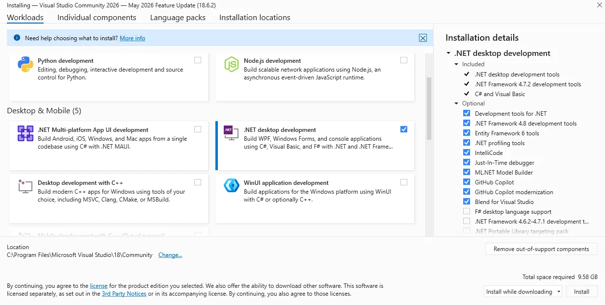
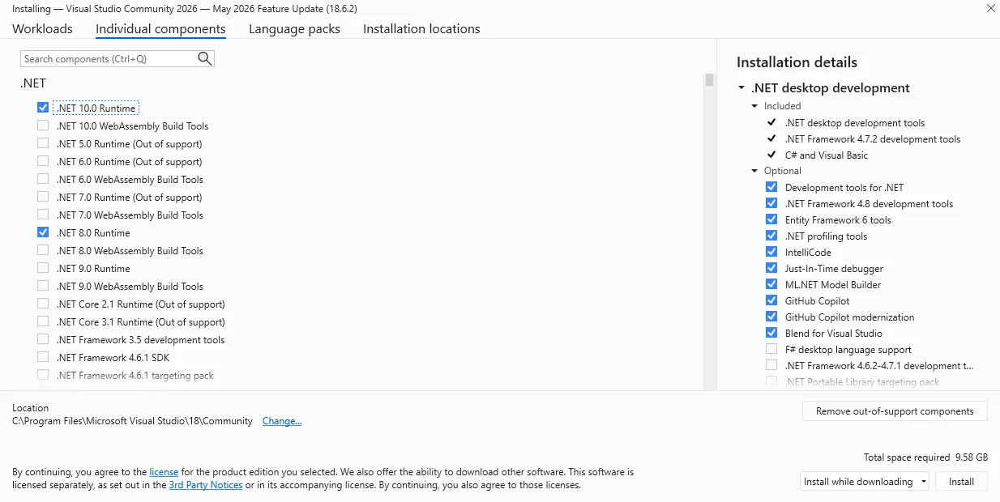
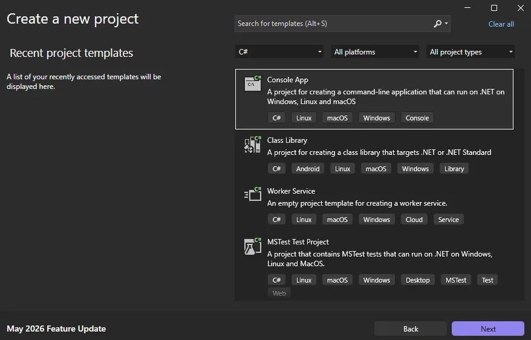
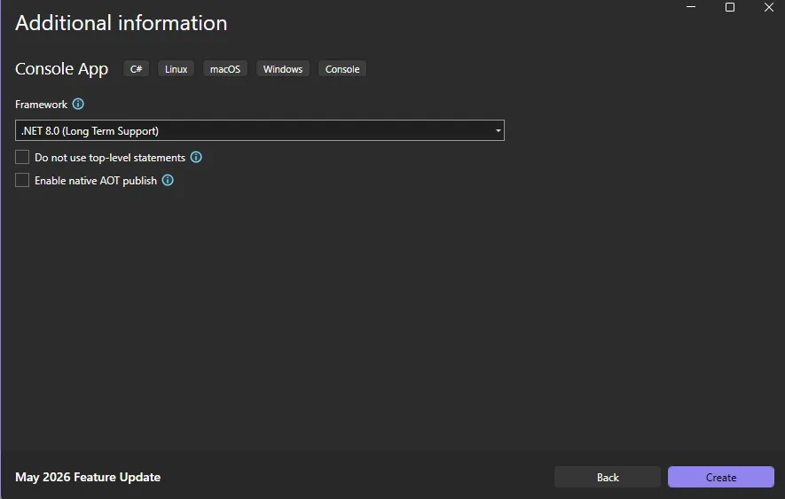
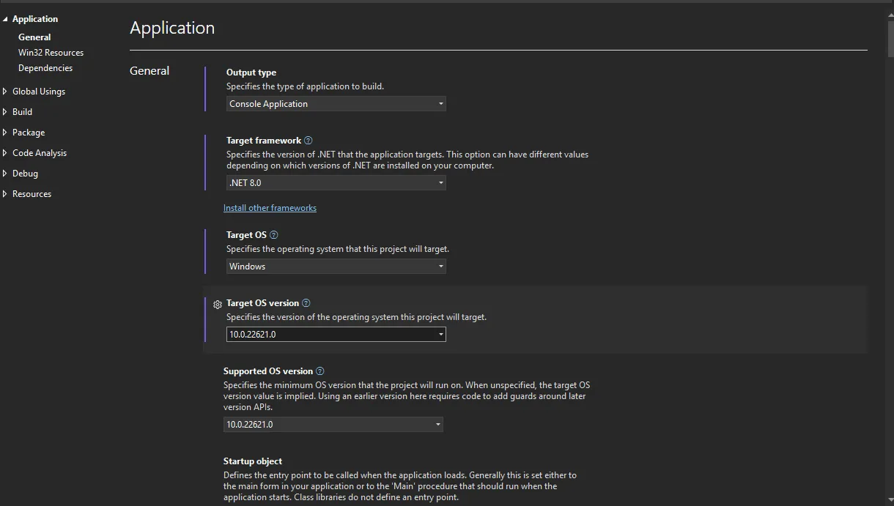
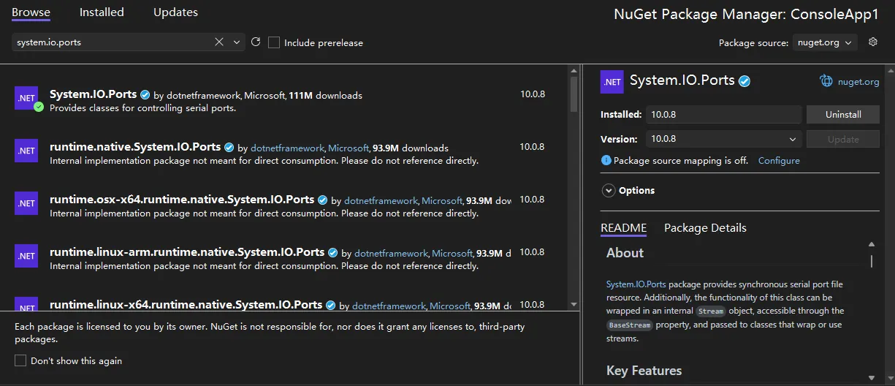

Windows GPIO Programming - C#
=============================

This chapter guides you through programming UART, I2C, and GPIO interfaces on the LattePanda Mu under Windows using C#. It covers pinout mappings, BIOS requirements, Visual Studio setup, and provides ready-to-run C# examples using `System.IO.Ports` and `WinRT APIs` for physical hardware control.

## UART

### Pinout Assignment

The LattePanda Mu compute module provides up to 4 UART ports.

The pin locations and corresponding system port mappings are detailed below:

| **Pin#(Edge Connector)** | Pin Name | Note |
| ------------------------ | -------- | ---- |
| 10                     | SIO_UART_TX | UART exposed from SuperIO; <br>Typically mapped as `COM1` in Windows or `/dev/ttyS0` in Linux |
| 12                      | SIO_UART_RX | As above |
| 139                      | SOC_UART0_TXD | UART0 exposed from PCH; <br/>Typically mapped as `COM2` in Windows or `/dev/ttyS4` in Linux |
| 137                      | SOC_UART0_RXD | As above |
| 143                      | SOC_UART1_TXD | UART1 exposed from PCH; <br/>Typically mapped as `COM3` in Windows or `/dev/ttyS5` in Linux |
| 141                      | SOC_UART1_RXD | As above |
| 138                      | SOC_UART2_TXD  | UART2 exposed from PCH; <br/>Typically mapped as `COM4` in Windows or `/dev/ttyS6` in Linux |
| 140                      | SOC_UART2_RXD  | As above |

### Logic Level

All the UART pins mentioned above use 3.3V levels. Do not apply voltages higher than 3.3V.

### BIOS Requirement

To ensure the port mapping matches the table above, the BIOS version must be `S70NC1R200-8G-A` or the 16G variant or the SATA variant (Build Date: 2025/12/19) or higher.

Older BIOS versions may cause duplicate serial port mappings or mappings that don't match the table above. If upgrading from an older BIOS version:

  - Windows: It is recommended to uninstall all COM devices in Device Manager and reboot the system to refresh the mapping.
  - Linux: A simple system reboot is sufficient.


### Programming with C# System.IO.Ports

#### <span id="csharp-env">Environment Setup</span>

We will use C# in Visual Studio as an example for illustration.

!!!note

    Since the Visual Studio consumes significant storage and computing resources, it is recommended to perform the following steps on your personal computer. Once compiled, the executable file could be transferred to and run in the LattePanda Mu's windows operating system.

- Download and install [Visual Studio](https://visualstudio.microsoft.com) (version 2022 or later is recommended). This guide uses Visual Studio 2026.

- Run the installer and configure the following options:
    - Select the `.NET desktop development` under the `Workloads` tab.
    
        {width="1000" }
        
    - Navigate to the `Individual components` tab and ensure `.NET 8.0 Runtime` (or higher) is selected.
    
        {width="1000" }
    
- After installation, create a new project:
    - Choose `Console App (C#)` as the project type.
        {width="800" }
        
    - Select `.NET 8.0 (Long Term Support)` (or higher) as the framework.
        {width="800" }

- Once the project is created, configure the project properties to ensure compatibility with your LattePanda Mu operating system:
  
    - Right-click the project name in the solution explorer and select `Properties`. 
    
    - Change the `Target OS` to `Windows` (this ensures proper binding to the underlying Windows serial port APIs).
    - Set the `Target OS version` to match the Windows version running on your LattePanda Mu (e.g., select `10.0.22621.0` for Windows 11 22H2 or later).
    
        {width="1000" }
    
- Include the `System.IO.Ports` library in your project:

    - Right-click the project name in the solution explorer and select `Manage NuGet Packages...`.
    - In the Browse tab, search for `System.IO.Ports`.
    - Select and install the official package to add the dependency.
        {width="800" }

#### UART Loopback

The following sample is used to test the COM1 loopback.

- Copy the following code into your project's `Program.cs` file.

  ```c#
  /*!
   * @file Program.cs
   * @hardware LattePanda Mu (Intel N100/N305)
   * @BIOS S70NC1R200-8G-A or later
   * @author LattePanda Team(https://www.lattepanda.com/)
   * @version V1.0
   * @date 2026-06
   * @license The MIT License (MIT)
   * @brief Serial loopback sample code. Short-circuit the TX and RX pins of the corresponding serial port before running this program.
   */
  
  using System;
  using System.IO.Ports;
  using System.Text;
  using System.Threading;
  
  class Program
  {
      const string COM_PORT  = "COM1";   // Windows COM port(COM1: SIO_UART)
  
      const int    BAUD_RATE = 9600;
  
      static void Main(string[] args)
      {
          // ----------------------------------------------------------------
          // Graceful exit support for double-click launched executables.
          // Without this, the console window disappears immediately after the program finishes, giving the user no time to read the output.
          // ManualResetEventSlim is a lightweight synchronisation primitive that blocks until Set() is called from the Ctrl+C handler.
          // ----------------------------------------------------------------
          var exitEvent = new ManualResetEventSlim(false);
          Console.CancelKeyPress += (sender, e) =>
          {
              e.Cancel = true;          // Prevent the process from terminating immediately
              exitEvent.Set();          // Signal the main thread to proceed with cleanup
          };
  
          // Declare outside try so the finally block can always reach it.
          SerialPort? ser = null;
  
          try
          {
              ser = new SerialPort(
                  portName : COM_PORT,
                  baudRate : BAUD_RATE,
                  parity   : Parity.None,   // No parity bit
                  dataBits : 8,             // 8 data bits per frame
                  stopBits : StopBits.One   // 1 stop bit
              );
  
              // Timeout values (ms) prevent indefinite blocking if the loopback wire is missing or the UART is unresponsive.
              ser.ReadTimeout  = 1000;  // Throw TimeoutException after 1s with no incoming data
              ser.WriteTimeout = 1000;  // Throw TimeoutException after 1s if TX buffer is full
  
              // Open the port — allocates the OS handle and configures the hardware UART.
              ser.Open();
              Console.WriteLine($"Serial port opened: {ser.PortName}");
  
              // ----------------------------------------------------------------
              // Transmit phase
              // Convert the string to a raw byte array before writing;
              // SerialPort.Write() operates on bytes, not characters.
              // ----------------------------------------------------------------
              string txString = $"Hello from C# {ser.PortName},{ser.BaudRate}\r\n";
              byte[] txData   = Encoding.ASCII.GetBytes(txString);
              ser.Write(txData, 0, txData.Length);  // offset=0, send all bytes
              Console.WriteLine($"Sent: {txString.TrimEnd()}");
  
              // Give the UART hardware time to echo the bytes back through the loopback wire before we attempt to read.
              Thread.Sleep(500);
  
              Console.WriteLine("Waiting for data...");
  
              // ----------------------------------------------------------------
              // Receive phase
              // Allocate a receive buffer large enough for the expected payload.
              // ser.Read() returns the actual number of bytes read, which may be less than the buffer size.
              // ----------------------------------------------------------------
              byte[] rxData    = new byte[128];
              int    bytesRead = 0;
  
              try
              {
                  // Blocking read — waits up to ReadTimeout ms for incoming data.
                  bytesRead = ser.Read(rxData, 0, rxData.Length);
              }
              catch (TimeoutException)
              {
                  // No data arrived within the timeout window. This is expected if the loopback wire is not connected.
                  bytesRead = 0;
              }
  
              if (bytesRead > 0)
              {
                  // Decode only the bytes actually received, not the whole buffer.
                  string rxString = Encoding.ASCII.GetString(rxData, 0, bytesRead);
                  Console.WriteLine($"Received: {rxString}");
              }
              else
              {
                  Console.WriteLine("No data received");
              }
          }
          catch (Exception ex)
          {
              // Catches port-not-found, access-denied, and other fatal errors.
              Console.WriteLine($"Error: {ex.Message}");
          }
          finally
          {
              // Always close the port to release the OS handle, even if an exception was thrown during the test.
              if (ser != null && ser.IsOpen)
              {
                  ser.Close();
                  Console.WriteLine("Serial port closed");
              }
          }
  
          // Keep the console window open until the user presses Ctrl+C.
          // This is particularly important when the exe is launched by double-clicking in Windows Explorer rather than from a terminal.
          Console.WriteLine("\nPress Ctrl+C to exit...");
          exitEvent.Wait();
      }
  }
  ```

- Short the TX and RX pins of the SIO_UART, then run the compiled executable; you will see the serial data loopback.


## I2C

### Pinout Assignment

The LattePanda Mu compute module provides up to 4 I2C ports.

The pin locations are detailed below:

| **Pin#(Edge Connector)** | Pin Name |
| ------------------------ | -------- |
| 154                   | I2C2_SCL |
| 156                    | I2C2_SDA |
| 150                    | I2C3_SCL |
| 152                    | I2C3_SDA |
| 146                     | I2C4_SCL |
| 148                     | I2C4_SDA |
| 142                    | I2C5_SCL |
| 144                     | I2C5_SDA |

!!!note

    If you are using the [DFR1141 Full Eval Carrier](https://www.dfrobot.com/product-2821.html), an I2C device(IT8851 chip) with address `0x40` is already present on the `I2C2` port. Therefore, avoid connecting any other I2C device with the same address to this port.

### Logic Level

All the I2C pins mentioned above are pulled up to 3.3 V via 2.2kΩ resistors inside the compute module. Do not apply voltages higher than 3.3V.

### BIOS Requirement

To ensure  the I2C ports can be controlled on Windows OS, the BIOS version must be `S70NC1R200-8G-B` or the 16G variant or the SATA variant (Build Date: 2026/06/03) or higher.

Older BIOS versions do not support this feature.


### Programming with C# Windows.Devices.I2c

#### Environment Setup

- Refer to [the C# environment setup of the UART chapter](#csharp-env).

#### I2C Bus Scanner

The following example is used to scan for device addresses on the I2C port.

- Copy the following code into your project's `Program.cs` file.


  ```c#
  /*!
   * @file Program.cs
   * @brief I2C bus scanner for LattePanda Mu using Windows.Devices.I2c (WinRT API).
   *        Probes each address in the valid 7-bit range and reports responding devices.
   * @Hardware LattePanda Mu (Intel N100/N305); I2C device
   * @BIOS S70NC1R200-8G-B or later
   * @author LattePanda Team(https://www.lattepanda.com/)
   * @version V1.0
   * @date 2026-06
   * @license The MIT License (MIT)
   */
  
  using Windows.Devices.Enumeration;
  using Windows.Devices.I2c;
  
  // available in I2C2, I2C3, I2C4, I2C5
  const string BusName = "I2C2";
  
  // Valid 7-bit I2C address range: 0x03–0x77.
  // Addresses 0x00–0x02 and 0x78–0x7F are reserved by the I2C specification and should never be probed to avoid unintended bus side-effects.
  const int FirstAddress = 0x03;
  const int LastAddress  = 0x77;
  
  // Windows.Devices.I2c requires Windows 10 version 1809 (build 17763) or later. Earlier builds lack the necessary WinRT I2C inbox driver support.
  Version minimumWindowsVersion = new(10, 0, 17763, 0);
  
  try
  {
      EnsureSupportedWindows(minimumWindowsVersion);
      await RunScanAsync();
  }
  catch (Exception ex)
  {
      Console.WriteLine($"Fatal error: {ex.GetType().Name} - {ex.Message}");
      // Use Enter-to-exit strategy here because Ctrl+C handler is not yet registered at the point this catch block may be reached (e.g., version check failure).
      WaitForExitIfInteractive();
      Environment.ExitCode = -1;
  }
  
  async Task RunScanAsync()
  {
      bool stopRequested = false;
  
      // Register Ctrl+C handler before starting any blocking work so the user can always abort cleanly. e.Cancel = true prevents the OS from killing the process immediately, 
      // giving us a chance to finish the current iteration gracefully.
      Console.CancelKeyPress += (_, e) =>
      {
          e.Cancel = true;
          stopRequested = true;
          Console.WriteLine("Ctrl+C detected, exiting...");
      };
  
      Console.WriteLine($"I2C scan started. preferredBus={BusName}, range=0x{FirstAddress:X2}-0x{LastAddress:X2}, mode=hardware.");
  
      // FindAllAsync with the device selector returned by GetDeviceSelector() queries the WinRT device enumeration layer for all I2C controllers that match the requested bus name.
      // Each controller (I2C2–I2C5) appears as a separate DeviceInformation entry.
      DeviceInformationCollection devices = await DeviceInformation.FindAllAsync(
          I2cDevice.GetDeviceSelector(BusName));
  
      if (devices.Count == 0)
      {
          Console.WriteLine("No WinRT I2C controller found. Check BIOS I2C enable/pin mux settings and WinRT I2C driver state.");
          WaitForExitIfInteractive();
          return;
      }
  
      // Use the first enumerated controller that matches BusName. In practice, GetDeviceSelector(BusName) returns at most one matching entry.
      string deviceId = devices[0].Id;
  
      var foundAddresses = new List<int>();
      Exception? firstError = null;  // Capture the first probe error for diagnostic output.
  
      for (int address = FirstAddress; address <= LastAddress; address++)
      {
          try
          {
              var settings = new I2cConnectionSettings(address)
              {
                  // StandardMode = 100 kHz. Use FastMode (400 kHz) only if all devices on the bus are confirmed to support it.
                  BusSpeed = I2cBusSpeed.StandardMode,
  
                  // Exclusive mode: the driver issues a real START+address+STOP on the bus and throws an exception when the address is NACKed.
                  // This is the correct mode for scanning — Shared mode may succeed even for non-existent addresses and produce false positives.
                  SharingMode = I2cSharingMode.Exclusive
              };
  
              // FromIdAsync opens a logical handle to the device at 'address'.
              // Returns null if the driver cannot satisfy the request for reasons other than a missing ACK (e.g., resource conflict).
              using I2cDevice? probe = await I2cDevice.FromIdAsync(deviceId, settings);
              if (probe is null)
              {
                  continue;
              }
  
              // Perform a 1-byte read to confirm the device responds with an ACK.
              // The content of the byte is irrelevant; we only care whether the transaction succeeds (ACK) or throws (NACK / bus error).
              byte[] readBuffer = new byte[1];
              probe.Read(readBuffer);
              foundAddresses.Add(address);
          }
          catch (Exception ex)
          {
              // A NACK or bus error means no device at this address — expected during a scan. 
              // Record only the first error to surface unexpected failures(e.g., bus locked up, driver fault) in the summary output.
              firstError ??= ex;
          }
      }
  
      // Report results with a timestamp for log readability.
      string timestamp = DateTime.Now.ToString("HH:mm:ss");
      if (foundAddresses.Count == 0)
      {
          if (firstError is null)
          {
              Console.WriteLine($"{timestamp} No device found.");
          }
          else
          {
              // firstError gives a hint when every probe failed abnormally rather than via a clean NACK (e.g., driver timeout, access denied).
              Console.WriteLine($"{timestamp} No device found. Probe error: {firstError.GetType().Name} - {firstError.Message}");
          }
      }
      else
      {
          string addresses = string.Join(", ", foundAddresses.Select(addr => $"0x{addr:X2}"));
          Console.WriteLine($"{timestamp} Found: {addresses}");
      }
  
      // Spin-wait until the user presses Ctrl+C.
      // 100ms sleep keeps CPU usage negligible while still feeling responsive.
      Console.WriteLine("Scan completed. Press Ctrl+C to exit.");
      while (!stopRequested)
      {
          Thread.Sleep(100);
      }
  }
  
  // Verify the host OS is Windows and meets the minimum build requirement before attempting any WinRT API calls, which would throw cryptic COMExceptions otherwise.
  void EnsureSupportedWindows(Version minimumVersion)
  {
      if (!OperatingSystem.IsWindows())
      {
          throw new PlatformNotSupportedException("This sample only supports Windows.");
      }
  
      Version currentVersion = Environment.OSVersion.Version;
      if (currentVersion < minimumVersion)
      {
          throw new PlatformNotSupportedException(
              $"Windows version {currentVersion} is lower than required {minimumVersion}.");
      }
  }
  
  // Prevent the console window from closing immediately when the program is launched by double-clicking the exe (non-redirected interactive session).
  // Skipped when stdout/stdin is redirected (CI pipelines, shell scripts) to avoid blocking automated runs waiting for input that never comes.
  void WaitForExitIfInteractive()
  {
      if (Console.IsInputRedirected || Console.IsOutputRedirected)
      {
          return;
      }
  
      Console.WriteLine("Press Enter to exit.");
      _ = Console.ReadLine();
  }
  ```


- Connect an I2C device to the corresponding I2C port, then run the compiled executable; you will see the address of the connected I2C device.

#### EEPROM Read and Write

The following example writes one byte to address `0x0000` of an [AT24C256 EEPROM Module(DFR0117)](https://www.dfrobot.com/product-429.html) and reads it back for verification.

- Copy the following code into your project's `Program.cs` file.


  ```c#
  /*!
   * @file Program.cs
   * @brief Single-byte EEPROM read/write demo via WinRT I2C API.
   * @target AT24C256 (256 Kbit / 32 KB, 16-bit memory address, I2C address 0x50–0x57)
   * @Hardware LattePanda Mu (Intel N100/N305); AT24C256 EEPROM Module(DFR0117)
   * @BIOS S70NC1R200-8G-B or later
   * @author LattePanda Team(https://www.lattepanda.com/)
   * @version V1.0
   * @date 2026-06
   * @license The MIT License (MIT)
   */
  
  using Windows.Devices.Enumeration;
  using Windows.Devices.I2c;
  
  // Available in I2C2, I2C3, I2C4, I2C5
  const string BusName = "I2C2";
  
  // AT24C256 base I2C address (A2=A1=A0=GND → 0x50).
  const int AT24CXXAddress = 0x50;
  
  // Ctrl+C handler — set a flag so the main loop exits cleanly.
  bool stopRequested = false;
  Console.CancelKeyPress += (_, e) =>
  {
      e.Cancel = true;        // Suppress default process termination; let the loop exit gracefully.
      stopRequested = true;
      Console.WriteLine("Ctrl+C detected, exiting...");
  };
  
  Console.WriteLine($"Single-byte EEPROM read/write started. bus={BusName}, addr=0x{AT24CXXAddress:X2}, mem=0x0000, mode=hardware.");
  
  // Discover WinRT I2C controllers registered on the requested bus.
  // FindAllAsync queries the PnP device tree; an empty result means the driver is absent or the bus is disabled in BIOS / ACPI tables.
  DeviceInformationCollection controllers =
      await DeviceInformation.FindAllAsync(I2cDevice.GetDeviceSelector(BusName));
  
  if (controllers.Count == 0)
  {
      Console.WriteLine(
          "No WinRT I2C controller found. " +
          "Check BIOS I2C enable/pin mux settings.");
      return;
  }
  
  
  // Open the target I2C device.
  // Exclusive mode is required for an EEPROM: it ensures the driver performs a real START + address + STOP on the bus, 
  // and prevents address conflicts with other handles that might accidentally open the same device simultaneously.
  var settings = new I2cConnectionSettings(AT24CXXAddress)
  {
      BusSpeed    = I2cBusSpeed.StandardMode,
      SharingMode = I2cSharingMode.Exclusive  // Must be Exclusive for a real EEPROM device.
  };
  
  I2cDevice? device = await I2cDevice.FromIdAsync(controllers[0].Id, settings);
  if (device is null)
  {
      // FromIdAsync returns null when the address is already opened in Exclusive mode by another process, 
      // or when the driver rejects the open request.
      Console.WriteLine($"WinRT I2C open failed. addr=0x{AT24CXXAddress:X2}");
      return;
  }
  
  // Main loop — write then read back one byte at memory address 0x0000.
  using (device)
  {
      try
      {
          byte dataToWrite = 0xA5; // Test pattern: write 0xA5 to verify read-back
          
          // Write one byte to address 0x0000, then wait for AT24C256 internal write cycle to complete 
          // (tWR max 5 ms; 10 ms gives safe margin)
          WriteOneByte(device, 0x0000, dataToWrite);
          await Task.Delay(10);
  
          byte readValue = ReadOneByte(device, 0x0000);
          string match = (readValue == dataToWrite) ? "OK" : "MISMATCH";
          Console.WriteLine($"{DateTime.Now:HH:mm:ss} Write=0x{dataToWrite:X2}, Read=0x{readValue:X2} [{match}]");
      }
      catch (Exception ex)
      {
          Console.WriteLine($"{DateTime.Now:HH:mm:ss} I2C transaction error: {ex.GetType().Name} - {ex.Message}");
      }
  }
  
  // Single read/write completed. Block here until user presses Ctrl+C.
  Console.WriteLine("Done. Press Ctrl+C to exit.");
  while (!stopRequested)
  {
      Thread.Sleep(100);
  }
  
  // ---------------------------------------------------------------------------
  // WriteOneByte — perform a random write to a 16-bit memory address.
  //
  // AT24C256 write frame (3 bytes total):
  //   [0] MSB of 15-bit memory address  (A14–A8)
  //   [1] LSB of memory address          (A7–A0)
  //   [2] Data byte
  //
  // The EEPROM latches the data into its internal page buffer and then starts
  // the self-timed write cycle (tWR). Do NOT issue another write before tWR expires.
  // ---------------------------------------------------------------------------
  static void WriteOneByte(I2cDevice device, ushort address, byte data)
  {
      byte[] writeBuffer =
      [
          (byte)(address >> 8),   // Memory address high byte
          (byte)(address & 0xFF), // Memory address low byte
          data                    // Data to write
      ];
      device.Write(writeBuffer);
  }
  
  // ---------------------------------------------------------------------------
  // ReadOneByte — perform a random read from a 16-bit memory address.
  //
  // This is a combined WriteRead (repeated-START) transaction:
  //   Write phase : send the 16-bit memory address (sets the internal address pointer).
  //   Read phase  : clock out 1 byte; EEPROM auto-increments the pointer after each byte.
  // ---------------------------------------------------------------------------
  static byte ReadOneByte(I2cDevice device, ushort address)
  {
      byte[] addressBuffer =
      [
          (byte)(address >> 8),   // Memory address high byte
          (byte)(address & 0xFF)  // Memory address low byte
      ];
      byte[] readBuffer = new byte[1];
  
      // WriteRead issues a repeated START between the write and read phases,
      // which is required by the AT24C256 random read protocol.
      device.WriteRead(addressBuffer, readBuffer);
  
      return readBuffer[0];
  }
  ```

- Connect the AT24C256 to the corresponding I2C port, then run the compiled executable; the write/read result will be printed along with a pass/fail indicator (`OK` / `MISMATCH`). 


## GPIO

### Pinout Assignment

The LattePanda Mu compute module currently provides up to 17 GPIO pins that can be configured as either inputs or outputs. You can execute scripts within the system to control these GPIOs to read signals from or send signals to peripheral devices.

The pin locations and their default functions are listed in the table below:

| **Pin#(Edge Connector)** | Pin Name                | Default Function |
| ------------------------ | ----------------------- | ---------------- |
| 126                      | GPP_F12                 | GPIO             |
| 124                      | GPP_F13                 | GPIO             |
| 122                      | GPP_F14                 | GPIO             |
| 120                      | GPP_F15                 | GPIO             |
| 118                      | GPP_F16                 | GPIO             |
| 119                      | GPP_E0                  | WWAN_PWR_EN      |
| 121                      | GPP_A12                 | CAM_PWR_EN       |
| 139                      | SOC_UART0_TXD / GPP_H11 | UART0_TXD        |
| 137                      | SOC_UART0_RXD / GPP_H10 | UART0_RXD        |
| 143                      | SOC_UART1_TXD / GPP_D18 | UART1_TXD        |
| 141                      | SOC_UART1_RXD / GPP_D17 | UART1_RXD        |
| 138                      | SOC_UART2_TXD / GPP_F2  | UART2_TXD        |
| 140                      | SOC_UART2_RXD / GPP_F1  | UART2_RXD        |
| 128                      | GPP_D0                  | WWAN_PWR_EN      |
| 130                      | GPP_D1                  | WWAN_RST         |
| 132                      | GPP_D2                  | IT8851_INT       |
| 134                      | GPP_D3                  | CAM_PWR_EN       |

### GPIO Features

- 3.3V I/O voltage levels

- Floating input or push-pull output

- Defaults to high-impedance state after OS boot or reboot

- Routed directly from the processor PCH

!!!warning

    Since these GPIOs originate directly from the processor's PCH, special care must be taken during use.<br>Overvoltage, overcurrent, and short circuits are strictly prohibited, as any damage to the pins is irreparable.

### BIOS Requirement

GPIO control in windows OS requires BIOS support. Please ensure that the BIOS version used by LattePanda Mu module is `S70NC1R200-8G-B` or the 16G variant or the SATA variant (Build Date: 2026/06/04) or higher.

Older BIOS versions do not support this feature.

### Switch Multiplexed Pins to GPIO Mode

`GPP_F12` to `GPP_F16` pins can be used directly as GPIOs without requiring any BIOS configuration. 

The remaining pins are not set to GPIO by default and must be switched to GPIO mode in the BIOS.

 **Switching Steps:**

- Power-on or restart LattePanda board, press ++del++ to enter the BIOS setup.

- Navigate to the `GPIO Configuration` option  via the following path: `Advanced -> GPIO Configuration`.

- Configure the required pins to GPIO mode.

    >For example: If you do not need to use UART2 but wish to use the UART2 TXD and RXD pins as GPIOs, select "GPIO" as shown in the figure below.

    {width="600" }

- Navigate to the `Save & Exit page` and select  `Save Changes and Exit`option to save the BIOS settings and restart the LattePanda board.

### GPIO Address

The mapping between the physical pins and the pin numbers (used in the code) is shown in the table below.

| Pin Name                | **PIN Mapping Number** |
| ----------------------- | ---------------------- |
| GPP_A12                 | 0                      |
| GPP_E0                  | 1                      |
| GPP_D0                  | 2                      |
| GPP_D1                  | 3                      |
| GPP_D2                  | 4                      |
| GPP_D3                  | 5                      |
| GPP_F12                 | 6                      |
| GPP_F13                 | 7                      |
| GPP_F14                 | 8                      |
| GPP_F15                 | 9                      |
| GPP_F16                 | 10                     |
| SOC_UART0_RXD / GPP_H10 | 11                     |
| SOC_UART0_TXD / GPP_H11 | 12                     |
| SOC_UART1_RXD / GPP_D17 | 13                     |
| SOC_UART1_TXD / GPP_D18 | 14                     |
| SOC_UART2_RXD / GPP_F1  | 15                     |
| SOC_UART2_TXD / GPP_F2  | 16                     |


### Programming with C# Windows.Devices.Gpio

#### Environment Setup

- Refer to [the C# environment setup of the UART chapter](#csharp-env).

#### GPIO Output

The following code sets the `GPP_F12` pin to output mode and toggles the output level signal every second.

- Copy the following code into your project's `Program.cs` file.

  ```C#
  /*!
   * @file Program.cs
   * @brief GPIO toggle demo for LattePanda Mu using Windows.Devices.Gpio (WinRT API).
   * @Hardware LattePanda Mu (Intel N100/N305)
   * @BIOS S70NC1R200-8G-B or later
   * @author LattePanda Team(https://www.lattepanda.com/)
   * @version V1.0
   * @date 2026-06
   * @license The MIT License (MIT)
   */
  
  using Windows.Devices.Gpio;
  
  // LattePanda Mu(N100/N305): physical GPIO name to WinRT logical GPIO index mapping.
  var PinMapping = new Dictionary<string, int>()
  {
      { "GPP_A12",  0 },
      { "GPP_E0",   1 },
      { "GPP_D0",   2 },
      { "GPP_D1",   3 },
      { "GPP_D2",   4 },
      { "GPP_D3",   5 },
      { "GPP_F12",  6 },
      { "GPP_F13",  7 },
      { "GPP_F14",  8 },
      { "GPP_F15",  9 },
      { "GPP_F16", 10 },
      { "GPP_H10", 11 },   // SOC_UART0_RXD - avoid using as GPIO when UART is active.
      { "GPP_H11", 12 },   // SOC_UART0_TXD
      { "GPP_D17", 13 },   // SOC_UART1_RXD
      { "GPP_D18", 14 },   // SOC_UART1_TXD
      { "GPP_F1",  15 },   // SOC_UART2_RXD
      { "GPP_F2",  16 },   // SOC_UART2_TXD
  };
  
  // Select the target pin by name. Change "GPP_F12" to any key in PinMapping above.
  const string TargetPin = "GPP_F12";
  int PinNumber = PinMapping[TargetPin];
  
  // Toggle interval in milliseconds — the pin state flips once per period.
  const int IntervalMs = 1000;
  
  // Flag set by the Ctrl+C handler to break the toggle loop.
  bool stopRequested = false;
  
  // Handle Ctrl+C gracefully: cancel the default termination so the finally-path (pin drive low) can execute before the program exits.
  Console.CancelKeyPress += (_, e) =>
  {
      e.Cancel = true;
      stopRequested = true;
      Console.WriteLine("Ctrl+C detected, exiting...");
  };
  
  Console.WriteLine($"GPIO output toggling started. Pin: {TargetPin}, Mapping Number: {PinNumber}, interval: {IntervalMs}ms, mode:hardware.");
  
  // Obtain the default WinRT GPIO controller.
  // Returns null if no controller is available (driver not loaded or BIOS disabled).
  GpioController? controller = GpioController.GetDefault();
  if (controller is null)
  {
      Console.WriteLine("WinRT GPIO controller is unavailable. Check BIOS pin mux and driver/capability settings.");
      return;
  }
  
  // Open the target pin and configure it as a push-pull output.
  // The pin is held open for the lifetime of the toggle loop via the using statement.
  using GpioPin pin = controller.OpenPin(PinNumber);
  pin.SetDriveMode(GpioPinDriveMode.Output);                  // Set pin mode to output
  pin.Write(GpioPinValue.Low);                                // Set initial value to Low
  
  // Toggle loop: flip the pin state every IntervalMs milliseconds until Ctrl+C.
  GpioPinValue currentValue = GpioPinValue.Low;
  while (!stopRequested)
  {
      // Invert the current pin level.
      currentValue = (currentValue == GpioPinValue.Low) ? GpioPinValue.High : GpioPinValue.Low;
  
      pin.Write(currentValue);
      Console.WriteLine($"{DateTime.Now:HH:mm:ss} {TargetPin} (Mapping Number:{PinNumber}) -> {currentValue}");
  
      if (!stopRequested)
      {
          Thread.Sleep(IntervalMs);
      }
  }
  
  // Release the pin by switching to input (high-impedance), relinquishing drive control
  pin.SetDriveMode(GpioPinDriveMode.Input);
  ```

- Run the compiled executable, you will observe the `GPP_F12` pin outputting high and low signals at approximately 1-second intervals.

#### GPIO Input

The following code sets the `GPP_F12` pin to input mode and read its level status every second.

- Copy the following code into your project's `Program.cs` file.

  ```c#
  /*!
   * @file Program.cs
   * @brief GPIO level monitor demo for LattePanda Mu using Windows.Devices.Gpio (WinRT API).
   * @Hardware LattePanda Mu (Intel N100/N305)
   * @BIOS S70NC1R200-8G-B or later
   * @author LattePanda Team(https://www.lattepanda.com/)
   * @version V1.0
   * @date 2026-06
   * @license The MIT License (MIT)
   */
  
  using Windows.Devices.Gpio;
  
  // LattePanda Mu(N100/N305): physical GPIO name to WinRT logical GPIO index mapping.
  var PinMapping = new Dictionary<string, int>
  {
      { "GPP_A12",  0 },
      { "GPP_E0",   1 },
      { "GPP_D0",   2 },
      { "GPP_D1",   3 },
      { "GPP_D2",   4 },
      { "GPP_D3",   5 },
      { "GPP_F12",  6 },
      { "GPP_F13",  7 },
      { "GPP_F14",  8 },
      { "GPP_F15",  9 },
      { "GPP_F16", 10 },
      { "GPP_H10", 11 },   // SOC_UART0_RXD - avoid using as GPIO when UART is active.
      { "GPP_H11", 12 },   // SOC_UART0_TXD
      { "GPP_D17", 13 },   // SOC_UART1_RXD
      { "GPP_D18", 14 },   // SOC_UART1_TXD
      { "GPP_F1",  15 },   // SOC_UART2_RXD
      { "GPP_F2",  16 },   // SOC_UART2_TXD
  };
  
  // Target pin to monitor. Change this string to switch to a different pin.
  const string TargetPin = "GPP_F12";
  const int IntervalMs = 1000;    // Polling interval in milliseconds
  
  // Resolve the WinRT GPIO index for the selected pad
  if (!PinMapping.TryGetValue(TargetPin, out int PinNumber))
  {
      Console.WriteLine($"Unknown Pin name: {TargetPin}. Check the mapping table.");
      Console.WriteLine("Press Enter to exit.");
      Console.ReadLine();
      return;
  }
  
  bool stopRequested = false;
  // Register Ctrl+C handler so the user can terminate the monitor loop cleanly
  Console.CancelKeyPress += (_, e) =>
  {
      e.Cancel = true;        // Prevent immediate process termination
      stopRequested = true;
      Console.WriteLine("Ctrl+C detected, exiting...");
  };
  
  Console.WriteLine($"GPIO input monitor started. Pin: {TargetPin}, Mapping Number: {PinNumber}, interval: {IntervalMs}ms, mode: hardware.");
  
  // Obtain the default WinRT GPIO controller.
  // Returns null if the GPIO driver is not loaded or BIOS pin mux is not configured.
  GpioController? controller = GpioController.GetDefault();
  if (controller is null)
  {
      Console.WriteLine("WinRT GPIO controller is unavailable. Check BIOS pin mux and driver/capability settings.");
      Console.WriteLine("Press Enter to exit.");
      Console.ReadLine();
      return;
  }
  
  // Open the target pin and configure it as a floating input.
  using GpioPin pin = controller.OpenPin(PinNumber);
  pin.SetDriveMode(GpioPinDriveMode.Input);
  
  Console.WriteLine("Monitoring pin level. Press Ctrl+C to exit.");
  
  // Poll the pin level at the configured interval and print the current state.
  while (!stopRequested)
  {
      GpioPinValue value = pin.Read();
      Console.WriteLine($"{DateTime.Now:HH:mm:ss} {TargetPin} (Mapping Number:{PinNumber}) -> {value}");
  
      if (!stopRequested)
      {
          Thread.Sleep(IntervalMs);
      }
  }
  ```

- Run the compiled executable, you will observe the `GPP_F12` pin level at approximately 1-second intervals.


## Download Source Project

The sample codes for this chapter are provided as Visual Studio source projects, including UART, I2C, and GPIO. You can download them below.

- [GPIO Programming with C#](../../assets/drivers/mu_edition/LattePanda_Mu_GPIO_Project_CSharp.zip)
