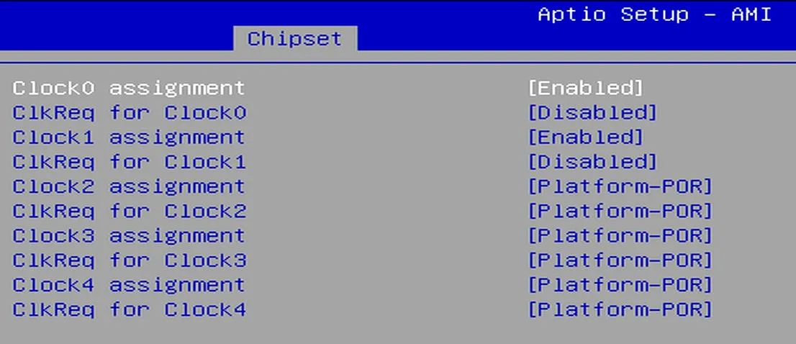

## Overview

The LattePanda Mu x86 compute module exposes all **9 Flexible HSIO Lanes** from the Intel processor. These lanes offer high flexibility and can be configured as USB 3.2, SATA, or PCIe lanes depending on the carrier board design requirements.

{width="800" }

## HSIO Multiplexing Rules

Based on the Intel hardware reference[^1], the supported functions for each HSIO lane are as follows:

- **HSIO 0, 1, 2, 3:** Configurable as **USB 3.2 Gen 2** or **PCIe Gen3**.
- **HSIO 6, 8, 9:** Strictly dedicated to **PCIe Gen3**.
- **HSIO 10, 11:** Configurable as **SATA Gen3** or **PCIe Gen3**.

[^1]:[Intel® Processor and Intel® Core™ i3 N-Series Datasheet, Volume 1 of 2](https://www.intel.com/content/www/us/en/content-details/759603/intel-processor-and-intel-core-i3-and-intel-core-3-n-series-datasheet-volume-1-of-2.html) 

## PCIe Bifurcation

When configured in PCIe mode, these HSIO lanes support **flexible bifurcation**. For clarity, the 9 HSIO lanes are categorized into three groups:

### HSIO 0 ~ 3

- **1x4 Mode:** Combined as a single complete PCIe x4 link.
- **2x2 Mode:** Split into two independent PCIe x2 links (HSIO 0+1 as one link, HSIO 2+3 as another).
- **1x2 + 2x1 Mode:** Split into one PCIe x2 link and two PCIe x1 links.

    > *Option 1:* HSIO 0+1 (x2) + HSIO 2 (x1) + HSIO 3 (x1).<br>
    > *Option 2:* HSIO 0 (x1) + HSIO 1 (x1) + HSIO 2+3 (x2).

- **4x1 Mode:** Split into four independent PCIe x1 links.

### HSIO 8 ~ 11

- **1x4 Mode:** Combined as a single complete PCIe x4 link.
- **2x2 Mode:** Split into two independent PCIe x2 links (HSIO 8+9 as one link, HSIO 10+11 as another).
- **1x2 + 2x1 Mode:** Split into one PCIe x2 link and two PCIe x1 links.
  
    > *Option 1:* HSIO 8+9 (x2) + HSIO 10 (x1) + HSIO 11 (x1).<br>
    > *Option 2:* HSIO 8 (x1) + HSIO 9 (x1) + HSIO 10+11 (x2).

- **4x1 Mode:** Split into four independent PCIe x1 links.

### HSIO 6

- **x1 Mode:** This lane only supports operation as a single independent PCIe x1 lane. It cannot be aggregated with other lanes.

## Mixed Configuration

The bifurcation above apply when the entire group is dedicated to PCIe. However, mixing functions is supported:

- **Rule:** Lanes configured as USB 3.2 or SATA are removed from the PCIe pool. The remaining lanes can still form valid PCIe links based on the grouping logic.
- 💡**Example:** If HSIO 0 & 1 are set to USB 3.2, the remaining HSIO 2 & 3 can still be configured as 1x2 Mode (One PCIe x2) or 2x1 Mode (Two PCIe x1).


##  Exclusivity and Constraints

HSIO lane multiplexing is **mutually exclusive** and does not support runtime protocol adaptation.

- **Fixed Function:** Once a lane is configured for a specific function in the BIOS firmware(e.g., USB 3.2), it is fixed for that purpose and cannot automatically switch to other function like PCIe.
- **Group Dependency:** Mixing functions within the same PCIe Group (e.g., HSIO 0 ~ 3) breaks PCIe link aggregation.

    > 💡 **Example:** Let's assume you are planning to use HSIO 0~3.<br>
    > **Ideal Scenario (All PCIe):** If all 4 lanes are dedicated to PCIe, they can be aggregated to form a high-speed PCIe x4 link.<br>
    > **Conflict Scenario (Mixed Use):** If you configure HSIO 0 to function as a USB 3.2 port, HSIO 0 is removed from the PCIe pool. The remaining lanes (HSIO 1, 2, 3) cannot form an x4 link anymore.<br>
    > **Result:** HSIO 2 and 3 can still be aggregated to form one PCIe x2 link, while HSIO 1 is forced to operate as an independent PCIe x1 link (alternatively, all three can be configured as independent x1 links).

##  Applying Configuration Changes

HSIO lane assignments and PCIe link configurations are **static**. They cannot be configured via the BIOS setup menu, nor do they support auto-negotiation or runtime switching.

To apply changes, you must follow this procedure:

1. Customize the **BIOS firmware** to define the new configuration.
2. **Re-flash** the updated firmware into the LattePanda Mu module (or flash chip on the carrier board).
3. Then **reboot** the LattePanda module for the changes to take effect.

> 💡**Example**
> 
> Customized BIOS firmware is required for any HSIO or PCIe bifurcation configuration changes. The list below provides a few common examples.
>
> - Configure HSIO 2 to USB 3.2, or configure HSIO 3 to USB 3.2
> - Configure aggregation of HSIO 2 and HSIO 3 to PCIe x2
> - Split PCIe x4 into two PCIe x2 or four PCIe x1 on HSIO 8–HSIO 11

##  PCIe Clock Distribution & Expansion

The LattePanda Mu compute module exposes 5 independent PCIe REFCLKs(Reference Clocks).

If your carrier board design requires connecting more than 5 PCIe devices, you must use a PCIe clock fanout buffer chip to expand the clock signals.

!!!warning

    Do not attempt to parallel a single clock signal to multiple devices directly. This will cause signal integrity issues and result in device recognition failure.

## CLKREQ Mapping & Control

The LattePanda Mu compute module exposes only two PCIe CLKREQ(Clock Request) pins: `CLKREQ3` and `CLKREQ4`.

These pins strictly control specific reference clock output:

- **Fixed Mapping:** There is a 1-to-1 correspondence: `CLKREQ3` controls only `REFCLK3`, and `CLKREQ4` controls only `REFCLK4`. This mapping is immutable. (e.g., CLKREQ3 cannot be configured to control other clocks)

- **Control Logic:** When a PCIe device drives the `CLKREQ` pin low, the corresponding `REFCLK` output is enabled. If the pin is released high, the clock output stops.

With the default BIOS configuration, for REFCLK outputs that lack dedicated CLKREQ pins:

- **REFCLK 0 & 2:** The clock output is enabled automatically once the system detects a device presence on the corresponding PCIe lane. The mapping between clock and lane is provided in the following table.

- **REFCLK 1:** The clock output is always enabled regardless of a device's presence.

## **Clock-to-Lane Mapping**

The BIOS defaultly defines a specific binding between the PCIe Clock Outputs (REFCLK) and PCIe Data Lanes (HSIO). 

| PCIe Clock Output | HSIO Lane |
| ----------------- | --------- |
| REFCLK 0          | HSIO 2    |
| REFCLK 2          | HSIO 8    |
| REFCLK 3          | HSIO 3    |
| REFCLK 4          | HSIO 6    |

REFCLK1 is a forced output and is not binded to any HSIO.

To modify the clock-to-lane mapping, customized BIOS firmware is required. It cannot be changed via the BIOS setup menu.

Use the default BIOS firmware, but altering this pairing on your carrier board (e.g., routing REFCLK 0 to a device on HSIO 8) will prevent the PCIe device from receiving the correct clock signal, causing enumeration failure.

>Here is why:
>
>- According to the table above, REFCLK 2 and HSIO 8 are bound together by default BIOS firmware. This means that when the system detects a PCIe device on HSIO 8, it automatically enables the clock output via REFCLK 2.
>- However, in this hardware design, the device on HSIO 8 is physically connected to receive its clock from REFCLK 0. Since the system logic expects HSIO 8 to act in tandem with REFCLK 2, it does not activate the output for REFCLK 0. Consequently, the PCIe device receives no clock signal (as REFCLK 0 remains silent) and fails to enumerate.

If this happens, you can try to set the corresponding REFCLK to forced output in the BIOS menu. In most cases, the device will then be recognized normally. 

For example, set REFCLK0 to forced output.

  - BIOS Menu Path: 
    
```
Chipset -> PCH-IO Configuration -> PCI Express Configuration -> PCIE Clocks -> Clock assignment / Clkreq for clock
```

  - Set the corresponding options:

```
Clock0 assignment: Enabled
Clkreq for Clock0: Disabled
```
{width="500" }

  - Then save the BIOS settings and restart.
  - If the steps mentioned above do not resolve the issue, a customized firmware will be required.
