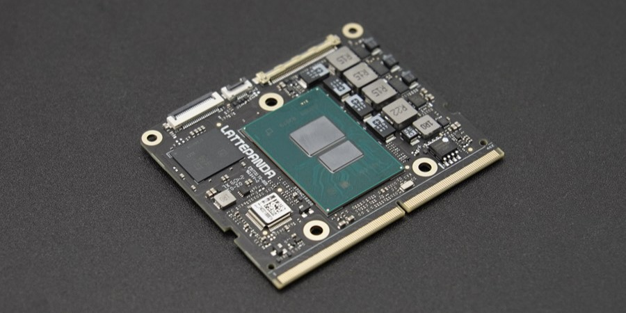

# Introduction

Welcome to the powerful LattePanda Mu, an x86 compute module with customizable interfaces to meet diverse needs. Refer to the following guide for details.

!!! danger
    Remember to completely disconnect the power input before plugging or unplugging the LattePanda Mu.

## For User

- :material-play: [Getting Started](./get_started.md)

- :material-microsoft-windows: [Check Operating System Compatibility](./os_compatible.md)

- :material-download: Download [Drivers](https://github.com/LattePandaTeam/LattePanda-Mu/tree/main/Softwares/Drivers) and [BIOS Updates](https://github.com/LattePandaTeam/LattePanda-Mu/tree/main/Softwares/BIOS)

- :material-truck-flatbed: View Carrier Board Detailed Documentation

    - [Lite Carrier](./lite_carrier.md)

    - [Full Evaluation Carrier](./full_eval.md)

## For Developer

- :material-view-list: [Block Diagram and Detailed Specifications](./specification.md)

- :material-list-status: [Tracking LattePanda Mu Function Develop Status](./dev_status.md)

- :simple-opensourcehardware: [Open Source Carrier Board Design File](https://github.com/LattePandaTeam/LattePanda-Mu/tree/main/Electricals)

- :material-chip: [Evaluating different BIOS branches or trying beta BIOS](https://github.com/LattePandaTeam/LattePanda-Mu/tree/main/Softwares/BIOS)

[**:simple-discord: Join our Discord**](https://discord.gg/RkSvc9g7eU){ .md-button .md-button--primary }
