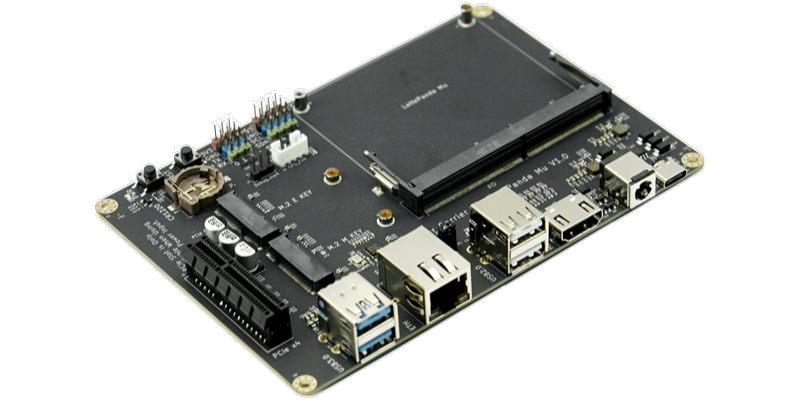
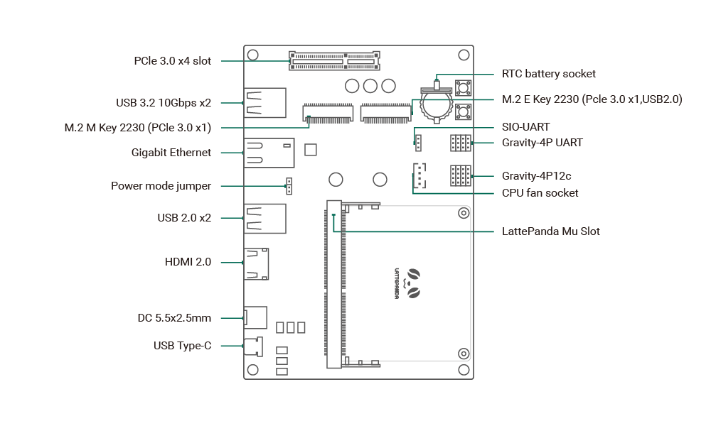

# DFR1142 Lite Carrier Board

{ width="400" }

## Introduction

The Lite Carrier Board is a development platform designed for the LattePanda Mu compute module, integrating common interfaces such as USB 3.0, Type-C, Ethernet, PCIe 3.0, M.2 M Key, M.2 E Key, and HDMI. This allows for the connection of various external devices and modules, facilitating rapid prototyping and testing of different design concepts, thereby reducing the product development cycle. Additionally, its full design is open-source, making it highly suitable as a reference for LattePanda Mu carrier board designs.

!!! danger

    - 🔌 Before inserting/removing the LattePanda Mu or connecting/disconnecting any type of ribbon cable and internal interface, ensure that the power is completely disconnected and wait for the power indicator light on the carrier board to turn off.
    - ❗ All pin headers operate at 3.3V levels; do NOT connect 5V peripherals.
    - ⚡️ The PCIe slot is only available when powered by a 12V supply via the DC 5.5x2.5mm input.
    - 🔥 If installing high-powered expansion cards such as graphics cards into the PCIe x4 slot, verify that the power supply is sufficient.

## Get Started

1. Install the heatsink onto the LattePanda Mu.
2. Insert the LattePanda Mu equipped with a heatsink at a 30° angle into the slot, then press down.
3. Secure the LattePanda Mu with fixing screws.
4. Connect the heatsink fan, eDP ribbon cable, and other internal peripherals as required.
5. Install the RTC battery.
6. Connect the power supply and press the power button to start the device.

Because the RTC loses power, the initial boot may be slow and the system may automatically restart 1-2 times. Please be patient. After the first boot, as long as the RTC remains powered, the boot speed will return to normal.

## Hardware Interface

1. **LattePanda Mu Slot**: For installing the LattePanda Mu compute module.
2. **USB Type-C**: Power supply only, negotiates 15V PD supply.
3. **DC 5.5x2.5mm**: Power input, supports 12~20V wide voltage range.
4. **HDMI 2.0**: Video output, supports 4K resolution, maximum signal bandwidth TMDS 600MHz.
5. **USB 2.0 x2**: Standard USB 2.0 interfaces.
6. **Power Mode Jumper**: Used to switch power modes, see [Power Mode Switch](### Power Mode Jumper) for details.
7. **Gigabit Ethernet**: RTL8111 NIC.
8. **USB 3.2 10Gbps x2**: Standard USB 3.0 interfaces, supporting 5Gbps and 10Gbps transfer rates.
9. **PCIe 3.0 x4 Slot**: For expanding PCIe devices, available only with 12V power supply via the DC 5.5x2.5mm input.
10. **RTC Battery socket**: Supports insertion of a CR1220 battery to power the RTC.
11. **M.2 M Key**: Supports expansion with an M.2 2230 NVMe SSD, PCIe 3.0 x1 signal.
12. **M.2 E Key**: Supports expansion with an M.2 2230 WLAN wireless network card, PCIe 3.0 x1, USB2.0 signal.
13. **SIO_UART**: 3.3V logic level, can be used as a serial port terminal.
14. **Gravity-4P UART**: 3.3V logic level, for connecting UART peripherals.
15. **Gravity-4P I2C**: 3.3V logic level, for connecting I2C peripherals.
16. **CPU FAN**: Connect a 5V cooling fan.

## Interface User Guide

### Power Mode Jumper

The carrier board's auxiliary supply (USB, NIC, M.2 Slot, etc) has two power management modes that can be controlled via jumpers:

- **PSON\#**: Enable auxiliary power only when the system is powered on (ACPI S0 state).
- **SLP**: Enable auxiliary power during both the powered on (ACPI S0) and sleep (ACPI S3) states.

### PCIe 3.0 x4

The PCIe slot is available only when powered by a 12V supply via the DC 5.5x2.5mm input.

Compatible with common PCIe slot devices such as NVMe SSDs, network cards, and graphics cards. If a device requires more than x4 PCIe lanes, it will automatically downgrade to operate at x4 lanes.

**⚠️ Caution**: When installing power-hungry devices such as graphics cards, ensure that the power adapter is sufficiently powerful. For example, a 75W graphics card should be paired with a 12V 120W power supply for system stability.

### M.2 M Key

Compatible with M.2 M Key 2230 SSDs, and can also connect to other PCIe devices via an M.2 adapter.

Since the M.2 M Key provides only PCIe 3.0 x1 signal, the maximum read/write speed is approximately 950MB/s, which may not reach the SSD's advertised maximum speed.

### M.2 E Key

Compatible with M.2 E Key 2230 WLAN network cards, supporting only the PCIe protocol, not the CNVio protocol.

In addition to WLAN modules, it is also compatible with other expansion cards designed for the M.2 E Key interface, such as "Coral M.2 Accelerator A+E key"

## Compatibility List

### Power Supply Compatibility

The Lite Carrier supports two power supply methods:

- USB Type-C: Compatible with power adapters that support the PD protocol with an output power of 45W or more.

- DC Jack: Compatible with power adapters with an output voltage of 12~19V and an output power of 45W or more, with a DC connector specification of 5.5x2.5mm.

**⚠ If you need to use the PCIe x4 Slot, you must use a DC 5.5x2.5mm interface power adapter with an output voltage of 12V. And increase the power supply according to the PCIe expansion card power specification**

### M.2 WLAN Module Compatibility

Compatible with M.2 E Key 2230 WLAN network cards, supporting only the PCIe protocol, not the CNVio protocol.

Tested M.2 WLAN modules include:

- [Intel® Wi-Fi 6E AX210](https://www.dfrobot.com/product-2325.html)
- Intel® Wi-Fi 6 AX200
- Intel® Wireless-AC 9260
- [Intel® Dual Band Wireless-AC 8265](https://www.dfrobot.com/product-1998.html)
- Intel® Dual Band Wireless-AC 8260

This list includes only the modules we have verified. If you have successfully tested modules not listed here and they function properly, we encourage you to submit a pull request to include them.

### M.2 NVMe SSD Compatibility

The Lite Carrier supports M.2 M Key NVMe solid-state drives of the 2230 size.

If you need to expand the 2280 M.2 SSD, you will need to use an M.2 adapter card to install it into the PCIe x4 slot.

### PCIe Expansion Card Compatibility

Compatible with common standard PCIe expansion cards. If you need to insert high-power expansion cards, please check if the power adapter's power is sufficient.

When using the M.2 NVMe SSD adapter card, it will occupy the PCIe expansion slot.

## Design Documentation

The LattePanda Mu Lite carrier board is fully open-source and the complete design files can be downloaded from the [LattePanda Mu GitHub repository](https://github.com/LattePandaTeam/LattePanda-Mu/tree/main/Electricals/Examples) for modification as desired.

The project has been crafted using the open-source electronic design software KiCAD. For optimal compatibility, please open it with KiCAD version 8.0 or higher.
