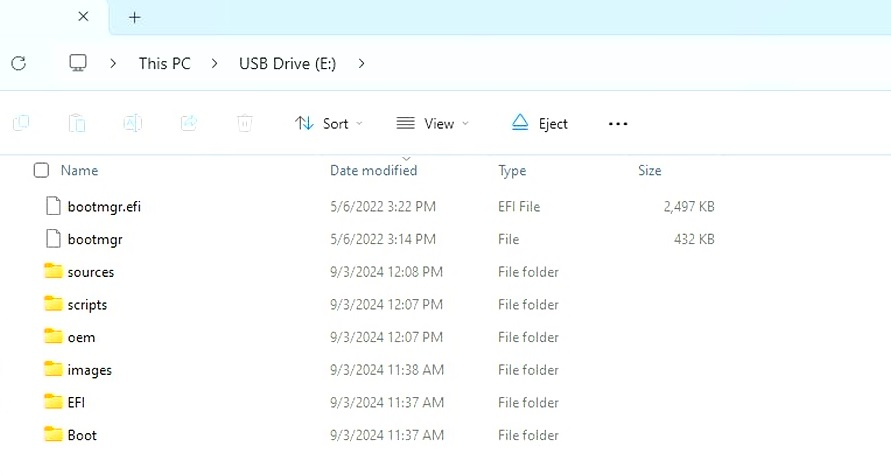
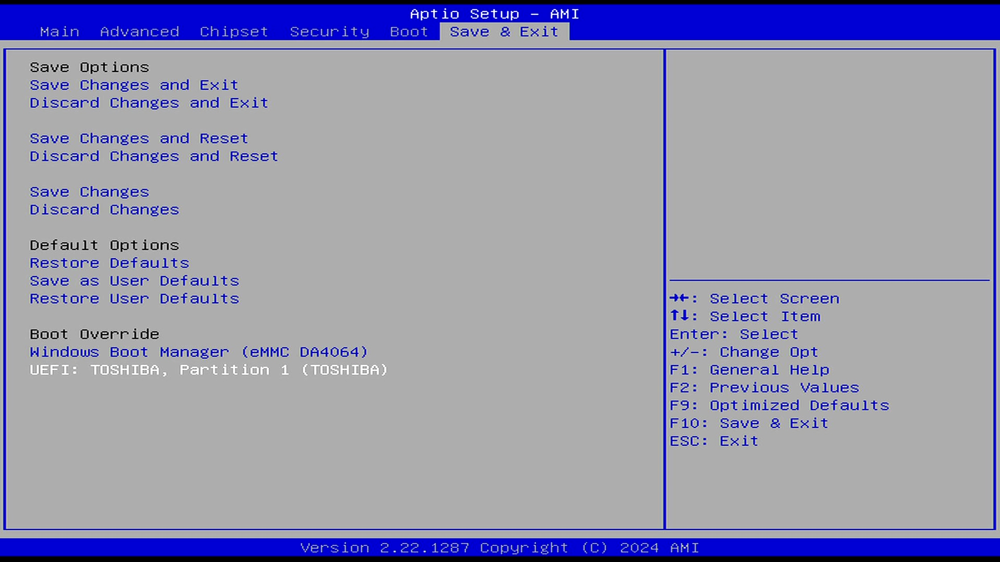

# Operating System

## Windows Recovery Image

In this section, we will use the Windows 11 recovery image file, which is the Windows 11 image pre-installed on the LattePanda Mu from the factory. This image comes with all hardware drivers and is ready to use, providing you with a fast and ultimate experience.

This image does not update in real-time. Therefore, if you need to install the latest version of the Windows OS, you will need to download it yourself and install the drivers.

The Operating system will be installed on the eMMC by default.

??? tip "How to install the recovery OS image to the SSD?"
    - Insert your SSD into the LattePanda Mu with the carrier board, then remove all other storage.
    - Enter into the BIOS setup to disable the onboard eMMC(`Chipset->PCH-IO Configuration->SCS Configuration->eMMC 5.1 Controller:Disabled`). Then save the change.
        
    - Restart the LattePanda Mu. Use the following installation steps to install the system image.

### Preperations

* :material-usb-flash-drive-outline: Empty USB flash drive (8 GB or larger)
* 💿 OS Disc Image File for the LattePanda Mu: Download from [:material-dropbox:Dropbox](https://www.dropbox.com/scl/fo/2t7hqjg8frdaxhyhz8nn2/AD8SyaccaXlrLU_3vBq3fuY?rlkey=wxmxp2edmmygsv3r8yixf5vj8&st=8olwrik0&dl=0) or [:material-google-drive:Google Drive](https://drive.google.com/drive/folders/1_idMEHEUTjU8OPoml1TSp8KbzQ5p-wwr?usp=sharing)

### Installation Steps

* Download the Windows disc image file for LattePanda Mu.

* Format your USB drive into NTFS format.

* Unzip the  Windows disc image file. Then copy and paste them to the USB drive. 

      The files location on the USB flash drive should be as shown below.

  

* Insert your USB drive into LattePanda, and turn on the LattePanda. (If you created the USB installation media on LattePanda, please restart the LattePanda before OS installation.) 

* Press **++del++** key continuously to enter into BIOS setting. 

* On the `Save & Exit` page, there  is a `Boot Override`option.  Use the **++arrow-up++** or **++arrow-down++** key to choose the USB bootable device, then press **++enter++** key.
  

* It will enter into the OS installation terminal. It should look like the picture below. As it's a fully automatic process, you don't need to do anything. Please wait patiently for 5-8 minutes.
  

* After 5~8 minutes, the installation will be completed. You will get the notice in the terminal like the picture below. 
  Then shut down the LattePanda. Unplug the USB flash drive.
  

* Press the power button to turn on the LattePanda. Then it will start the system initialization. After about 3 minutes, it will enter into Windows System desktop.  Now enjoy it!

## Standard Windows Installation

The Lattepanda Mu runs a full version of the Windows OS, which means that the installation process is the same as on a regular laptop or desktop computer. The general steps are as follows:

- Search for and download the version of Windows you need. 
- Burn the Windows image into a USB drive. You can use the [**Rufus**](https://rufus.ie/) for this purpose.
- Plug the USB drive into the LattePanda, and continuously press **++del++** after turning it on to enter the BIOS settings. Configure the LattePanda to boot from the USB drive.
- Follow the on-screen instructions to complete the operating system installation.
- Refer to the drivers section and complete the installation of all necessary drivers.

[**:simple-discord: Join our Discord**](https://discord.gg/k6YPYQgmHt){ .md-button .md-button--primary }