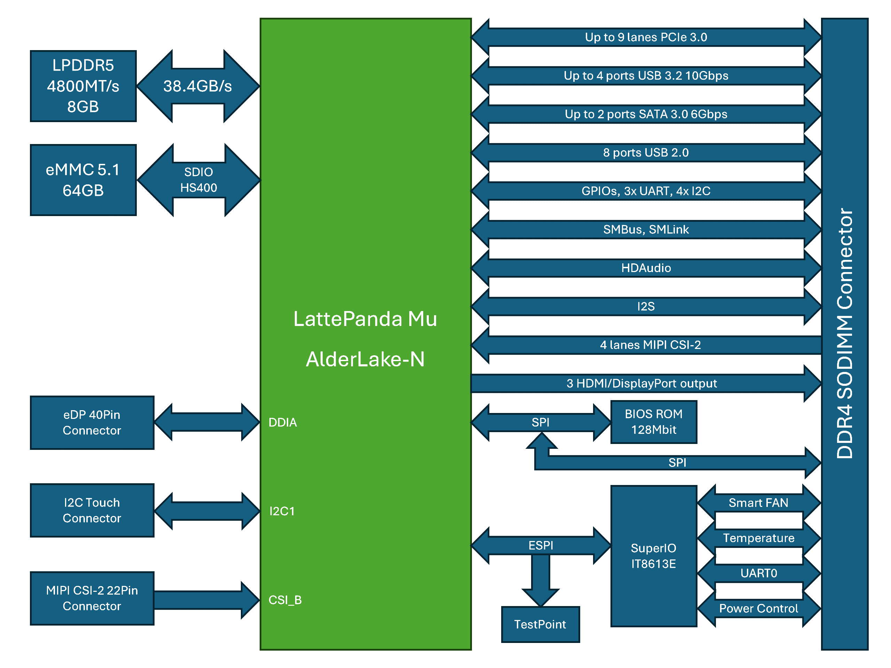

# Tech Specs

## Block Diagram

## Specifications

### CPU

- Intel® Processor N100
    - Cores: 4
    - Max Turbo: 3.4GHz
    - Cache: 6MB
    - TDP: 6~35W configurable

### Memory

- LPDDR5 8GB
    - Speed: 4800MT/s
    - ECC: Support IBECC

### Storage

- eMMC 5.1 64GB
    - Speed: HS400

### BIOS

- AMI UEFI 128Mbit SPI BIOS

### Graphs

- Intel® UHD Graphics
    - EU: 24
    - Max Turbo: 750MHz
    - 3D Acceleration: DirectX 12.1; OpenGL 4.6; Vulkan 1.2

### Display

- eDP 40Pin Connector
    - Support: eDP 1.4b
    - Max Resolution: 4096 x 2160 @ 60Hz

- Digital Display Interface
    - Support: DisplayPort 1.4; HDMI 2.0
    - Max Resolution: 4096 x 2160 @ 60Hz
    - Max Outputs: 3

### I/O

- PCIe 3.0: up to 9 lanes
- SATA 3.0: up to 2 ports
- USB 3.2 (10Gbps): up to 4 ports
- USB 2.0 (480Mbps): 8 ports
- Audio: HD Audio; I2S
- Camera: MIPI CSI-2, up to 8 lanes
- SPI: Yes, for second BIOS ROM and discrete TPM
- SMBus: Yes
- I2C: SoC 4 Ports
- UART: SIO 1 Port; SoC 3 Ports
- GPIO: up to 64 pins expanded by shift registers

### Power

- Supply Voltage:
    - VIN: 9~20V
    - RTC Battery: 3V

### Operating System

- Official Support:
    - Windows 10 Enterprise LTSC
    - Windows 11
    - Ubuntu 22.04 LTS

### Environment

- Operating Temperature: 0~60°C
- Operating Humidity: 0~80% relative humidity, non-condensing

### Dimensions

- 69.6 x 60mm

## Dimension Drawing

LattePanda Mu 3D model available on [GitHub repo](https://github.com/LattePandaTeam/LattePanda-Mu/tree/main/Mechanicals)

[**:simple-discord: Join our Discord**](https://discord.gg/RkSvc9g7eU){ .md-button .md-button--primary }
