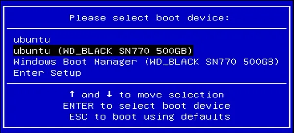
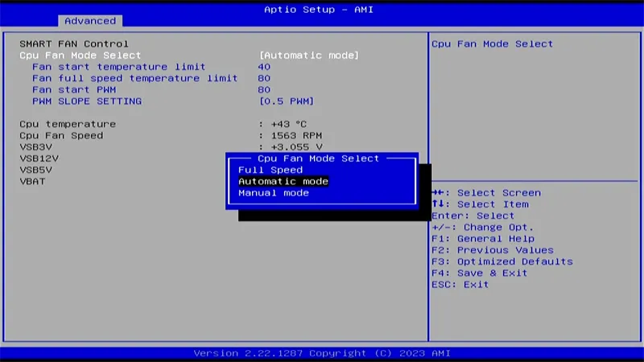
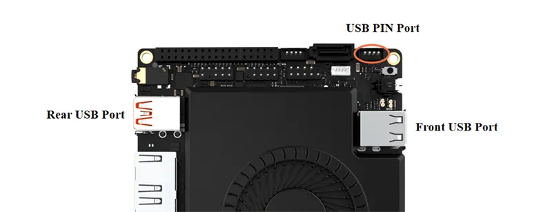
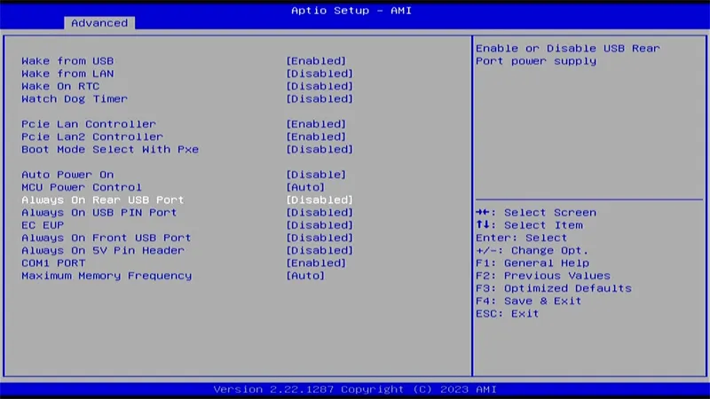
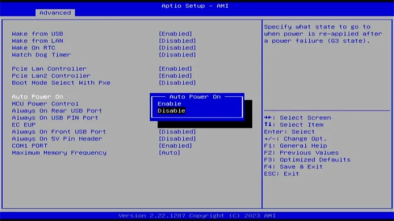
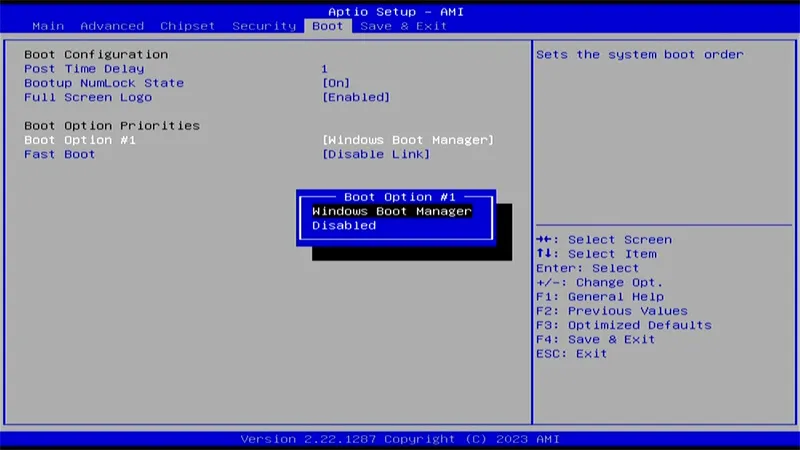

# BIOS Setup

## Enter into BIOS Menu

* Power on or reboot LattePanda.

* Press the **++del++** key repeatedly before the LattePanda logo appears on the screen during the boot process.

    

## Select Bootable Device

* Power on or reboot LattePanda.
* Press the **++f7++** key repeatedly before the bootable devices appear on the screen during the boot process.

* Press **++arrow-up++** or **++arrow-down++** key to select the bootable device, and press **++enter++** key to boot from it. 

  

**The following outlines some common BIOS settings.**

## CPU Cooling Fan Settings

You can modify the CPU fan settings through the following path. The default setting is **"Automatic Mode"**.

**Path: BIOS Setup -> Advanced -> Hardware Monitor -> CPU Fan Mode**

## USB Ports Power Control

All four USB Type-A ports on LattePanda Sigma support power control. The Font USB 2.0 port, rear USB 3.2 gen2 port and the USB 2.0 pin header can be set separately.

**Path: BIOS Setup -> Advanced -> Power Management -> Always On Rear USB Port/Always On Front USB Port/Always On USB PIN Port**

You can set it enabled or disabled. The default setting is **disabled**.

| Always On USB Port | Power Control of the USB Port                                |
| ------------------ | ------------------------------------------------------------ |
| Enabled            | Run: Enabled; Sleep: Enabled; Hibernate: Enabled; Shut Down: Enabled |
| Disabled           | Run: Enabled; Sleep: Enabled; Hibernate: Disabled; Shut Down: Disabled |
|                    | Enabled means the USB port can output power; Disabled means the USB port cannot output power. |

!!! Note
    When the LattePanda is disconnected from the power supply, all USB-A ports and the MCU power control are powered off by default. When the LattePanda is reconnected to the power supply and not turned on, the USB-A ports and the MCU power control remain off.

## Auto Power-on
To turn on LattePanda without pressing the power button, please set Auto Power On in the BIOS.

**Path: BIOS Setup -> Advanced -> Power Management -> Auto Power On**

The default setting is **Disabled**.

!!! Note "RTC Battery Capacity"
    Please ensure that the RTC battery is fully charged, as when it runs down, the Auto Power-on function will not work.

## Configure Bootable Device Order

The default boot order priorities are as follows: 

* Boot Option #1: NVME
* Boot Option #2: USB Device
* Boot Option #3: Network

If default boot order priorities don't meet your requirement, you can change them manually.

**Path: BIOS Setup -> Boot-> Boot Option Priorities**

Press **++arrow-up++** or **++arrow-down++** key to select the bootable device, and press 'Enter' key to confirm it. 

[**:simple-discord: Join our Discord**](https://discord.gg/k6YPYQgmHt){ .md-button .md-button--primary }