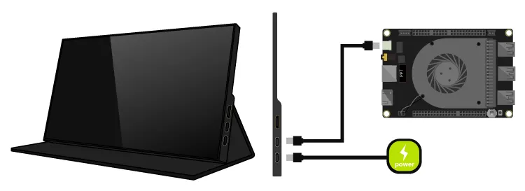

# Display Connections

This chapter will demonstrate multiple ways to connect display devices to your LattePanda, and provide information on the necessary components and installation steps.

!!! Warning "Electrostatic Warning"

    Be sure to remove the static electricity from your body before touching the LattePanda! Otherwise, it may cause potential static discharge and damage your LattePanda! 

## 3 Ways to Connect Your Display

=== "HDMI monitor"

    * via HDMI port
    * HDMI 2.1, Up to 4096 x 2304 @ 60Hz
    * for standard desktop usage

=== "USB Type C monitor or USB Type C to HDMI / DP Dock"

    * via USB Type C port
    * DP 1.4a, Up to 7680 x 4320 @ 60Hz
    * for standard desktop or mobile usage

=== "eDP Screen"

    * via eDP slot
    * eDP 1.4b, 4 Lanes, Up to 4096 x 2304 @ 120Hz
    * for embedded application scenarios

## HDMI

!!! Note "4K HDR"

    The LattePanda Sigma supports HDMI 2.1, therefore, if you are using a display that supports 4K 60Hz HDR, it is recommended to use an HDMI 2.0b or 2.1 cable.

### Preparations

- HDMI Cable
- TV or Monitor with HDMI Port

### Steps

1. Connect one end of the HDMI cable to the HDMI port on the LattePanda.
2. Connect the other end of the HDMI cable to the TV or monitor.

## USB Type C

The USB Type C ports on LattePanda Sigma are both full function Thunderbolt 4. They both supports power, USB data, video and PCIe.

??? Info "Thunderbolt 4 Introcution"

    - Thunderbolt 4 supports video output at up to 8K resolution or faster refresh rates, which is significantly higher than most other types of video outputs, and can help to reduce motion blur and provide a smoother and more responsive visual experience. 
    - Thunderbolt 4 also supports daisy-chaining multiple devices together. You can connect multiple displays to a single Thunderbolt 4 port, without needing to use additional video ports on LattePanda. 
    - Additionally, Thunderbolt 4 supports higher power delivery, which means you can charge your display devices while using the Thunderbolt 4 port for video output. 
    - One Thunderbolt 4 supports up to 8K resolution and 60Hz refresh rate,  but only when connected to a single monitor and use a Thunderbolt 3 or 4, or USB 4 cable.

### Preparations

- USB Type C Display, or USB Type C / Thunderbolt Dock

- USB Type C / Thunderbolt Cable

### Steps

   - If your display device does not have a USB Type C port, you will need to use a USB Type C Dock. Follow these steps to connect your LattePanda to the display device:

    > a. Locate the USB Type C port on your LattePanda(there are two USB Type C ports on LattePanda Sigma, both of which can be used).
    
    > b. Connect the USB Type C HUB to the USB Type C port of your LattePanda. 
    
    > c. Locate the display cable that you want to use (DP / DVI / VGA).
    
    > d. Connect the display cable to the USB Type C HUB. 
    
    > e. Connect the other end of the display cable to your TV or monitor. 

   - If your display device has a USB Type C port, you can directly connect your LattePanda using a USB Type C cable. Follow these steps:

    > a. Locate the USB Type C port on your LattePanda.
    
    > b. Connect one end of the USB Type C cable to the USB Type C port of your LattePanda. Make sure it is securely plugged in.
    
    > c. Connect the other end of the USB Type C cable to the USB Type C port of your display device. Make sure it is securely plugged in.

## eDP(Embedded DisplayPort)

The LattePanda Sigma uses a **0.5mm pitch 40-pin connector** for its eDP interface, which has 4 lanes and supports resolutions up to 4K and refresh rates up to 120Hz. This design allows for a power-efficient and high-bandwidth display connection while also enabling thinner and lighter device designs. 

### Compatibility

In most cases, display devices equipped with a 40-pin eDP connector and powered by 3.3V are compatible with the LattePanda Sigma and do not necessitate the installation of additional drivers. Notably, the eDP connector on the LattePanda Sigma is designed with four lanes.

### Preparations

- [Touch Display (eDP) for LattePanda Sigma](https://www.dfrobot.com/product-2763.html)

### Steps

!!! Warning "Ensure Correct eDP Cable Installation"

    To avoid any potential damage to your LattePanda or display device, it's important to ensure that the eDP cable is correctly installed and the display is connected before turning on your LattePanda. Please double-check these connections carefully, as failure to do so may cause a short circuit.

- Before starting, ensure that your LattePanda is powered off and disconnected from its power supply cable.

- Align the eDP cable with the eDP connector on LattePanda. Make sure the gold finger of the eDP cable face up.

    { width="400" }

!!! tip
    Gently insert the eDP cable into the connector. If the cable has the latch, press down on the latch to secure the cable in place.

- Reference Video: :fontawesome-brands-youtube:{ style="color: #EE0F0F" }[How to Install the 7'' eDP Touch Display for LattePanda Sigma](https://youtu.be/tbvC4nlbtog)

### Pin Definition

When selecting a screen, please refer to the following pin definitions and voltage parameters.

Voltage of the Power Pin:

* LCD_VCC: 3.3V
* BL_PWR:  9.6V

## Touch Panel

Touchscreen connections can be made using **USB, I2C, or Type-C**. 

- USB and Type-C connections are simple and convenient, suitable for most PCs and tablets. 
- I2C connection is commonly used in embedded applications, especially for eDP touchscreen screens. 

When choosing a touchscreen, it is important to consider the requirements of the device and the intended application scenario in order to choose the appropriate connection method.

!!! note ""
    === "USB Connection"

        **The USB connection** is a common method for connecting a touchscreen, known for its simplicity, convenience, and wide compatibility. **Most personal computers and tablets** support USB interfaces, making it suitable for these devices. USB connection typically utilizes the USB HID (Human Interface Device) protocol for communication, enabling basic touchscreen functionality.
    
    === "I2C Connection"
    
        **The I2C connection** is a serial communication protocol commonly used for embedded devices. In the context of touchscreens, the I2C connection is often employed for connecting eDP (Embedded DisplayPort) touchscreen screens. Compared to USB connection, I2C has a lower transmission rate but is more prevalent in embedded applications. Selecting an I2C connection usually requires considering factors such as **device power consumption and space limitations**.
    
    === "TYPE C Connection"
    
        **The Type-C connection** is a versatile and comprehensive standard that supports various protocols and functions, including USB, DisplayPort, and Power Delivery. Opting for a Type-C connection is typically suitable for scenarios that demand both data transfer and power charging capabilities simultaneously, such as **high-performance tablets and mobile devices**.

[**:simple-discord: Join our Discord**](https://discord.gg/k6YPYQgmHt){ .md-button .md-button--primary }