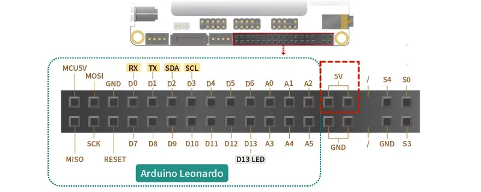
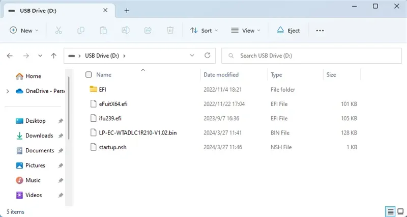
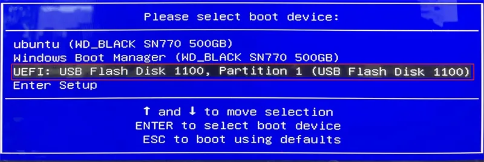

# EC Firmware
## EC Firmware for Continuous Power Supply to MCU and 5V Pin Headers
Applicable for LattePanda Sigma 16GB RAM and 32GB RAM models.

**Location of MCU (Arduino Leonardo) and 5V Pin Headers**
 

!!! note ""
    #### :fontawesome-solid-microchip: LP-EC-WTADLC1R210_FLASHUPDATE2
    - **Update Time:** 2024/03/27
    - **Size:** 619KB
    - **Update Information:**
        * keep the MCU power and 5V pin headers power continuously on
    - :fontawesome-solid-download:  [**Download**](https://github.com/LattePandaTeam/LattePanda-Win10-Software/tree/master/BIOS%20for%20LattePanda%20Sigma/EC%20firmware%20for%20Continuous%20Power%20Supply%20to%20MCU%20and%205V%20Pin%20Headers)

!!! Note

    It needs to be paired with the following BIOS settings:

    
    1. BIOS Setup -> Advanced -> Power Management -> MCU Power Control -> Enabled  
    2. BIOS Setup -> Advanced -> Power Management -> Always On 5V Pin Header -> Enabled

    This setup ensures that: as long as the LattePanda Sigma is connected to a power source, the Arduino pins and 5V Pin Headers will be powered, regardless of whether the device is switched on or off.

## Update the EC Firmware

#### **Preparation:**
1．LattePanda board 
2．:material-usb-flash-drive: USB flash Drive (Formatted as **FAT32**) 
3．:octicons-file-zip-24: EC firmware

#### **Instructions:**
1. Unzip the EC firmware and copy all files under "LP-EC-WTADLC1R210_FLASHUPDATE2" to the **root directory** of your USB drive;

     

2. Insert the USB flash drive and start the system;

3. Continuously press **"F7"** and choose the USB flash drive as your boot option;

     

4. The EC firmware will start to update automatically.

5. Wait for the update to finish. The system will automatically shut down. Upon pressing the power button, you will be able to keep the MCU power and 5V pin headers power continuously on.

This concludes our tutorial. Hope you've found it helpful and good luck with your future projects!

[**:simple-discord: Join our Discord**](https://discord.gg/k6YPYQgmHt){ .md-button .md-button--primary }