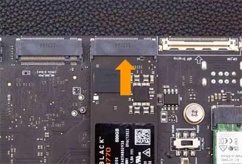
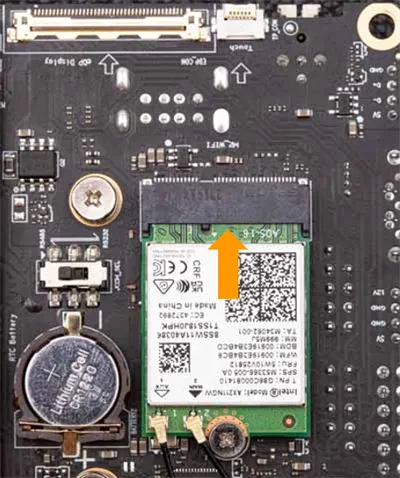
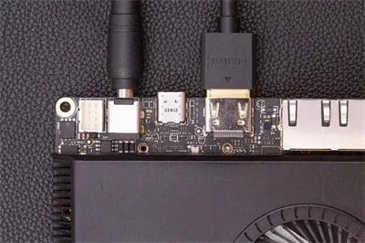
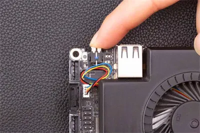

# Initial Setup

This chapter will show how to start with your LattePanda Sigma at the first time. It will demonstrate what you need and instructions to boot up LattePanda Sigma.

## Booting the LattePanda

### Preparations

Before booting your LattePanda Sigma, you will need the following accessories:

- :fontawesome-regular-hard-drive:      M.2 NVMe SSD
- :material-wifi:     [M.2 Wireless Network Module with WiFI/BT Antennas (optional)](https://www.dfrobot.com/product-2325.html)
- :material-cable-data:     HDMI Cable
- :material-monitor:    An External Monitor
- :material-keyboard:    Keyboard and a Mouse
- :material-power-plug-battery:    A Power Adapter

### Instructions

!!! Warning "Electrostatic Warning"

    Please note that the LattePanda is a uniquely designed, pocket-sized device that offers endless possibilities for embedded developments and IoT innovations. As with all CPU-related products, the LattePanda is electrostatically sensitive. Although we have implemented an anti-static design, it is crucial to be cautious when handling the device. Please ensure that you remove any static electricity from your body before touching the LattePanda. Failure to do so may result in potential static discharge and damage to your device.

!!! Note "Attach Backplane to Protect LattePanda"
    After assembling the components, please attach the metal backplane to safeguard the LattePanda board's bottom components from short-circuit damage due to small metallic objects.

- **Connect an M.2 NVMe SSD  to the M.2 M key socket.**
    * Before using the M.2 sockets, if a metal backplane has been installed, uninstall the metal backplane first.
    * The LattePanda Sigma is compatible with 2280 NVMe PCIe 4.0 x4 and 3.0 x4 SSDs.
    * If you are using a SSD purchased by yourself, please refer to the [Multiple OS Support][3] section for instructions on installing Operating System on your SSD. 
    * The 500GB PCIe 4.0 x4 SSD is already assembled on the DFR1081 and DFR1091 model, and the Windows 11 Pro 22H2 OS(not activated) has been pre-burned.

[3]: Operating_Systems.md

  

- **Install a compatible wireless network module to the M.2 E key socket. Then assemble the WiFi/BT Antennas.**
    * Commonly Used Module: Intel AX210, AX211.
    * Please refer to [Mutiple Internet Connections][4] section for a list of compatible modules. If you don't need a wireless connection, you can skip this step. 

[4]: Internet_Connection.md

  

- **Connect an HDMI display.** 
    * Please refer to the [Display Connections][5] section for instructions on using different displays with your LattePanda.
[5]: Display_Connection.md

- **Connect a keyboard and mouse to the USB ports on LattePanda.**

- **Connect the power adapter(Provided) to LattePanda.** 
    * Please refer to the [Powering On][6] section for instructions on using different power solutions to power your LattePanda.

[6]: Powering_On.md

  

- **Press the power button and the blue LED indicator will light up.** 
    
  * Wait approximately 30 seconds for the operating system to fully boot up.
  
  

[**:simple-discord: Join our Discord**](https://discord.gg/k6YPYQgmHt){ .md-button .md-button--primary }