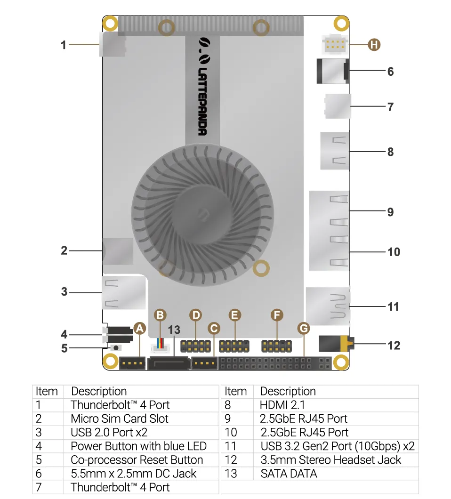
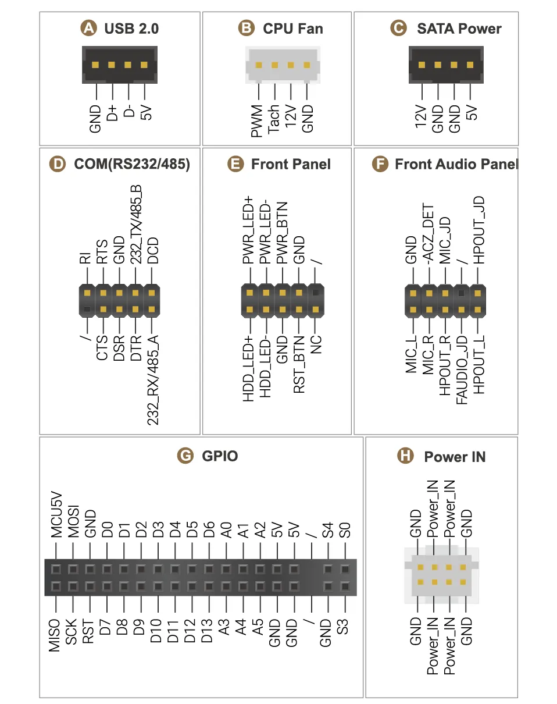
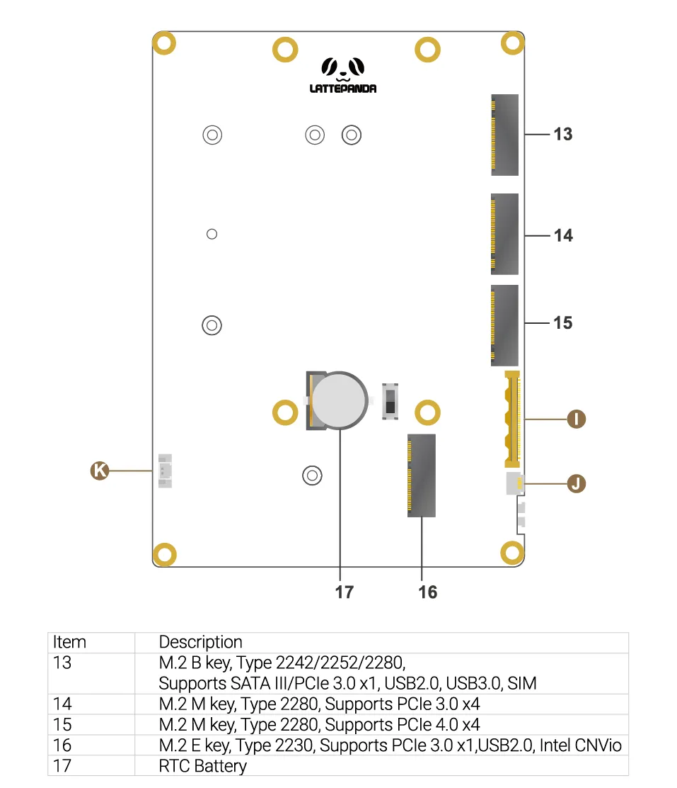
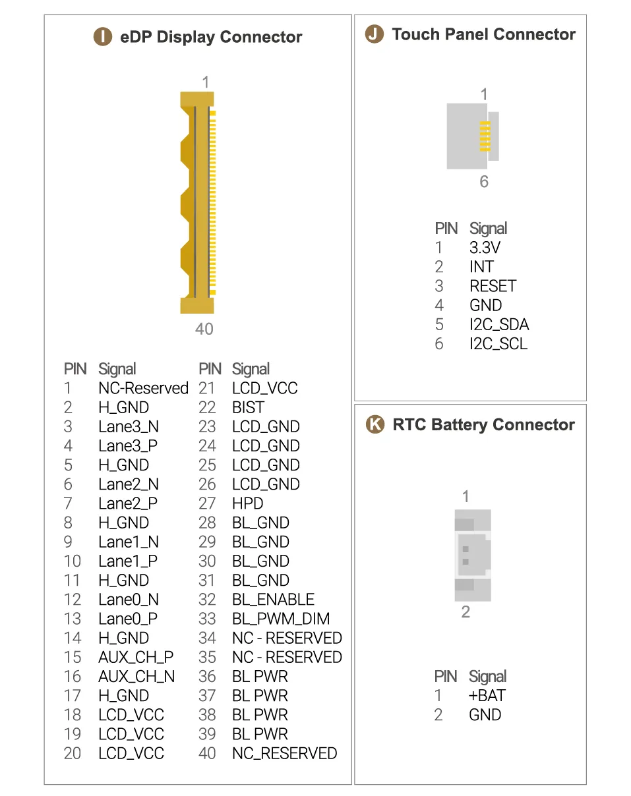
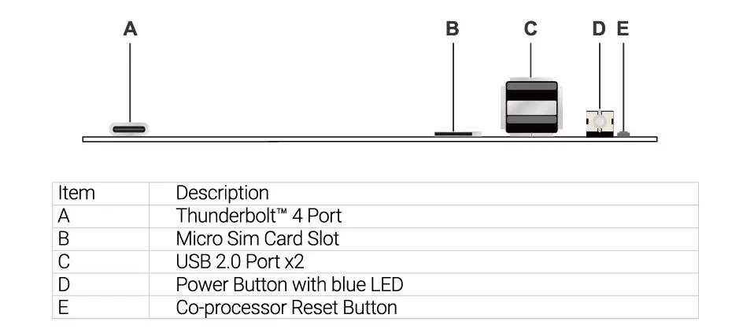
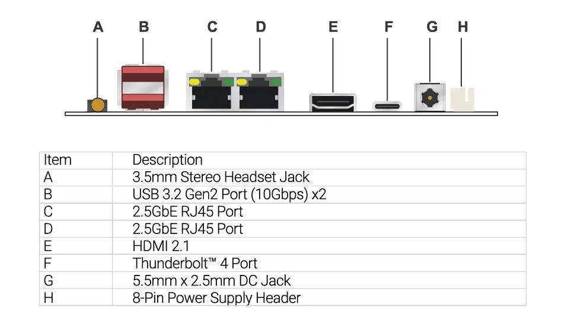
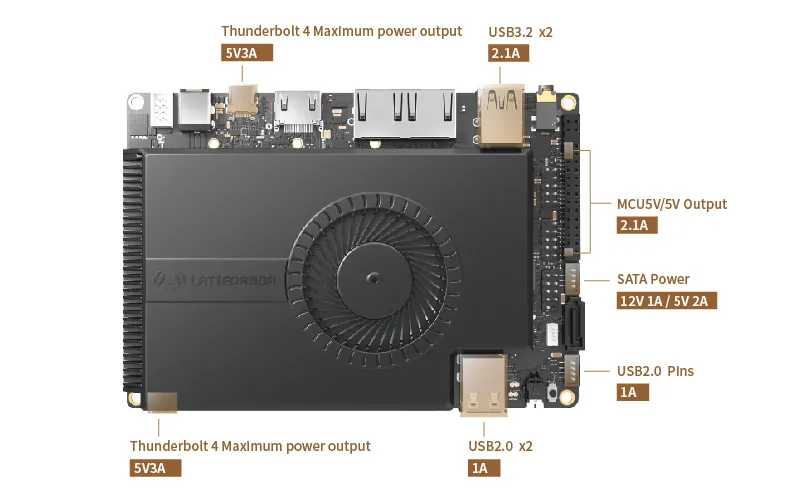
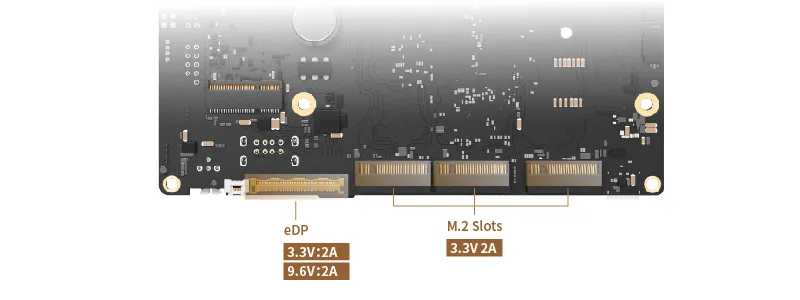

# Pinout and  Layout

## Top Layout

## Bottom Layout

## Front Panel

## Back Panel

## Maximum Current Output of Power Supply Interfaces

The LattePanda Sigma features several power supply interfaces, including USB Type-A and Type-C. Each of these interfaces can deliver a specific maximum current output. It's essential to understand these limits when connecting devices to ensure they receive sufficient power to work properly.
#### Front

#### Back

[**:simple-discord: Join our Discord**](https://discord.gg/k6YPYQgmHt){ .md-button .md-button--primary }