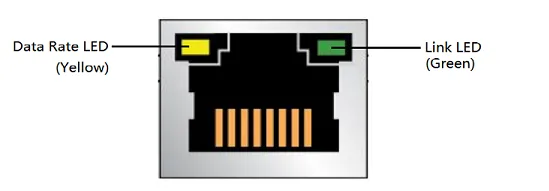

## USB Type-A Port

There are four USB Type-A ports on the LattePanda Sigma. Two USB 2.0 ports are located on the front panel, with a theoretical maximum throughput of 480Mbps/s each. The other two ports on the back panel are USB 3.2 Gen 2 ports, with ultra-high bandwidth delivering **up to 10Gb/s** throughput, which is twice as fast as USB 3.2 Gen 1 x1 (previously known as USB 3.0). 

These connectors are standard Type-A receptacles, allowing them to be connected to all types of USB 1.1,2.0,3.0 devices using standard-A USB 3.0 or USB 2.0 plugs.

All four USB Type-A ports on LattePanda Sigma support power control. 

The default configure is as following:

| OS State  | USB Port Power Control                                       |
| --------- | ------------------------------------------------------------ |
| Run       | Enabled                                                      |
| Sleep     | Enabled                                                      |
| Hibernate | Disabled                                                     |
| Shut Down | Disabled                                                     |
|           | Enabled means the USB port can output 5V power;  Disabled means the USB port cannot output 5V power. |

- When the LattePanda is disconnected from the power supply, then reconnected to the power supply but not turned on, the USB-A ports power control remain disabled.
- You can change the USB port power control in the BIOS. Please refer the [USB Ports Power Control](BIOS_Setup.md#usb-ports-power-control) section.

## USB Type-C Port(Thunderbolt 4)

Both of the two USB Type C ports on LattePanda Sigma are full function Thunderbolt™ 4, which support power, USB data, video and PCIe. They have a 40Gbps (gigabits per second) bidirectional bandwidth. Thunderbolt 4 supports multiple 4K displays or a single 8K display, and it could be an ideal choice for video professionals and gamers. It can offer fast data transfer speeds, high-resolution display support, and fast charging simultaneously, enabling it to be used in a wide range of applications.

The following devices can be connected to Thunderbolt™ 4 ports:

- Thunderbolt™ devices (bearing the Thunderbolt™ logo). Thunderbolt™ 3 devices and cables are compatible with Thunderbolt™ 4 ports. Older Thunderbolt™ devices will also work but require an adapter.

- External monitors. One Thunderbolt™ 4 port can connect up to two 4K 60hz DisplayPort or HDMI monitors through a compatible dock or adapter.

- Storage. Connect a high-speed external Thunderbolt™ SSD to expand the storage capacity of your system and achieve speeds on par with internal drives.

- USB peripherals. Connect USB devices such as mice, keyboards, controllers, and headsets for gaming.

- PCI Express (PCIe) devices. Utilize a PCIe expansion chassis to access compatible PCIe devices.

- Networking. Connect to a high-speed 10 Gigabit Ethernet network via an adapter or use a Thunderbolt™ cable to connect two computers over a peer-to-peer network.

- Charging. Connect your phone, a display, a lightweight notebook PC (that requires less than 100W), and other compatible USB devices to charge them quickly.

  
  
  These two USB Type C ports on LattePanda Sigma can still output power when the OS in hibernate or shutdown state. If you want to disabled the power output in hibernate or shutdown state, please enabled EC EUP function in the BIOS.

## RJ-45 LAN Connector(2.5Gbps)

The LattePanda Sigma features two 2.5 Gigabit Ethernet ports, which use the Intel i225-V Ethernet Controller. These ports support various speeds, including 10Mbps, 100Mbps, 1Gbps, and 2.5Gbps. And with support for **Wake-On-LAN (WOL)**, LattePanda can be easily managed remotely, making it a perfect choice for network administrators or anyone who needs to remotely manage their device. 

Whether streaming high-definition video, downloading large files, or managing a network of devices, the LattePanda Sigma's 2.5GbE RJ45 ports are sure to provide the speed and reliability to get the job done.

Two LEDs are built into the RJ-45 LAN connector, here are the LED states:

| LED           | LED Color | LED State | Meaning                                           |
| ------------- | --------- | --------- | ------------------------------------------------- |
| Link LED      | Green     | OFF       | LAN link is not established                       |
|               |           | ON        | LAN link is established                           |
|               |           | Blinking  | LAN activity is occurring                         |
| Data Rate LED | Yellow    | OFF       | 10/100 Mb/s data rate is selected, or no LAN Link |
|               |           | Green     | 1000 Mb/s or 2500 Mb/s data rate is selected      |

## SATA Port

LattePanda Sigma has a SATA 6Gb/s data port and a power port. It can support 2.5 or 3.5 inch Hard Drive. To use with a HDD , a SATA data cable and a PH2.0-4Pin to 15Pin SATA power cable is needed. 

- Recommended SATA Power Cable: [SATA Power Cable for LattePanda Sigma](https://www.dfrobot.com/product-2751.html)

- SATA Data Cable: universal SATA data cable

[**:simple-discord: Join our Discord**](https://discord.gg/k6YPYQgmHt){ .md-button .md-button--primary }