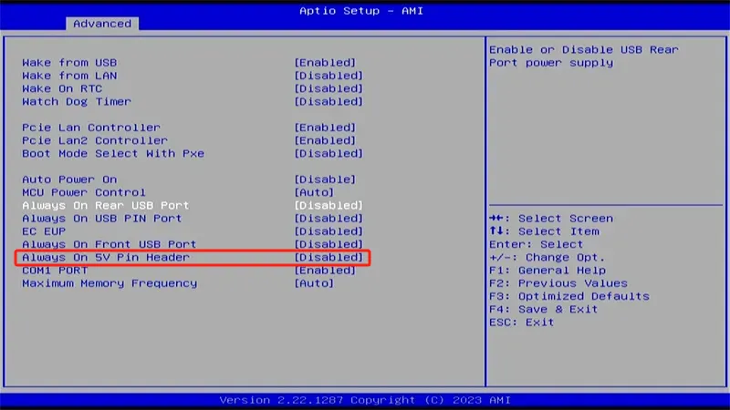
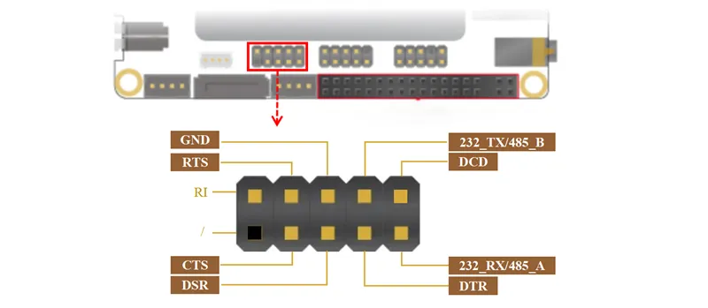

## M.2 Sockets

There are four M.2 sockets on LattePanda 3 Delta: **M key x2, E key x1, B key x1**.

=== "M.2 M Key"

    !!! note ""
        The M.2 M key sockets allow **PCIe 4.0 x4** and **PCIe 3.0 x4**.
        
        #### :material-check-circle: **Compatible Device**
          - **Storage:** Compatible with M.2 NVMe SSD, Type 2280
          - **Other Devices:** eGPU (If you have a high-quality cable adapter such as the ADT Link, you can also connect an eGPU to the M.2 M key slot. Here is a [**video link** :link:](https://youtu.be/LMmm2V33cvs) for your reference)

=== "M.2 E Key"
    
    !!! note ""
        The M.2 E key socket allows **PCIe 3.0 x1, USB2.0, Intel CNVio**.
    
        #### :material-check-circle: **Compatible Device**
          - **Wireless Devices**
            * M.2 WiFi Module via CNVio, Type 2230: Intel AX211, AX201, etc.
            * M.2 WiFi Module via PCIe, Type 2230: Intel AX210, AX200, etc.

=== "M.2 B Key"

    !!! note ""
        The M.2 B key socket allows **SATA III/PCIe 3.0 x1, USB2.0, USB3.0, SIM**.
        
        #### :material-check-circle: **Compatible Device**
          - **Storage:** Compatible with M.2 SATA SSD, Type 2242/2252/2280
          - **Wireless Devices**
            * M.2 4G Module (USB 2.0 lane)
            * M.2 5G Module (USB 3.0 lane)
        
          Before using the 4G or 5G module, please insert a micro-SIM card into the SIM card slot, then assemble the antennas on the module. More information to get Cecullar network on LattePanda, pls refer to [**Multiple Network**](Internet_Connection.md#cellular-4g5g).
          
          
    
          Then install the driver of the module after logging into the OS.
          We have tested the following modules, which are working fine in the Windows 10/11 OS.
    
          * [Quectel EM05-E](https://www.quectel.com/product/lte-em05-series)
          * [SIMCom SIM7600G-H-M2](https://www.dfrobot.com/product-2643.html)
          * [Quectel RM500Q-GL](https://www.quectel.com/product/5g-rm50xq-series)
          * [SIMCom SIM8262](https://www.dfrobot.com/product-2636.html)

## GPIO Pins
#### :simple-arduino: Arduino Leonardo Pins

One of the distinctive features of LattePanda is its built-in co-processor, the Arduino Leonardo, which is a microcontroller based on ATmega32u4.

For more detailed information and tutorials on how to use the Arduino Leonardo, you can refer to the official Arduino website: [:simple-arduino: **Arduino Leonardo Tutorials**](https://docs.arduino.cc/retired/getting-started-guides/ArduinoLeonardoMicro#tutorials).

- **MCU Power Configuration**

By default, the Arduino Leonardo pins on the LattePanda Sigma are powered only when the device is either turned on or in sleep mode. However, **enabling the MCU Power Control** in the BIOS settings will keep them powered even when the device is off.

Please note, it only works if the power supply is constant. If interrupted, the Arduino pins won't be powered without booting the device. To keep the pins powered whenever the device is connected to a power source, you can flash a specific EC firmware.

[:octicons-file-zip-24: **EC firmware for Continuous Power Supply to MCU and 5V Pin Headers**](../../content/sigma_edition/EC_Firmware.md)

| Status                 | Default BIOS settings                                         | Modifying BIOS Settings                                      | Modifying BIOS Settings + Flashing Specific EC Firmware      |
| :--------------------- | ------------------------------------------------------------ | ------------------------------------------------------------ | ------------------------------------------------------------ |
| **Settings**           | BIOS Setup -> Advanced -> Power Management -> MCU Power Control -> Auto | BIOS Setup -> Advanced -> Power Management -> MCU Power Control -> Enabled | 1. BIOS Setup -> Advanced -> Power Management -> MCU Power Control -> Enabled 2. Flash the EC firmware for continous power supply to MCU and 5V pin headers |
| **MCU(Arduino) Power Status** | Run: Has Power  Sleep: Has Power  Hibernate: No Power  Shut Down: No Power | Run: Has Power Sleep: Has Power  Hibernate: Has Power  Shut Down: Has Power  :material-comment-alert-outline: Only effective when power supply is uninterrupted. If the power to the LattePanda Sigma is cut off and then reconnected without booting the device, the Arduino pins will not be powered. | Run: Has Power  Sleep: Has Power  Hibernate: Has Power  Shut Down: Has Power  :material-comment-alert-outline: The Arduino pins will stay powered whenever the LattePanda Sigma is connected to a power source (regardless of whether the device is on or off). |

#### :zap: 5V Pin Headers

The female headers feature two 5V output pins. The pins support a maximum of **2.1A**.

- **5V Pin Header Power Configuration**

By default, the 5V Pin Headers on the LattePanda Sigma are powered only when the device is either turned on or in sleep mode. However, enabling the **'Always On 5V Pin Header'** option in the BIOS settings will keep them powered even when the device is off.

Please note, it only works if the power supply is constant. If interrupted, the 5V Pin Headers won't be powered without booting the device. To keep the pins powered whenever the device is connected to a power source, you can flash a specific EC firmware.

[:octicons-file-zip-24: **EC firmware for Continuous Power Supply to MCU and 5V Pin Headers**](../../content/sigma_edition/EC_Firmware.md)

| Status                         | Default BIOS settings                                        | Modifying BIOS Settings                                      | Modifying BIOS Settings + Flashing Specific EC Firmware      |
| :----------------------------- | ------------------------------------------------------------ | ------------------------------------------------------------ | ------------------------------------------------------------ |
| **Settings**                   | BIOS Setup -> Advanced -> Power Management -> Always On 5V Pin Header -> Disabled | BIOS Setup -> Advanced -> Power Management -> Always On 5V Pin Header -> Enabled | 1. BIOS Setup -> Advanced -> Power Management -> Always On 5V Pin Header -> Enabled 2. Flash the EC firmware for continous power supply to MCU and 5V pin headers |
| **5V Pin Header Power Status** | Run: Has Power  Sleep: Has Power  Hibernate: No Power  Shut Down: No Power | Run: Has Power Sleep: Has Power  Hibernate: Has Power  Shut Down: Has Power  :material-comment-alert-outline: Only effective when power supply is uninterrupted. If the power to the LattePanda Sigma is cut off and then reconnected without booting the device, the 5V Pin Headers will not be powered. | Run: Has Power  Sleep: Has Power  Hibernate: Has Power  Shut Down: Has Power  :material-comment-alert-outline: The 5V Pin Header will stay powered whenever the LattePanda Sigma is connected to a power source (regardless of whether the device is on or off). |

#### :bulb: Status Indication Pins

The S0, S3, S4 pins can indicate the current state of operating system through different output voltages. So the OS status can be obtained by reading these voltages or connecting LED indicators.

The voltage of these pins in different states are shown as follows:

|        | Run  | Sleep | Hibernate | Shut Down |
| ------ | ---- | ----- | --------- | --------- |
| S0 Pin | High | Low   | Low       | Low       |
| S3 Pin | Low  | High  | Low       | Low       |
| S4 Pin | Low  | Low   | High      | Low       |

* High: 5V; Low: 0V
* The power output of these pins has built-in 1K ohm resistors.

## Front Panel Pins

#### :material-power-standby: Power Switch
By shorting these pins, you can turn the LattePanda on or off. 

#### :material-restart: Reset Switch Pins
By shorting these pins, you can reset the LattePanda.

#### :material-lightbulb-on: Power LED Pins
By connecting an LED light, it serves as the system's power indicator, providing a visual indication that the system is powered.

#### :material-lightbulb-on: Hard Drive LED Pins
By connecting an LED light, it serves as the hard drive activity indicator. This LED illuminates whenever the hard drive is accessed, providing a visual indication of hard drive activity.

## RS232/485 Pins

The LattePanda Sigma features shared pinout design for its RS232 and RS485 serial interfaces. These functions are controlled by **a DIP switch** located on the back side of Sigma board, near the RTC battery.

{width="300"}

Before using either the RS232 or RS485 functionality, please ensure that the DIP switch is properly configured according to your intended communication protocol. Incorrect settings may result in communication failure or signal interference.

!!! note
    Please note that changes to the DIP switch setting require the system to be powered off. Do not adjust the switch while the board is in operation.

[**:simple-discord: Join our Discord**](https://discord.gg/k6YPYQgmHt){ .md-button .md-button--primary }