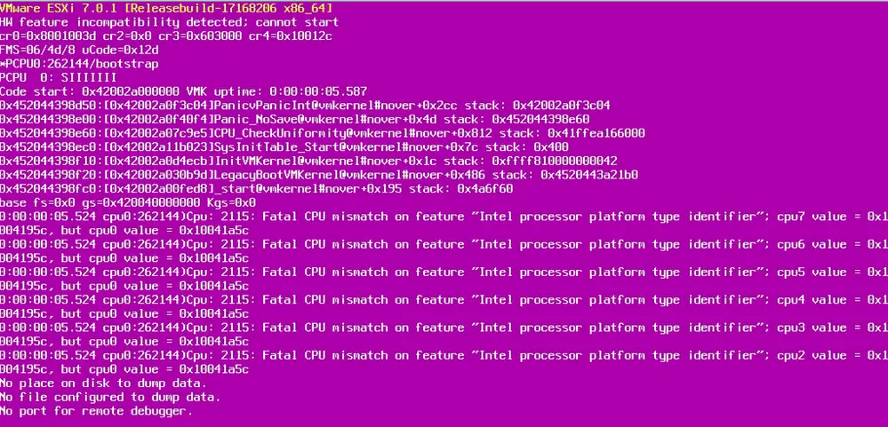
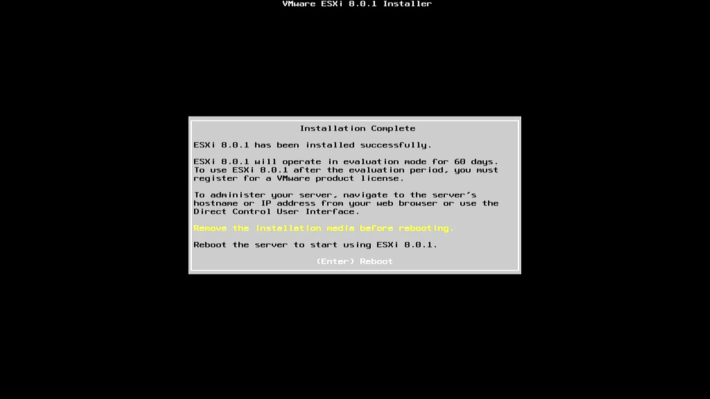
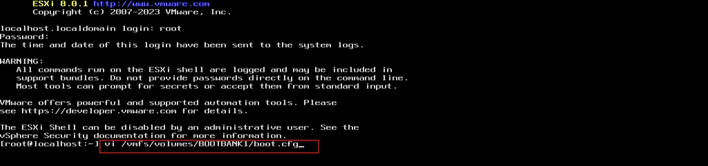
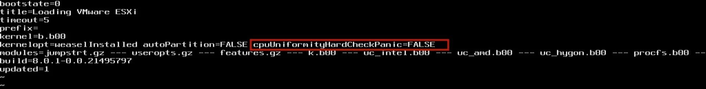
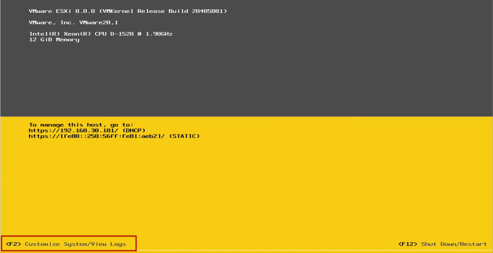
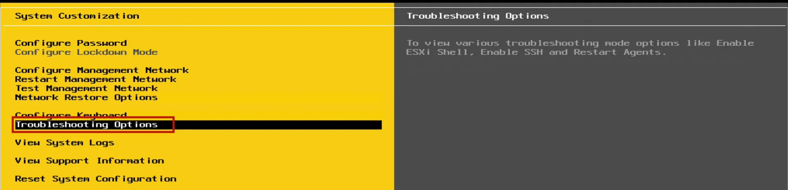
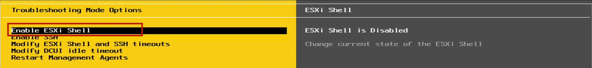
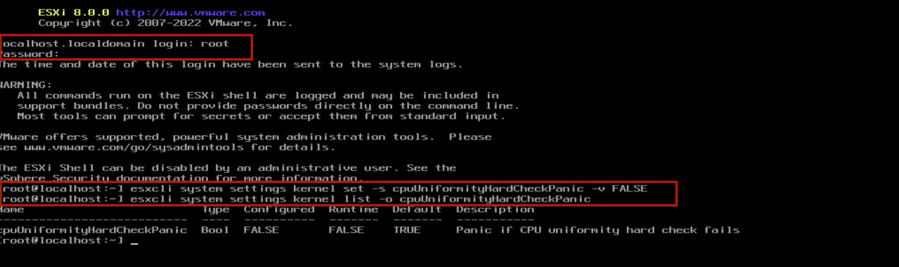

# Operating Systems

## VMware ESXi

VMware ESXi is a software program that enables virtualization, allowing multiple virtual machines to run on a single physical host. It is used to create and manage virtual machines, providing a cost-effective and efficient way to utilize hardware resources, simplify IT management, and increase server utilization.

As ESXi does not support Intel's hybrid consumer CPU architecture that integrates two types of CPU cores: **Performance-cores** (P-cores) and **Efficienct-cores** (E-cores) into the same physical CPU die, you may encounter a PSOD (Purple Screen of Death) when attempting to power on a virtual machine on LattePanda Sigma, resulting in the following exception:

The error code indicates that the issue is caused by CPU incompatibility. However, there is a workaround available that does not require disabling the E-Cores or P-Cores.

### Solution

To resolve the issue, we will add an ESXi kernel boot option that disables the CPU uniformity check. Please refer to the instructions below for more details.

* **STEP 1** 

- When booting up the ESXi installer, you will be prompted to append additional ESXi kernel boot settings. Press **SHIFT+O** and add the following kernel option to the command line: **cpuUniformityHardCheckPanic=FALSE**. Then press enter to continue with the boot process.

- Install ESXi by following the install wizard and once you are prompted to reboot, **DO NOT reboot yet**. We still need to add the kernel option again so that ESXi can successfully boot after the installation. 

* **STEP 2**

- Switch into the ESXi shell by pressing **ALT+F1**. 
- Login using **'root'** and blank password as ESXi has not gone through full reboot and is not using the configured password. and Edit **vi /vmfs/volumes/BOOTBANK1/boot.cfg** 

- Append following kernel option **cpuUniformityHardCheckPanic=FALSE** to existing kernelopt entry, which should look like the following:

​		`kernelopt=weaselInstalled autoPartition=FALSE cpuUniformityHardCheckPanic=FALSE`

- Save your changes by pressing **'wq'** and then change back to the reboot prompt by pressing **ALT+F2** and then reboot.
- Instead of having to manually append the ESXi kernel option, you will notice that it has been appended and applying the setting in the boot.cfg file.

* **STEP 3** 

To permanently configure the ESXi kernel boot setting, in case of updates/upgrades in the future, we can set the kernel setting using ESXCLI. 

- Login to DCUI by pressing **F2**. 

- Navigating to **Troubleshooting Option**.

- Enable **ESXi Shell.**

* **STEP 4**

Switch into the ESXi shell by pressing **ALT+F1**. Then login with '**root**' and the password you had configured during installation. Now run the following ESXCLI command to configure the kernel option:

`esxcli system settings kernel set -s cpuUniformityHardCheckPanic -v FALSE`

* **STEP 5**

Reboot it by executing the command "**reboot**". Now, you can run VMware ESXi on your LattePanda Sigma.

[**:simple-discord: Join our Discord**](https://discord.gg/k6YPYQgmHt){ .md-button .md-button--primary }