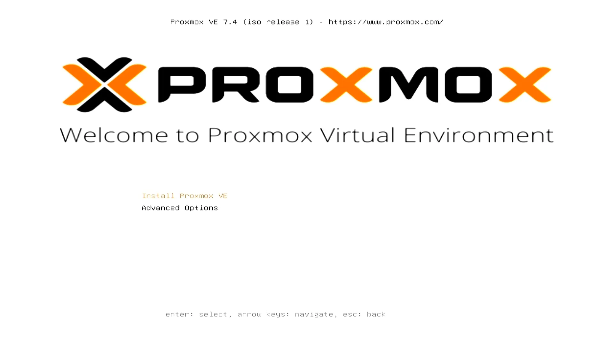
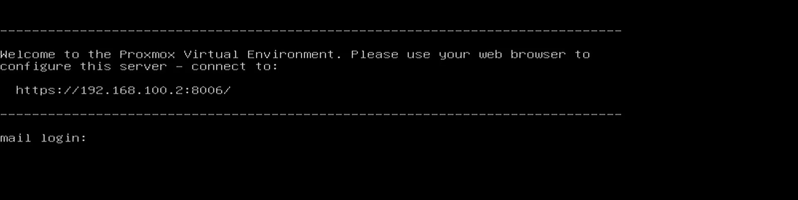

# Operating Systems

## Proxmox VE


### What You Will Need

* :material-usb-flash-drive-outline:  Empty USB Flash Drive (8 GB or larger)
* 💿[Proxmox VE image file](https://www.proxmox.com/en/downloads/category/iso-images-pve) (Download Proxmox VE 7.4 ISO Installer)

### Build an USB Boot Disk

* Download the Proxmox VE image file. We use `Proxmox VE 7.4 ISO Installer`.
* Create a USB installation media for Proxmox VE. We recommend using [Rufus](https://rufus.akeo.ie/) to create the installation media. 
* Choose your USB flash drive, and load the ISO file. The GUI of Rufus will look like the picture below. Click `Start` to burn the ISO file onto the USB flash drive.


### Installation Steps

* Insert your USB drive into LattePanda, and turn on the LattePanda(Note that if you created the USB installation media on the same LattePanda, you'll need to restart the device before beginning the installation process).
* Press ++f7++ key continuously to enter into `Bootable Device Selection Menu`. 
* Use the ++arrow-up++ or ++arrow-down++ key to choose the USB bootable device, press ++enter++ key, then the welcome interface of Proxmox will appear.




!!! Note

    - Please note that Proxmox 7.4-1 does not support the graphics of latest Intel 13th generation processor, which means that the graphical user interface(GUI) may fail to start. However, this issue is expected to be resolved in a future edition of Proxmox. 
    -  If you are able to access the graphical user interface(GUI) directly, you may not need to refer to this tutorial. 

* Select `Install Proxmox VE`. Wait a few seconds until the GUI startup failure is displayed. Input `Xorg -configure` to manually create a new X11 configuration file.

  ```shell
  Xorg -configure
  ```


- After creating a new configuration file, disable the intel driver in it

  1. Go to editor. 

     `nano xorg.conf.new`


​		2. Search for the phrase `Driver "intel"` (you can press ++ctrl++ + ++w++ to find it quickly), and replace it with `Driver "fbdev"`.


​		3. Press ++ctrl++ + ++x++ , save and exit. Press ++y++ to save modified buffer.


- Move the new configuration file to the default configuration file path.

  ```shell
  root@proxmox:/# mv xorg.conf.new /etc/X11/xorg.conf
  ```

- Restart the GUI.

  ```shell
  root@proxmox:/# startx
  ```


- The Graphical User Interface will appear again. Follow the steps to complete the installation.


- After the installation is complete, the GUI will automatically close and return to the Shell.


- Press ++ctrl++ + ++alt++ + ++del++ to restart and unplug the USB flash drive to enter the Proxmox system.




[**:simple-discord: Join our Discord**](https://discord.gg/k6YPYQgmHt){ .md-button .md-button--primary }