# Operating Systems

## Ubuntu

### What You Will Need

* :material-usb-flash-drive-outline: Empty USB Flash Drive (8 GB or larger)
* 💿[Ubuntu 22.04 LTS disc image file](http://releases.ubuntu.com/jammy/) (64-bit Desktop disc image file is recommended)

### Installation Steps

* Download the Ubuntu 22.04 LTS image.
* Create a USB installation media for Ubuntu. We recommend using [**Rufus**](https://rufus.akeo.ie/) to create the installation media.
* Choose your USB flash drive, and load the ISO file. The GUI of Rufus will look like the picture below. Click the start button to burn the ISO file onto the USB flash drive.

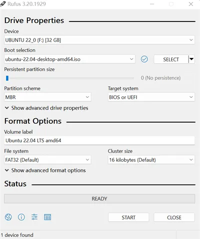

* Insert your USB drive into LattePanda, and turn on the LattePanda(Note that if you created the USB installation media on the same LattePanda, you'll need to restart the device before beginning the installation process).
* Press **++f7++** key continuously to enter into **`Bootable Device Selection Menu`**. 

* Use the **++arrow-up++** or **++arrow-down++** key to choose the USB bootable device, then press **++enter++** key.

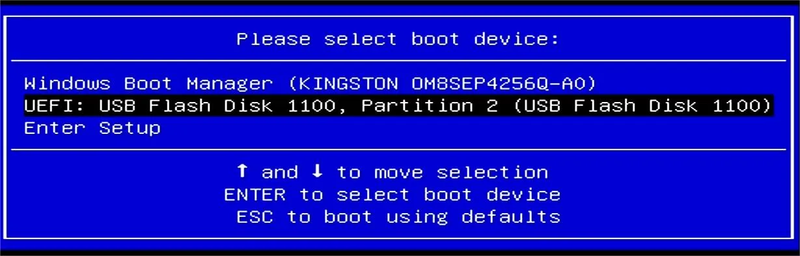

* Then, you will enter the installation GUI as shown below. In this guide, we will take the **`Try or Install Ubuntu`** option as an example. 

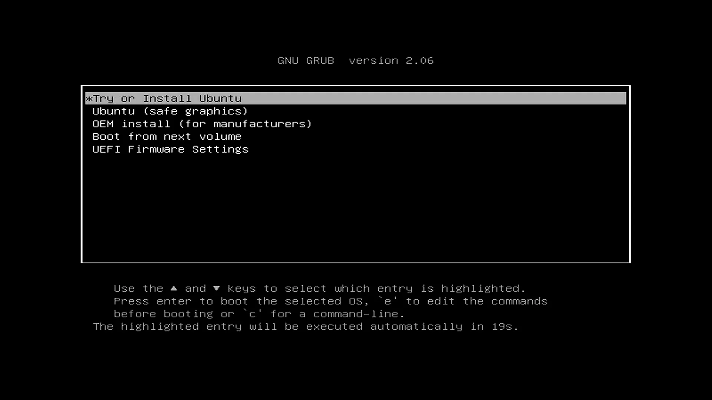 

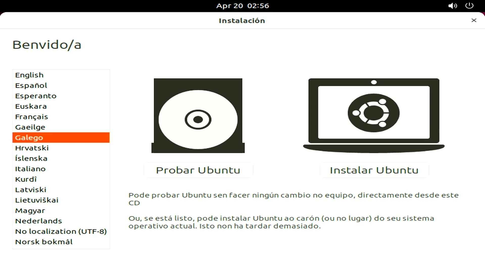

* Please double-click the **`Install Ubuntu`** icon. After double-clicking, the installation will begin.(as shown below)

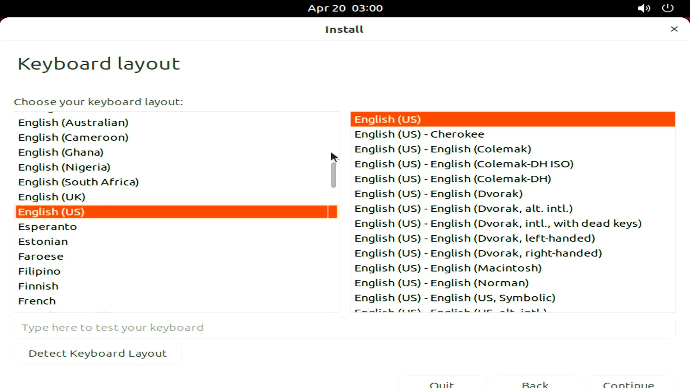

* Choose your default language and continue. 

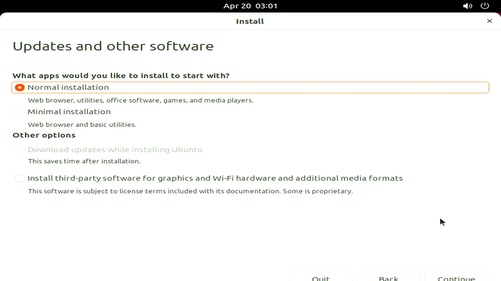

* Select the installation type that best suits your needs. As our SSD already has Windows installed, we will proceed to install Ubuntu alongside the Windows Boot Manager.

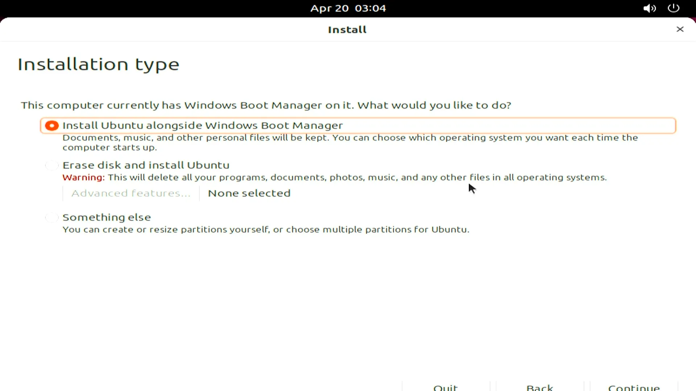

* Confirm the select drive and and that you wish to proceed with writing the previous changes to the disk.

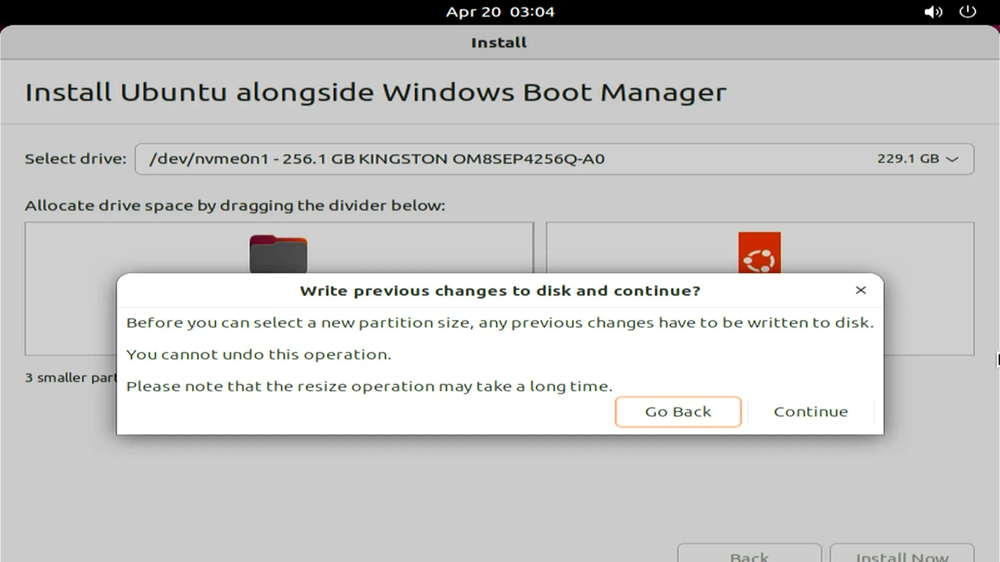

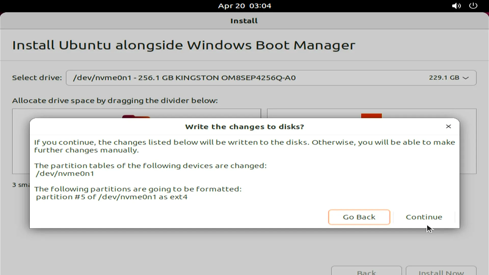

* Select your time zone and click **`continue`** to proceed.

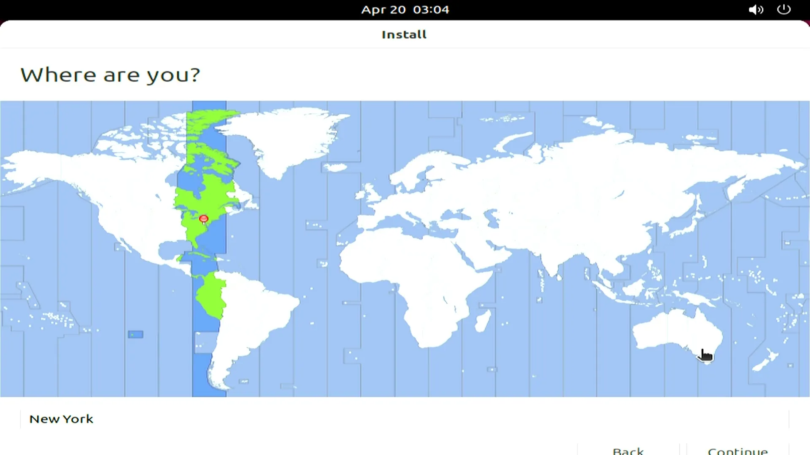

* Fill out all of the required input fields.

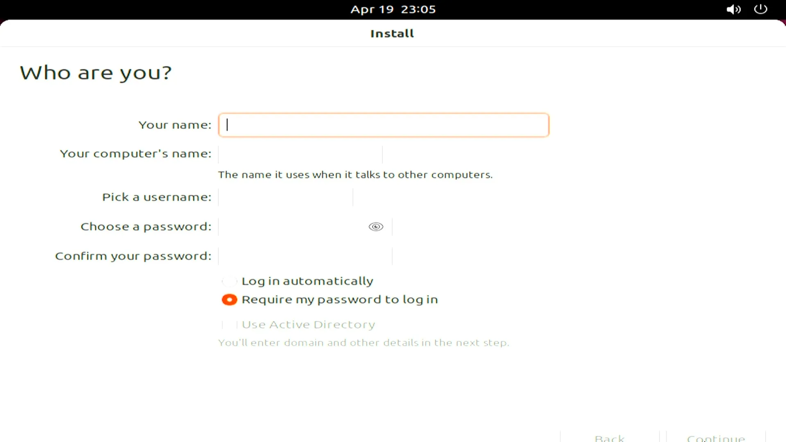

* Please be patient and wait for the installation to complete. Then, you will be asked to restart LattePanda to complete the installation.

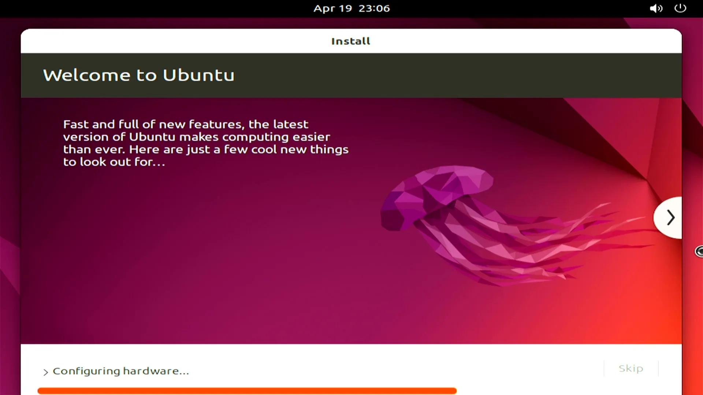

Wait for your LattePanda to restart and boot up Ubuntu, then enter your password to log in. Enjoy it!

[**:simple-discord: Join our Discord**](https://discord.gg/k6YPYQgmHt){ .md-button .md-button--primary }