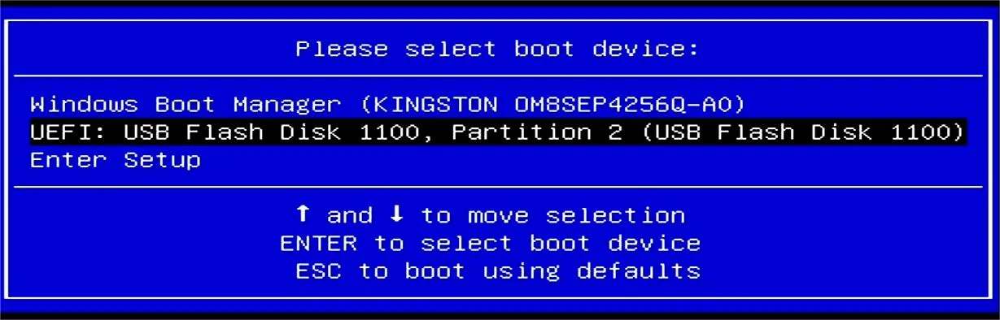
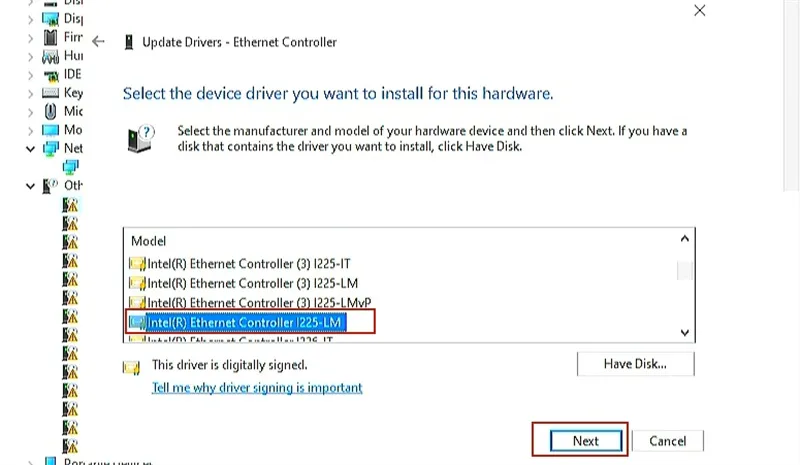

# Operating Systems

## Windows Server

Windows Server is a powerful operating system developed by Microsoft for use on servers. It provides a wide range of features and services designed to meet the needs of businesses, organizations, and other enterprises. Windows Server is used to manage and control network resources, provide centralized authentication and authorization, and host web applications and databases, among other things. Please follow the steps below to install Windows Server properly.

### What You Will Need

* :material-usb-flash-drive-outline: Empty USB Flash Drive (8 GB or larger)
* 💿 [WIndows Server image file](https://info.microsoft.com/ww-landing-windows-server-2022.html) (Fill out the form and download Windows Server 2022 for free)

### Installation Steps

* Fill out the form and download Windows Server 2022 for free.
* Create a USB installation media for Windows Server. We recommend using [Rufus](https://rufus.akeo.ie/) to create the installation media. 

* Insert your USB drive into LattePanda, and turn on the LattePanda(Note that if you created the USB installation media on the same LattePanda, you'll need to restart the device before beginning the installation process).
* Press ++f7++ key continuously to enter into `Bootable Device Selection Menu`. 

* Use the ++arrow-up++ or ++arrow-down++ key to choose the USB bootable device, then press ++enter++ key.

* It will enter into the OS installation terminal, which should resemble the image below. 

* The installation steps are same as normal Windows installation. Please follow the installation guide to complete the installation. Then you can log in to Windows Server!

### Network Driver Installation

When accessing the Windows server system, if the network adapter appears as an unknown device, it is necessary to manually install the appropriate NIC driver to ensure optimal performance.

- Download the [Intel NIC driver](../../assets/drivers/sigma_edition/WS2022.zip).
- Log in to Windows Server, right click on Windows icon and go to `Device Manager`. You will see `Ethernet Controller` listed under `Other devices`.

- Right click on `Ethernet Controller`, and select `Update driver`.

- Select `Browse my computer for drivers`.

- Select `Let me pick from a list of available drivers on my computer`.

- Select `Show All Devices`.

- Click on `Have Disk` and locate the NIC driver.

- Select the `e2f file` in the driver pack and open it.
  

- Locate the `Intel Ethernet Controller I225-LM` and select it.

- The Update Driver Warning window will pop up and confirm to install this driver.
  

- Now, Windows has successfully updated your drivers.
  

- Follow the guide again to install the driver for the other Ethernet Controller. The network adapters will be recognized correctly as shown below.
  

- Congrats, you geek.

[**:simple-discord: Join our Discord**](https://discord.gg/k6YPYQgmHt){ .md-button .md-button--primary }