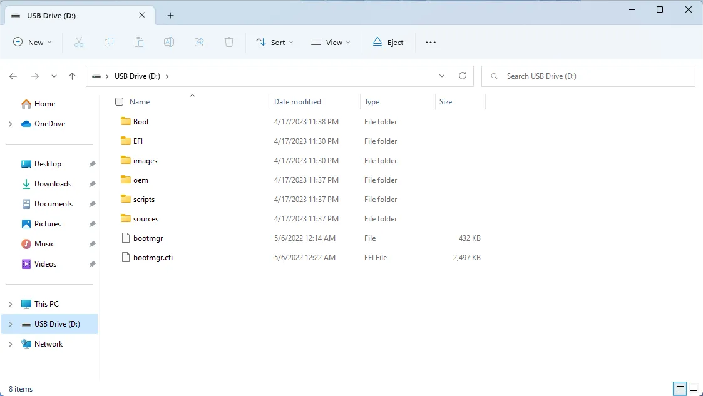
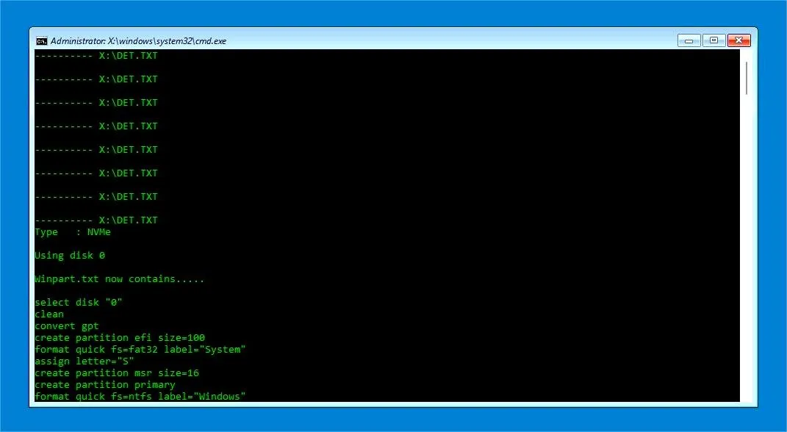
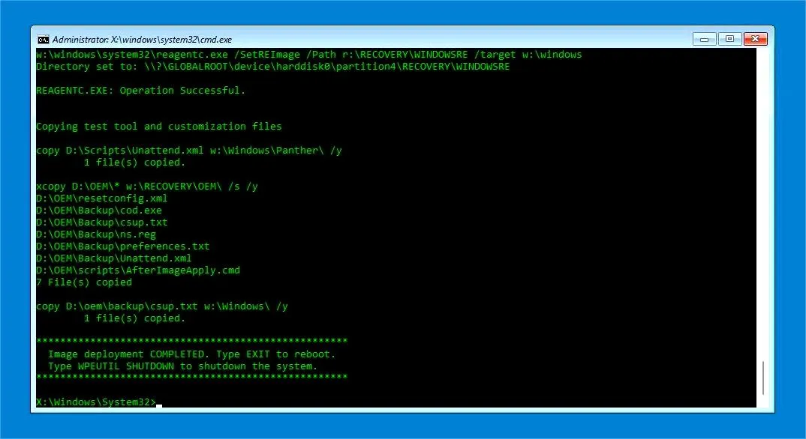

# Operating Systems

## Windows

The following contents will take the Windows OS installation as an example to demonstrate. 

!!! Note

    - The installation steps for both Windows 10 and Windows 11 are the same. 
    - We will use the official system image file(provided by LattePanda team) with all hardware drivers pre-installed and ready to use, bringing you a fast and ultimate experience.

### Preperations

* :material-usb-flash-drive-outline: Empty USB flash drive (16 GB or larger)
* :fontawesome-regular-hard-drive: M.2 NVMe SSD(or SATA SSD)
* 💿 OS Disc Image File for the LattePanda Sigma: Download from [:material-dropbox:Dropbox](https://www.dropbox.com/s/uitqb23soua6nrp/LP-JX-16-WTADLC1R200-001-D.7z?dl=0) or [:material-google-drive:Google Drive](https://drive.google.com/file/d/1PSPULHW076BRwFyuzWzmk2vK5vnNoY2m/view?usp=share_link)

### Installation Steps

* Insert M.2 NVMe SSD to M.2 M key socket on LattePanda Sigma.

* Download the Windows 11 disc image file of LattePanda Sigma.

* Format your USB drive into NTFS format.

* Unzip the  Windows 11 disc image file. Then copy and paste them to the USB drive. 

    The files location on the USB flash drive should be as shown below.
   

* Insert your USB drive into LattePanda, and turn on the LattePanda(Note that if you created the USB installation media on the same LattePanda, you'll need to restart the device before beginning the installation process).

* Press ++f7++ key continuously to enter into `Bootable Device Selection Menu`. 

* Use the ++arrow-up++ or ++arrow-down++ key to choose the USB bootable device, then press ++enter++ key.

* It will enter into the OS installation terminal, which should resemble the image below. As it's a fully automatic process, there's no need to take any action. Please wait patiently for 5-8 minutes.

* After 5~8 minutes, the installation will be completed. A notice will appear in the terminal similar to the image below. 

    Then shut down the LattePanda and unplug the USB flash drive.

* Press the power button to turn on the LattePanda and wait for the system initialization process to begin. After approximately three minutes, the device will boot up and bring you to the Windows desktop. 
    Now enjoy it!

  

[**:simple-discord: Join our Discord**](https://discord.gg/k6YPYQgmHt){ .md-button .md-button--primary }