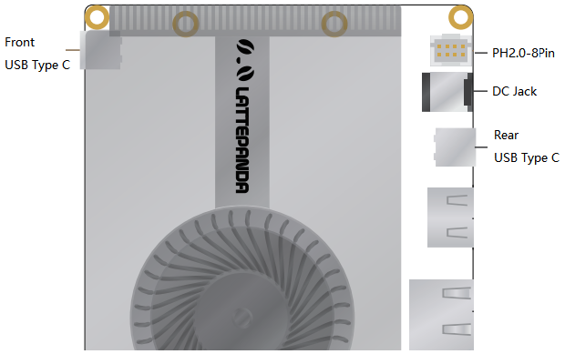
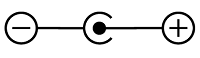
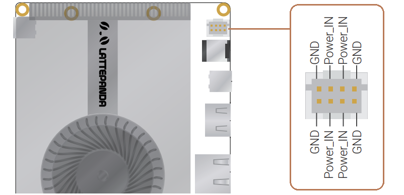

# Power Options

LattePanda is a powerful and versatile single-board computer that can be used for a wide range of application scenario.

To power your LattePanda Sigma, you have several options depending on your specific needs and preferences. In this chapter, we will explore the different ways that you can power your LattePanda Sigma and provide you with the necessary information and steps to get started.


## 3 Ways to Power the LattePanda

!!! Warning "Voltage and Power"

    - In these 3 ways, the acceptable power input range is **12V to 20V**. Please ensure the voltage doesn't exceed 20V.
    - Please use the power adapter with at least **90W** or more, otherwise the LattePanda Sigma may suddenly shut down when the processor is under high load.


1. Power Adapter with 5.5 x 2.5mm DC  Jack (**Recommended**)

2. USB Type C PD adapter

3. JST PH2.0-8Pin connector



## Power Supply Priority

   The PD adapter and DC adapter can be connected at the same time. LattePanda prioritizes using the connector with the higher voltage for its power supply.

   The prority is that: 
``` text
   USB Type C(Rear) > USB Type C(Front) > DC Jack = PH2.0-8Pin connector
```
 The power supply with high priority will be used first.

!!! Example
    === "Senario 1"
        If the USB Type-C port is powered by 20V PD adapter, and the DC Jack port is powered by 19V adapter, **LattePanda will prioritize the power supply from the USB Type-C port.**<br>
        > 1. In case the power supply from the USB Type-C port is accidentally cut off, LattePanda will automatically switch to the power supply from the DC Jack port.<br>
        > 2. When the power supply from the USB Type-C port is restored, LattePanda will automatically switch back to using the power supply from the USB Type-C port.<br>
        > 3. During the power switching process, LattePanda will continue to operate normally without any unexpected power outages.

    === "Senario 2"
        If both the USB Type-C ports are powered by 20V PD adapter, **LattePanda will utilize the power supply from rear USB Type-C ports.**
        
    === "Note"
        * The USB Type C ports only accepts PD 20V power supply.
        * The pins of the JST PH2.0-8Pin connector are directly connected to the pins of the DC Jack.

## Powered by 5.5 x 2.5mm DC Jack (Recommended)

### **Input Specifications**

- 12-20V

- 90 watts or above is recommended



LattePanda Sigma has a DC 5.5mm x 2.5mm circular power jack onboard, and a 19V 90W power adapter is attached.  It is strongly recommended to use the attached power adapter to ensure the stability and safety of power supply.

## Powered by USB Type C PD adapter

!!! Note "Use 90W+ Adapter"

    The 65W PD adapter is not enough to power the LattePanda Sigma, and LattePanda Sigma may suddenly shut down when the processor is under high load. So please use the power adapter with at least 90W or more.

### **Input Specifications**

- 20V
- 90 watts or above

LattePanda Sigma has two Type C ports, one at the front and one at the rear. Both of which support PD adapters to power the board.

If both Type C ports are plugged into the PD adapters, the power supply of the rear Type C port will be used first.


## Powered by JST PH2.0-8Pin Input Connector

!!! Warning "Ensure Correct Polarity Connection"

    Please make sure the positive and negative pins are properly connected and double-check your connections before turning on your LattePanda.

### **Input Specifications**

- 12-20V

- 90 watts or above



When the LattePanda is placed inside a device, you can use this connector to power it through the internal wiring of the device.

The middle four pins are the positive. The pin mapping is marked on the bottom with '+' and '-’, which means four negative pins and four positive pins.

The pins of the JST PH2.0-8Pin connector are directly connected to the pins of the DC Jack, which means that when the DC Jack is connected to a power source, the power from the DC Jack can be output via the JST PH2.0 connector.

### **Recommend Cable**

- [PHB2.0-8PIN Power Supply Cable for LattePanda Sigma](https://www.dfrobot.com/product-2736.html)


## Reference info

- [Power Consumption Test Report for LattePanda Sigma](https://www.lattepanda.com/forum/topic/329004)


[**:simple-discord: Join our Discord**](https://discord.gg/k6YPYQgmHt){ .md-button .md-button--primary }