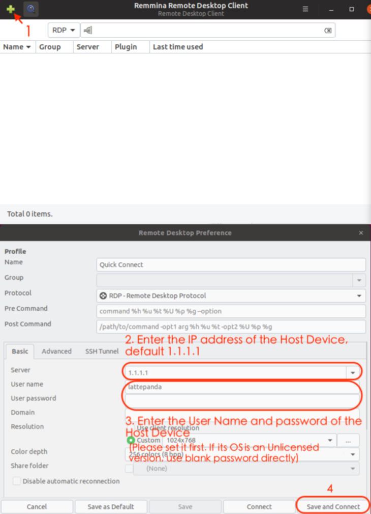

# Setup Client Computer RDP - Ubuntu

This section will show you how to use Remote Desktop in Ubuntu Client Computer.

!!! tip
    Keep the Server Computer connected to the Client Computer with the streaming cable

## Install Remmina

[Click to download and run Remmina](https://remmina.org/how-to-install-remmina/)

## Create A New Connection

Follow the guide below and set it up accordingly.

## Configuration Completed

Now, you are in. Next time, you can power on the Server Computer, connect the Streaming Cable, then click and run. You can also try other software solution. Enjoy!
